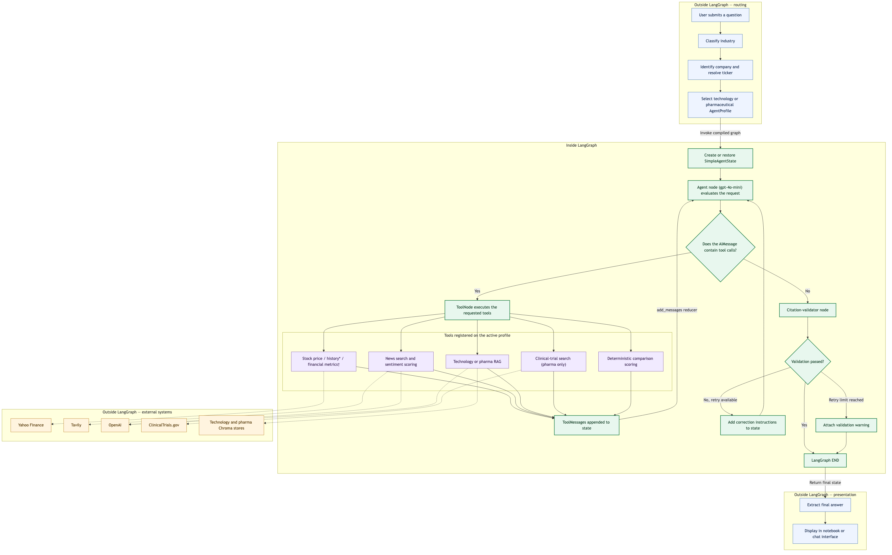
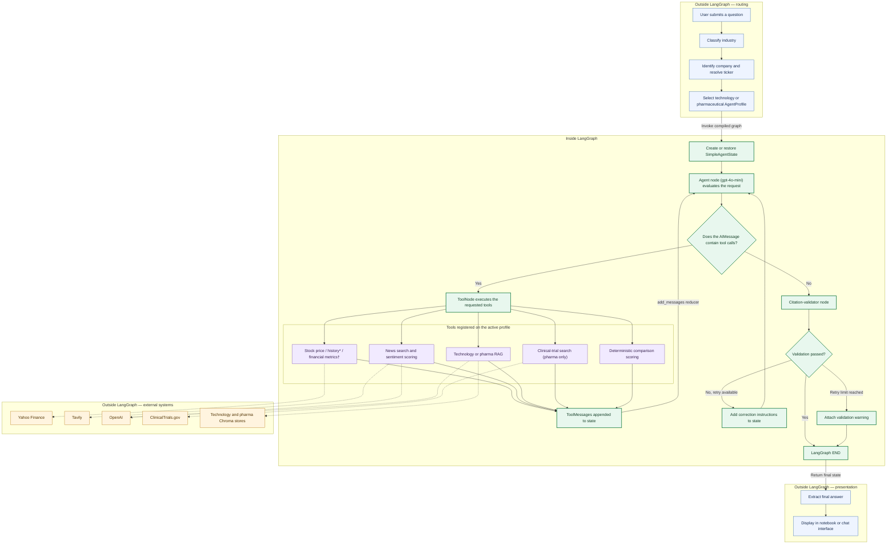
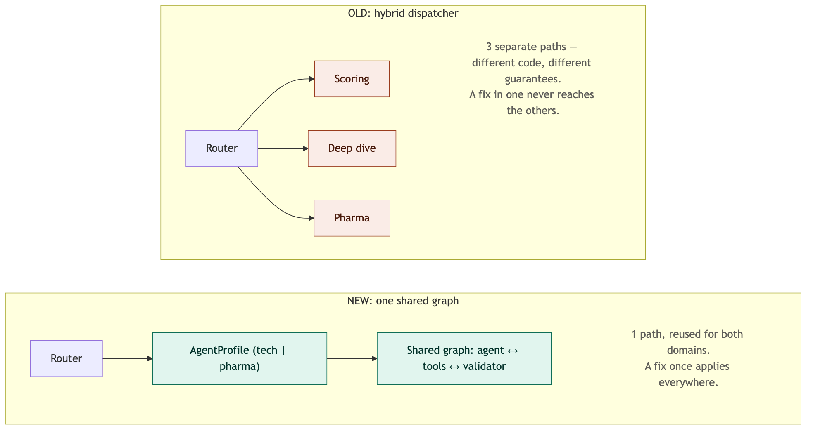
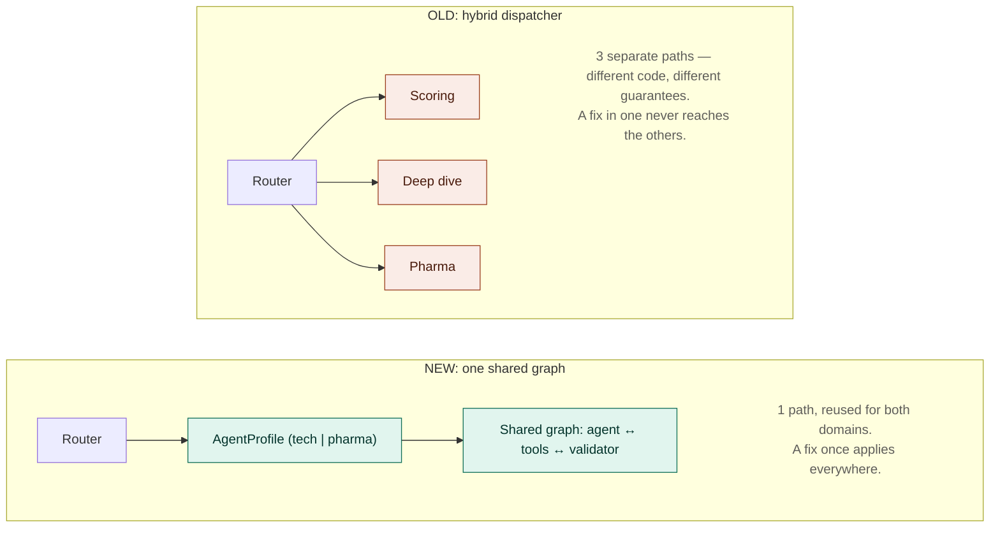

# Summary and Future Scope -【2 Marks】

## A. Summary / Your Observations about this Project - 【1 Mark】

### 1. Project overview

This project demonstrates how an autonomous financial research agent can combine LLM reasoning, external tools, conversation memory, and retrieval-augmented generation (RAG) to produce evidence-based investment research.

The agent uses Yahoo Finance for stock information, Tavily for recent financial news, an LLM-based sentiment-analysis tool, and private company documents for research about AI initiatives. Unlike a traditional chatbot, the agent can decide which tools it needs, collect information from multiple sources, respond to tool failures, and synthesize the evidence into a structured report.

The original technology workflow was also extended to pharmaceutical companies. The extension incorporates clinical-trial information and private pharmaceutical filings while reusing the main agent architecture.

### 2. High-level architecture and design evolution

#### Original assignment architecture

The original assignment developed the system in two stages.

**Part 1 — Base financial agent**

```text
User Question
      ↓
Financial Agent
      ↕
Public Financial Tools
 ├── Stock Price
 ├── Stock History
 ├── Financial News
 └── Sentiment Analysis
      ↓
Final Response
```

The base agent followed a LangGraph ReAct loop. The `agent` node used `gpt-4o-mini` to reason about the question and select tools. The `tools` node executed those tools and returned the results. The workflow continued until the model had enough information to produce its final answer.

**Part 2 — Enhanced RAG agent**

```text
Private PDF Reports
       ↓
Document Loading
       ↓
Token-Aware Chunking
       ↓
OpenAI Embeddings
       ↓
Chroma Vector Store
       ↓
RAG Retrieval Tool
       ↓
Enhanced Financial Agent
```

Part 2 added `query_private_database`, enabling the agent to retrieve company AI initiatives from private analyst reports. This allowed the final report to combine public financial information with private company research.

#### What was changed

The completed implementation preserves the required base and enhanced agents but adds a higher-level, multi-domain architecture:

```text
                           User Question
                                 ↓
                        Unified Query Router
             ┌───────────────────┼───────────────────┐
             ↓                   ↓                   ↓
        Technology          Pharmaceutical      Unsupported or
          Profile              Profile          Mixed Request
             └───────────────────┬───────────────────┘
                                 ↓
                      Shared LangGraph Workflow
              ┌──────────────────┼──────────────────┐
              ↓                  ↓                  ↓
          Agent Node         Tool Node      Citation Validator
              ↑                  │                  │
              └── More research ┘                  │
                                 ↓                 │
                         Validated Response ←──────┘
```

The main changes were:

| Area | Original assignment | Completed implementation |
|---|---|---|
| Domains | Technology and AI | Technology and pharmaceuticals |
| Entry point | Direct agent invocation | Unified query router |
| Agent configuration | Tools and prompts embedded in each agent | Domain-specific `AgentProfile` |
| RAG | Technology analyst reports | Technology reports and pharmaceutical filings |
| Comparisons | Primarily LLM-generated rankings | Deterministic comparison tools |
| Citations | Prompt-based instructions | Citation validation with bounded correction |
| Company handling | Primarily ticker-based | Company aliases, ticker resolution, and unsupported-company checks |
| Loop control | Continue until the model stops | Tool-round limits and duplicate-call prevention |
| Interaction | Printed notebook responses | Session-based interactive chat interface |

The original Part 1 and Part 2 agent implementations remain in the notebook to preserve the assignment progression. The shared profile-based graph is an additional extension used by the final technology and pharmaceutical router.

The router first identifies the relevant industry and supported companies. It then selects either the technology or pharmaceutical profile. Each profile provides its own system prompt and tool set, but both use the same main graph pattern.

This separates shared behavior from domain-specific behavior:

```text
Shared behavior
 ├── Agent and tool loop
 ├── Conversation memory
 ├── Tool-round limits
 ├── Error handling
 └── Citation validation

Domain-specific behavior
 ├── System prompt
 ├── Available tools
 ├── Supported companies
 ├── Private-document collection
 └── Comparison criteria
```

Technology reports and pharmaceutical filings are stored in separate vector collections. This keeps retrieval domain-specific and reduces the risk of using pharmaceutical evidence in a technology report, or technology evidence in a pharmaceutical report.

#### Full request lifecycle

The diagrams above summarize the design evolution; the flow below shows how one request actually moves through the completed system, separating what happens **outside** the compiled LangGraph (routing and presentation) from what happens **inside** it (the shared agent/tool/validator loop). Rendered image first, for viewers without Mermaid support, followed by the Mermaid source:





Two wrinkles the diagram simplifies away, since a single "Tools" box can't show per-domain differences:

- **\*`get_stock_history`** is directly agent-callable in the technology profile's tool list, but not in the pharmaceutical profile's — pharma only reaches it internally, through `compute_pharma_comparison_scores`.
- **†`get_financial_metrics`** is never directly agent-callable in either domain. It has no `@tool` decorator; it's a plain cached helper that `compute_comparison_scores`/`compute_pharma_comparison_scores` call internally in Python to gather the five ranking metrics, without a separate `ToolNode` round trip.

#### The routing chain, step by step

The "routing" box in the diagram above is itself an ordered chain of checks in `route_query()`, run before any agent invocation — deterministic where possible, falling back to one cheap LLM call only where a keyword match cannot answer the question:

| Step | Function | Type | What it checks |
|---|---|---|---|
| 1 | `classify_industry()` | Deterministic, no LLM | Does the query contain a known company alias or domain keyword (tech or pharma)? Both hit → `mixed` (asks the user to pick one sector). One hit → that domain, decided instantly. |
| 2 | `_classify_generic_domain()` | One LLM call, only if step 1 found nothing | Does the *subject matter* still fit tech or pharma (e.g. "which company has the best AI research")? Neither → deflected as out of scope. |
| 3 | `_mentioned_companies()` | Deterministic | Once a domain is set, is one of the 5 supported companies for that domain named (exact alias match)? If yes, skip straight to the agent. |
| 4 | `_detect_unsupported_company()` | Deterministic fuzzy match first, LLM fallback only if that finds nothing | Only if no supported company was named: is this a typo/partial name of a supported company, a real company outside coverage (flagged, unscored overview, no agent call), or truly generic (falls through to the agent with no company context)? |
| 5 | Agent invocation | — | Whichever domain resolved, the *same* shared graph runs with that domain's `AgentProfile` (its tools and system prompt) and the query, rewritten to include a resolved ticker if step 4 found one. |

Only step 5 differs by domain — steps 1–4 are identical routing logic regardless of which domain a query ends up in.

#### State management

One state class, `SimpleAgentState`, is defined once and reused by every agent variant in this notebook (Traditional, Basic, Full, Enhanced/RAG, and both router agents) via `StateGraph(SimpleAgentState)` — no divergent schemas. It holds three fields: `messages` (standard LangGraph accumulation), `validation_retry_count` (bounded citation-correction counter), and `tool_round_count` (rounds completed in the current turn). The last two exist in this shape for every variant, but are only actually exercised by the variants that wire in citation validation and round-capping (Full, Enhanced, both router agents) — they sit unused for Traditional/Basic, which have no citation-validator node at all.

What differs between variants is whether a `MemorySaver` is attached, and if so, which one:

| Agent | Memory |
|---|---|
| Traditional | None (deliberate stateless contrast baseline) |
| Basic | None |
| Full | Own `MemorySaver` |
| Enhanced/RAG | Own `MemorySaver` |
| Router — technology | Shared `_router_memory` |
| Router — pharma | **Same** shared `_router_memory` instance as technology |

The two router agents intentionally share one `MemorySaver`, namespaced only by `thread_id` — not two separate stores. Since `route_query()` always passes the same `session_id` regardless of which domain a query resolves to, a chat session that asks a tech question and then a pharma question checkpoints both under the same `thread_id` in the same store, even though they are served by two differently-configured compiled agents. Whether that surfaces as the pharma agent seeing tech-flavored history on a domain-switching follow-up has not been live-tested.

Beyond the graph's own state, five more kinds of state exist, only two of which survive a kernel restart:

| State | Scope | Survives restart? |
|---|---|---|
| Compiled-agent cache (`_compiled_profile_agents`) | Process lifetime | No |
| Chat panel session id + displayed history | One panel's lifetime | No |
| Disk-backed API cache (`@cached_call`) | TTL-expired | **Yes** |
| Vector store persistence (`.index_complete` + Chroma's store) | Until deleted | **Yes** |
| Lazily-initialized singletons | Process lifetime | No |

So everything except the two disk-backed stores disappears on restart, and nothing here is shareable across more than one process — the same limitation named under Limitations below.

### 3. Important design decisions and trade-offs

#### Shared workflow versus separate domain workflows

An earlier version of this multi-domain extension used a hybrid dispatcher that routed to three structurally different execution shapes: a fully deterministic scoring engine for comparisons, a partially-agentic pipeline for deep dives, and a separately-wrapped set of subgraphs for the pharma domain — three shapes glued together instead of one shared pattern. That structural hybridity was directly responsible for real bugs, not just incidentally related to them: because each path carried its own logic, a scoring-threshold table drifted from the actual recommendation logic without anyone noticing, and a cost-budget guardrail added to one domain never propagated to the other, since there was no single place to add it once.





This is why the current implementation instead uses one shared `agent ↔ tools ↔ citation_validator` graph, reused for both domains by swapping in an `AgentProfile` — a tool list and a system prompt, nothing else changes. Comparison is just another tool the same agent can call, not a separate execution shape. A shared graph reduces duplicated code, and improvements to memory, citation validation, error handling, and loop limits apply to both domains in one place.

The trade-off, and why it was chosen anyway: the old dispatcher could guarantee comparison scoring never touched an LLM at all — a real determinism advantage the new version gives up. In the shared-graph version, the LLM decides *when* to call the comparison tool (though never what it computes once called), and a per-domain-tuned path could in principle enforce "validate before synthesize" more tightly than one graph shared across two domains. What the shared graph trades that for: every guardrail — citation validation, session memory, tool-round caps, the N/A-not-zero rule — applies to every capability in every domain by construction, instead of depending on each of several separately-evolved paths remembering to add it. Given a choice between per-domain-optimized guarantees that can drift apart unnoticed, and slightly weaker guarantees that are structurally impossible to skip, the second was chosen because drift, not weakness, is what actually broke things in practice — the same class of failure as the two hybrid-dispatcher bugs above. One general workflow may still be less specialized than separate ones; pharmaceutical analysis may eventually need dedicated regulatory and clinical-evidence stages that are unnecessary for technology companies, which a shared graph makes marginally more awkward to add than a domain-specific path would.

#### LLM tool selection versus deterministic execution

The LLM decides which tools are needed for open-ended research questions. This gives the agent flexibility and allows it to handle different types of requests without a hardcoded workflow for every question.

However, LLM-based decisions are not completely predictable. The model can omit a useful tool or request an unnecessary one. System prompts, mandatory-tool rules, duplicate-call checks, and tool-round limits reduce this risk. Three independent, bounded limits keep the workflow from looping or retrying indefinitely:

| Limit | Bound | Purpose |
|---|---|---|
| Tool-calling rounds per turn | 8 | Stops an unproductive research path instead of looping forever; the agent answers with whatever evidence it already has once reached |
| Citation-correction retries | 2 | A failed citation check is sent back for correction at most twice, then fails closed with an explicit `VALIDATION FAILED` note rather than silently returning a wrong report |
| News-search quality retries | 2 | `search_financial_news` retries if it doesn't find enough relevant articles (semantic reranking against a 0.70 similarity threshold, minimum 2 of a target 3), instead of settling for off-topic results |

Raw network/API failures are deliberately not covered by these caps — a transient error from `get_stock_price` or Tavily returns immediately with no retry at that layer, a gap carried into Future Scope under reliability hardening.

Comparison calculations were therefore moved into deterministic tools. The LLM controls research planning and report generation, while the comparison tools control the numerical calculations. This preserves agent flexibility without allowing the model to invent comparison scores.

#### Strong citation validation versus flexibility

Citation validation helps detect unsupported numerical claims, improperly formatted sources, and citations to tools that were never successfully called.

The trade-off is that strict rules may reject a valid statement when its citation is formatted differently than expected. Correction attempts also increase latency and API usage, and a response can still fail validation after the allowed attempts (bounded to 2 retries before failing closed).

Citation validation checks whether citations follow the required format and refer to tools that were successfully used. It improves traceability but does not independently verify the factual truth of every retrieved statement.

Live testing surfaced two genuine over-strictness bugs, both fixed rather than loosening the rule generally: the price-citation check originally accepted only `get_stock_price`/`get_stock_history` as a valid source for any dollar figure, so a deal size sourced from `search_financial_news` or a balance-sheet line from the RAG tool failed even though it was properly cited; and a figure restated in the Executive Summary failed because the check never looked past its own paragraph block for an existing citation. Both were fixed — the accepted-tool set was broadened, and a figure now passes if it matches one already cited elsewhere in the same report. A genuinely uncited or fabricated figure still fails closed either way. Separately, what made the model reliably self-correct on retry was not a stricter rule but a more specific correction prompt: stating explicitly that it may call a tool it has not yet used during correction, rather than only rephrasing existing text, which is what let it make a real `analyze_sentiment` call instead of inventing a score.

#### Multiple evidence sources versus speed and reliability

Combining stock data, news, sentiment, private reports, clinical trials, and company filings produces more complete research.

The trade-off is that each additional provider increases execution time, API cost, and the number of possible failure points. Caching helps reduce repeated calls, but live external data can still be unavailable or incomplete.

Caching is disk-backed (capped at 500 entries / 100 MB) rather than a simple in-memory dict, with per-category freshness policies matched to how often each kind of data actually changes: 15 minutes for stock history (30-minute stale-while-revalidate window), 5 hours for news search and sentiment, and roughly a month for RAG queries. This applies only to the tools carried over from Part 1/2 (`get_stock_history`, `search_financial_news`, `analyze_sentiment`, `query_private_database`); the tools written new for this extension — `search_clinical_trials`, `query_pharma_database`, and both `compute_*_comparison_scores` tools — re-fetch and re-score from scratch on every call, a gap carried into Future Scope under scale. Separately, both vector stores use a one-time `.index_complete` marker so the document corpus is not re-embedded on every kernel restart.

#### In-memory state versus production persistence

`MemorySaver` is simple and appropriate for a notebook demonstration. It allows follow-up questions to reuse previous conversation context.

The limitation is that in-memory conversations do not reliably survive a kernel restart and are not suitable for multiple production servers or large numbers of concurrent users. Memory supports follow-up questions within the active notebook session, but it is not a production-grade persistent conversation store. Concretely, both the compiled-agent cache (`_compiled_profile_agents`) and the router's shared checkpointer (`_router_memory`) are plain in-process Python objects — a dict and a single `MemorySaver` instance — so neither is safe to share across multiple processes or workers, independent of the persistence question.

#### Unsupported companies: flagged, never silently scored

A live test found that "Compare Pfizer and Roche" did not fail outright — it partially succeeded. The free-text tools (`search_clinical_trials`, `search_financial_news`) returned real data for Roche even though it has no ticker in the system, so Roche received a partial score that outranked Pfizer's complete one, because missing categories are excluded from scoring rather than counted as zero.

The fix checks the supported-company list before scoring, not after. If no supported company is named at all (e.g. "Roche's clinical trial pipeline"), the router blocks the request immediately and returns a flagged, unscored overview without invoking the agent. If a supported company is named alongside the unsupported one (e.g. "Compare Pfizer and Roche"), the agent runs normally and the comparison tool itself flags Roche once it reaches it, scoring only Pfizer. Either path ends the same way: an unsupported company is always labeled as such, never scored or ranked alongside a real one.

#### Multi-turn follow-ups: sticky session for now, not the final design

A live test surfaced a real gap in the router. "Compare Amazon vs NVDA for growth" followed by "for balanced profile" both work, since each names the companies directly — but a further follow-up like "compare them for conservative" does not, because it carries no company name or domain keyword of its own, and domain classification runs *before* the agent, with no access to the conversation history the agent's own `MemorySaver` already holds.

The fix adopted is a sticky-session fallback: `_session_last_domain` tracks the last domain each session resolved to, and the router reuses it when neither the deterministic keyword check nor the standalone-query LLM classifier finds anything, instead of deflecting. This was chosen deliberately as the cheapest fix, not the most correct one — three options were weighed:

| Option | Approach | Trade-off |
|---|---|---|
| 1. Sticky-session fallback (chosen) | Reuse the last resolved domain per session | Cheap, a few lines; risk is a genuinely unrelated question right after a domain conversation incorrectly reusing that domain instead of deflecting — mild, since the agent would likely just report no relevant information |
| 2. Context-aware classifier | Classify using the last 1–3 turns, not just the bare new message | Handles "compare them for X" correctly without option 1's false-positive risk, at the cost of a larger classification prompt |
| 3. Router as a graph node | Fold classification into the same LangGraph state the agent already uses | Structurally correct — full conversation history for free — but a real redesign: two separately-compiled per-domain graphs would need to become one graph with conditional dispatch |

Option 1's blind spot is that it remembers only *which domain* was last used, never *which entities* — a gap worth revisiting via option 2 or 3 before adding more domains or meaningfully more traffic, since it is the same class of drift (guardrails that silently don't reach every path) that motivated the shared-graph rebuild in the first place.

### 4. Key observations and learning

The project showed that an autonomous agent requires more than a detailed prompt. It also needs reliable tools, a controlled workflow, conversation state, error-handling rules, and evidence validation.

The strongest answers resulted from combining different kinds of information:

- Stock data explained current and historical financial performance.
- Financial news captured recent company developments.
- Sentiment analysis provided a consistent interpretation of news coverage.
- Private-document RAG supplied company-specific AI or pharmaceutical information.
- Deterministic tools made company comparisons more reproducible.

Another important observation was that retrieval quantity does not guarantee answer quality. Retrieved evidence must be relevant to the question, connected to the correct company, and supported by clear citations.

Missing evidence is represented as `N/A` rather than zero. A zero means poor measured performance, while `N/A` means that the system lacks enough reliable evidence to assign a score. This prevents a company from being unfairly penalized simply because evidence could not be retrieved.

### 5. Challenges encountered

End-to-end testing — actually running queries, not just reviewing the code — surfaced several practical challenges, most caught by seeing the wrong thing happen on a real query rather than by inspection:

- **Company names needed to be resolved into valid ticker symbols.** The comparison tools resolved names with a bare `.upper()` call, so "Compare NVIDIA and Microsoft" sent the literal strings "NVIDIA"/"MICROSOFT" to Yahoo Finance and got a 404. The missing-evidence-stays-`N/A` rule kept this from becoming a wrong number or a crash, but it still needed a real fix (`_resolve_ticker()`, reusing the router's own alias dictionaries).
- **Unsupported companies had to be identified before scoring or ranking.** See "Unsupported companies" above (the Roche case).
- **On-topic questions with no exact keyword match were wrongly deflected.** The deterministic `classify_industry()` step is keyword-only by design, for speed on the common case, so an open-ended question like "which company has the best AI research" (no literal "artificial intelligence" phrase, no company name) was deflected as unsupported. Fixed with one cheap LLM classification step, used only when the fast keyword/company match finds nothing.
- **Risk preferences such as conservative, balanced, and growth needed to affect the scoring weights.** They initially didn't: the parameter was accepted and displayed in every report but never changed the actual weights, because the charter documented its existence without ever instructing the model to extract risk language from the query. A query like "Compare Amazon vs NVDA for growth" still produced a balanced-profile report. Fixed by adding an explicit word-to-profile mapping instruction to both domains' charters (the pharma charter previously had none at all), confirmed live across all three profiles afterward.
- **Short follow-up questions required conversation and domain context.** See "Multi-turn follow-ups" above.
- **External APIs could return incomplete, irrelevant, or unavailable information.**
- **Generated responses could contain incomplete or fabricated citations.** See the citation over-strictness fixes above; a citation for a tool that was genuinely never called still fails closed by design.
- **Company name typos were not resolved.** "Meck" (a typo for Merck) matched no alias and fell through to the generic-domain fallback, which isn't built to resolve typos, only to judge whether a question is in-scope at all. A single LLM prompt asked to both resolve typos *and* flag genuinely unsupported companies proved unreliable — four variants were tried, and every one generous enough to resolve "Meck" made the model worse at correctly flagging a real unsupported company like Roche. The working fix splits this into two independent steps: a deterministic, zero-cost string-similarity check (Python's `difflib`) runs first against the query's own words, matching only against already-supported companies so it can never invent a match to an unsupported one; the original, unmodified LLM prompt runs only if that finds nothing, which is exactly why it still correctly flags Roche.
- **Long reports needed a readable and scrollable notebook interface.** `ipywidgets.Output`'s own `max-height`/`overflow-y` layout properties were not reliably translated into working CSS by the notebook renderer, so report text overlapped the chat input row. Fixed by switching the chat log to a plain `widgets.HTML` widget with the scroll box built directly into its own inline CSS, which is basic, renderer-agnostic behavior rather than something tied to any widget's internal implementation.

The intentionally failing stock-price exercise demonstrated an important agentic behavior: when one tool fails, the agent should acknowledge the failure, continue with other available evidence, and explain how the missing information affects its conclusion.

### 6. Pharmaceutical extension

The original assignment suggested extending the agent to another industry as an optional challenge. This implementation directly addresses that challenge by adding pharmaceutical analysis for Pfizer, Merck, Eli Lilly, Johnson & Johnson, and AstraZeneca.

The pharmaceutical profile adds:

- Clinical-trial searches through ClinicalTrials.gov.
- RAG over private pharmaceutical filing documents.
- Pharmaceutical-specific research instructions.
- Pharmaceutical comparison scoring.
- Routing between technology and pharmaceutical questions.

This extension demonstrates that the shared architecture can support another industry without rebuilding the complete agent workflow. The domain-specific evidence and scoring rules change, while the main agent, memory, tool-control, and citation-validation patterns remain reusable.

The comparison scores demonstrate how financial, research, and sentiment evidence can be combined, but their weights are educational heuristics rather than a validated investment strategy. The scoring methodology would require historical backtesting before being used for real investment decisions.

Overall, the project demonstrates that the quality of an autonomous financial analyst depends on the complete system surrounding the LLM. Reliable results require coordination between reasoning, tools, RAG, routing, memory, validation, and transparent handling of missing evidence.

### 7. Limitations

Simplicity and production-readiness are different axes, and this implementation optimized for the first. What is missing before any real use:

- **No persistence beyond one process.** The compiled-agent cache and the router's memory checkpointer live in the kernel's process memory, so every session and cache disappears on restart and cannot be shared across more than one process.
- **UI exists but is notebook-bound.** The interactive `ipywidgets` chat panel (session management, live progress streaming, scrollable history) only runs inside this notebook's kernel — there is no standalone, deployable version a non-technical user could open without a Jupyter environment.
- **No structured tracing.** No visibility into which tool ran with which arguments, or why a citation check failed — the kind of visibility that would have surfaced the ticker-resolution bug above without needing a live run to catch it.
- **No automated evaluation.** No fixed query set with programmatic assertions on answer shape, so behavioral correctness currently depends on manually reading printed output.
- **No cost or latency budget.** Tool-call rounds are bounded, but not dollar cost or wall-clock time, for either domain.

None of these are flaws in the router pattern itself — they are outside what a single notebook can demonstrate, and are the concrete items carried into Future Scope below.

### 8. Capability matrix

| Case | Status | How |
|---|---|---|
| Single-company deep dive | Supported | Base ReAct loop |
| Multiple companies, not a comparison | Supported | LLM batches tool calls in one turn, no special routing |
| Comparison (explicit or implicit phrasing), 2+ supported | Supported | Deterministic comparison tool, relayed verbatim |
| Comparison with some unsupported companies | Supported | Supported ones scored; unsupported flagged with a brief unstructured overview |
| Comparison collapsing to 1 supported company | Supported | Solo deep dive instead of a meaningless 1-row table |
| Deep dive naming an unsupported company | Supported | Router short-circuits to a flagged overview before any tool calls |
| On-topic question, no exact company/keyword match | Supported | One cheap LLM classification routes it before deflecting |
| Company/topic outside both domains | Supported | Told which sectors are covered |
| Companies from both domains at once | Supported | Asked to pick one sector |
| Misspelled/partial company name (e.g. "Meck" for Merck) | Supported | Deterministic fuzzy match resolves it before any LLM call is made |
| Risk profile (conservative/balanced/growth) | Supported | Weights 5 ranked financial metrics + 4 AI signals, both domains |
| Arbitrary comparison focus/criterion | Supported | Shapes what evidence gets searched for |
| Domain-less multi-turn follow-up (e.g. "compare them for conservative") | Supported (sticky-session heuristic) | Reuses the session's last resolved domain — see the trade-off above |
| Interactive chat UI | Supported (notebook-bound) | Session management, live progress streaming, scrollable history — not a standalone deployable app |
| Concurrent multi-company evidence gathering | Not yet | Sequential loop |
| Cost / rate / latency budget | Not yet | None |
| Cross-process persistent state | Not yet | In-memory only |
| Automated evaluation suite | Not yet | None |

## B. Future Scope of this Project - 【1 Mark】

### 1. Expand company and industry coverage

The current solution only covers the five companies already listed per domain; a future version could integrate a general fuzzy-alias resolver or a lightweight symbol-lookup API to support a broader investment universe automatically, instead of hand-editing a dictionary for every new company — the most immediate gap the live testing above exposed.

Additional `AgentProfile` configurations could also be created for industries such as banking, energy, insurance, and consumer goods. Each profile could reuse the shared graph while providing industry-specific tools, documents, prompts, and scoring rules.

### 2. Improve multi-turn routing and persistent memory

The current sticky-session fallback only remembers *which domain* a session last resolved to, not *which entities, criteria, or results* were discussed. Before adding more domains or meaningfully more traffic, this should move to either a context-aware classifier (the last 1–3 turns as input, not just the bare new message) or folding routing into the same LangGraph state the agent already uses — the latter is the structurally correct fix, but is a real redesign (one graph with conditional dispatch instead of two separately-compiled per-domain graphs), not a small patch.

Conversation memory could also be moved from `MemorySaver` to a database-backed LangGraph checkpointer. This would allow sessions to survive kernel restarts and support multiple users or application servers — today, the compiled-agent cache and the router's memory are both plain in-process Python objects, safe for one notebook kernel but not for concurrent multi-user traffic or more than one server instance.

### 3. Strengthen reliability, security, and monitoring

External APIs should include controlled retries, timeouts, rate-limit handling, and circuit breakers. This would allow the system to recover from temporary provider failures instead of immediately returning incomplete results — today a single network blip on `get_stock_price` or `search_financial_news` returns an error string immediately, with no retry or backoff, and there is no rate-limit awareness for Tavily, OpenAI, yfinance, or ClinicalTrials.gov.

API credentials should be stored in environment variables or a secrets manager rather than a plaintext configuration file. Retrieved web and document content should also be treated as untrusted input and protected against prompt-injection attempts, since `search_financial_news` and both RAG tools currently pipe raw retrieved text straight into the LLM's context with no sanitization.

Structured tracing should record routing decisions, tool names and arguments, execution time, validation failures, and estimated API cost. This would make incorrect or slow responses easier to diagnose — it would, for instance, have surfaced the ticker-resolution bug above without needing a live run to catch it.

Scaling also means addressing what caching does not yet cover: the tools written new for this extension (`search_clinical_trials`, `query_pharma_database`, both `compute_*_comparison_scores` tools) have no caching at all, so repeated questions about the same company re-pay the full provider cost every time. The system also has no automated test suite wired into CI, no awareness of market-hours/after-hours data staleness (a "current price" claim on a weekend is technically the prior close, unlabeled as such), and no version tagging on the scoring rubric or charters, so there is no way to tell which version produced a given past comparison.

### 4. Add systematic evaluation

A repeatable evaluation suite should contain representative queries for:

- Technology and pharmaceutical routing.
- Tool selection.
- Single-company analysis.
- Multi-company comparisons.
- Unsupported companies.
- Missing evidence.
- Citation accuracy.
- Risk-profile interpretation.
- Multi-turn follow-up questions.
- Response structure and completeness.

Generated answers should be checked for supported claims, required report sections, citation coverage, and consistent treatment of unavailable evidence. A small golden-query eval (5–10 fixed queries with assertions like "both companies present in a comparison" or "at least N citations in a deep dive") would catch this class of bug automatically instead of relying on manual review — this is arguably the highest-value, lowest-cost addition, since most of the bugs found this round were only caught by running an actual query.

### 5. Validate and explain the scoring methodology

The comparison scores demonstrate how financial, research, and sentiment evidence can be combined, but the current weights have not been validated as an investment strategy — they are clearly-labeled educational heuristics, not validated rubrics.

Future work should backtest the scoring approach against historical company data and document how each metric contributes to the final result. The report could also present an evidence table containing each metric, its source, its weight, and its contribution to the score. Pharma's dimension set could also be extended (clinical maturity, regulatory position, patent exclusivity), gated behind validated structured extraction rather than shipped upfront and left unvalidated.

### 6. Deploy the agent responsibly

The notebook interface could be converted into a standalone Streamlit or Gradio application with persistent sessions, downloadable reports, structured monitoring, and direct links to evidence — extracting `route_query()` and its tools into a standalone app also unlocks deploying it somewhere reachable outside a local Jupyter environment, such as Hugging Face Spaces.

Because financial recommendations may affect real decisions, the system should consistently state that its results are educational and not professional financial advice, across both the technology and pharma reports. A production version should also include a real per-query cost/latency budget and human review before presenting a Buy, Hold, or Sell recommendation to a user.
