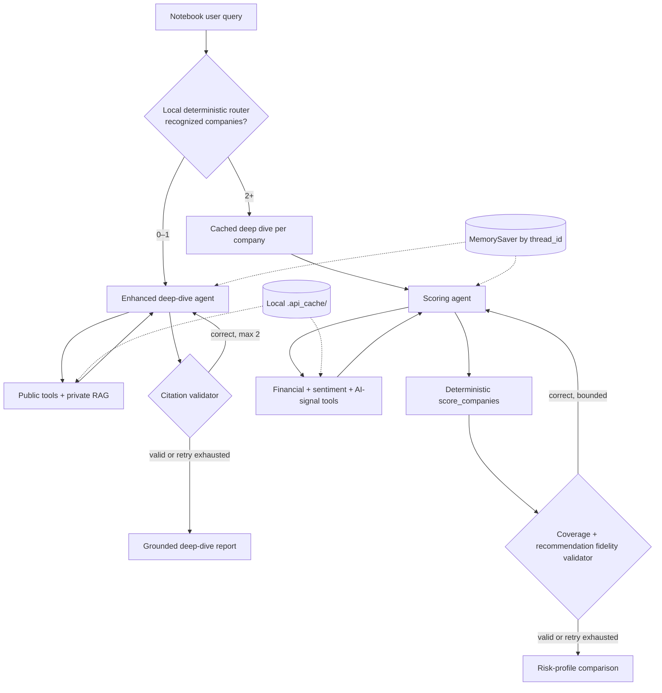

# Autonomous Financial Research Analyst
## Notebook Baseline Design

**Status:** Current local notebook design; implemented and exercised in the learner notebook  
**Working source artifact:** `Autonomous_financial_analyst_Learners_Notebook copy.ipynb`  
**Read-only notebook references:** `Merged-Autonomous_financial_analyst_Learners_Notebook.ipynb`, the Part 1 and Part 2 notebooks, and the unsolved notebook under `tests/`  
**Relationship:** Notebook-level baseline referenced by the separate [Multi-Company Financial Research Orchestrator HLD](open-universe-orchestrator-final-hld.md)  
**Scope boundary:** Local Jupyter execution only. Production orchestration, durable services, security-master integration, and distributed workers remain future enhancements.

---

## 1. Executive summary

The notebook demonstrates a **local financial-research system with three agent configurations and one deterministic router**:

1. `create_financial_agent` and `create_enhanced_financial_agent` produce single-company or small-scope research reports through an agent–tool loop. The enhanced agent adds private-document RAG.
2. `create_scoring_agent` gathers financial metrics, sentiment, and structured AI signals, then delegates the arithmetic to deterministic Python scoring. The LLM explains an already-final score table; it does not invent or recompute the ranking.
3. `route_financial_query` deterministically selects a deep dive for zero or one recognized company and deep dives plus a comparison for two or more recognized companies.

All paths remain inside the notebook process. `MemorySaver` provides in-memory conversation checkpoints, Chroma provides a local vector store, and `.api_cache/` provides a local disk-backed TTL cache. These mechanisms improve notebook iteration and repeatability but are not production persistence or distributed orchestration.

The implemented RAG corpus, four-signal extractor, and scoring rubric focus on AI-sector technology companies. Part 1 also implements a `sector` prompt parameter and exercises a healthcare-framed report, but a complete non-technology profile still requires a sector-specific corpus, signal extractor, evidence rules, and rubric. This document distinguishes that implemented prompt parameterization from the fuller industry-aware platform design.

The adaptation reuses the same core market and financial tools. It changes the industry-specific evidence, prompt, terminology, interpretation, risks, and comparison criteria.



The diagram shows local notebook control flow. Boxes do not represent deployed services or independent worker processes.

### Core design decision

Keep orchestration local and use deterministic code wherever the decision does not require model judgment:

- A tool-calling LLM chooses research actions inside the deep-dive and scoring graphs.
- `ToolNode`-style execution appends observations to message state.
- Citation validators gate deep-dive answers before `END` and allow at most two correction rounds.
- The scoring graph requires complete tool coverage, computes rankings in Python, and checks that the narrative preserves the computed recommendation.
- A hard tool-round ceiling prevents an agent from looping indefinitely.
- The top-level query router counts recognized company mentions and chooses the local execution path without another LLM call.
- `MemorySaver` and the disk cache remain process-local or workstation-local aids rather than platform services.

This keeps the educational agent loop visible while adding bounded, testable controls around the parts most likely to fabricate, drift, or repeat work.

---

## 2. Problem and goal

Manual investment research requires collecting market data, searching recent news, interpreting sentiment, reviewing private reports, and combining the evidence into one recommendation.

The notebook automates that workflow primarily for AI-sector technology-company research, then asks the learner to generalize the design to another industry.

### Target output

A completed report is expected to contain:

1. Financial health and historical performance
2. Recent news and market sentiment
3. AI initiatives from private reports
4. Risks and opportunities
5. Buy, Hold, or Sell recommendation with confidence
6. Source citations and stated data gaps
7. For multi-company requests, a reproducible score table and risk-profile-aware explanation

---

## 3. Scope

### In scope

- Single-company financial research
- Current price and market metrics
- Historical price analysis
- Recent financial-news search
- Sentiment analysis
- Private-report RAG for AI initiatives
- Tool-failure handling and partial completion
- Deterministic citation-format and citation-authenticity validation
- Bounded correction retries and duplicate-call suppression
- Fixed-list deterministic multi-company scoring for MSFT, GOOGL, NVDA, AMZN, and IBM
- Conservative, balanced, and growth risk profiles
- Local natural-language routing between deep dives and comparisons
- Disk-backed, function-specific TTL caching with stale-while-revalidate behavior
- Notebook conversation memory
- Implemented sector prompt parameterization plus a healthcare demonstration
- Design guidance for a fuller healthcare, fintech, or other industry profile

### Out of scope

- Open-ended company discovery and security-master validation
- One worker per company or bounded parallel fan-out
- Durable production persistence
- Shared cache services, distributed refresh locking, and multi-process consistency
- Multi-user API serving, authentication, and authorization
- Production claim-level provenance, per-turn evidence ledgers, and durable audit history
- A universal scoring formula that directly compares unlike industries without an explicit cross-industry rubric
- Trade execution or portfolio automation


### Assignment coverage verification

The notebook was audited against its visible assignment structure.

| Notebook requirement | Baseline-design coverage |
|---|---|
| Section 1.1 — Goal and proactiveness | Problem, charter, and request journey |
| Section 1.2 — Four public tools | Appendix A |
| Section 1.3 — Constraints, failures, citations, confidence | Reliability and grounding |
| Agent state and LangGraph graph creation | Architecture and Appendix B |
| Part 1 tests and simulated failures | Appendix D |
| Part 1 final interactive exercise | Appendix D and success criteria |
| Section 2.1 — RAG ingestion and retrieval | Appendix C |
| Section 2.2 — Enhanced RAG-enabled agent | Architecture and Appendix B |
| Section 2.3 — Enhanced-agent and synergistic-tool tests | Request journey and Appendix D |
| Section 2.4 — Fixed five-company ranking | Multi-company section covering the original LLM ranking, deterministic scoring, scoring agent, and unified router |
| Local reliability additions | Citation validators, capped correction routing, tool deduplication, cache policy, and deterministic scoring sections |
| Final exercise — different industry | Different-industry extension section |
| Summary and Future Scope | Observations and future-scope section |

This verifies **design coverage** of the current local notebook. Live API-dependent cells still depend on credentials, provider availability, rate limits, and the local RAG corpus.

---

## 4. Architecture in one page

| Layer | Responsibility |
|---|---|
| Notebook driver | Accepts queries and risk-profile inputs, assigns thread IDs, invokes local graphs, and displays results |
| Unified local router | Uses recognized ticker/company mentions to select a deep dive or deep dives plus comparison |
| Deep-dive graphs | `create_financial_agent` handles public research; `create_enhanced_financial_agent` adds private-report RAG |
| Deep-dive state | Accumulates messages and a bounded citation-correction counter |
| Citation validation gate | Checks citation format/completeness and verifies cited tool names against successful `ToolMessage` results |
| Scoring graph | Orchestrates financial, sentiment, and AI-signal gathering for a fixed local company set |
| Deterministic scoring | Applies rank-based financial and AI-signal weights for a caller-selected risk profile |
| Scoring validation gate | Requires evidence coverage, injects the computed score table, and checks recommendation fidelity |
| RAG pipeline | Loads PDFs, chunks and embeds them, stores vectors in local Chroma, and answers from retrieved context |
| Local cache | Stores function results under `.api_cache/` with function-specific TTLs and bounded background refresh |
| Conversation memory | Uses `MemorySaver` to retain messages for a configured local `thread_id` |
| Final response | Produces a validated deep-dive narrative or an explanation of the deterministic comparison |

### Runtime loop

```text
User query
    ↓
deterministic local router
    ├── 0–1 recognized company → enhanced deep-dive graph
    │       agent → tools/RAG → agent → citation validator
    │                              ├── valid → END
    │                              └── invalid → bounded correction → agent
    │
    └── 2+ recognized companies → cached deep dive per company
                                  + scoring graph
                                        agent → gathering tools → coverage check
                                              → deterministic score table
                                              → narrative fidelity check → END
```

The LLM still decides which tools to request inside each graph, but deterministic routing, retry caps, duplicate-call controls, scoring arithmetic, and final validation bound that autonomy.

---

## 5. Request journey

Consider:

> Analyze Microsoft’s position in the AI market, including recent news sentiment and strategic AI initiatives.

### Step 1 — Read the charter

The LLM receives the user request together with the financial-research charter. The charter requires a complete report rather than a narrow answer.

### Step 2 — Gather public financial evidence

The agent may call:

- `get_stock_price("MSFT")`
- `get_stock_history("MSFT", "3y")`

### Step 3 — Gather recent external evidence

The agent searches recent financial news and may pass relevant article text to `analyze_sentiment`.

### Step 4 — Retrieve private research

The agent calls `query_private_database` for Microsoft AI initiatives. The RAG tool retrieves relevant chunks from the private report corpus and instructs the LLM to answer only from that context.

### Step 5 — Validate the deep-dive answer

When the enhanced agent stops requesting tools, the graph does not immediately end. It runs two deterministic checks:

- `validate_citations` checks required citation syntax and local completeness rules.
- `validate_citation_authenticity` verifies that every cited tool name has a successful `ToolMessage` in the conversation.

An invalid answer is returned to the agent with precise correction instructions. After two unsuccessful correction rounds, the graph fails closed and preserves the last report together with the unresolved validation errors.

### Step 6 — Extract and score when comparison is requested

For a technology-company comparison, `extract_ai_signals` converts company-scoped private-report evidence into four consistent dimensions: `infrastructure_moat`, `product_deployment`, `research_depth`, and `strategic_commitment`. `score_companies` then combines those signals with five financial metrics using the caller-selected risk profile. Sentiment remains visible supporting context but is not included in `total_score`.

The LLM receives the completed table only after deterministic scoring. It explains the ranking, while the scoring validator checks that its Buy/Hold/Sell statements match the computed result.

---

## 6. Multi-company scoring and local routing

The notebook retains the assignment’s original LLM-led ranking demonstration for:

```text
MSFT, GOOGL, NVDA, AMZN, IBM
```

It then adds three notebook-level reliability layers.

### 6.1 Deterministic scoring — Test 7b

Test 7b gathers inputs directly and calls the pure `score_companies` function:

```text
get_financial_metrics per company
        +
extract_ai_signals across the requested companies
        +
get_average_sentiment per company
        ↓
score_companies(risk_profile)
        ↓
fixed score table → explanation-only LLM call
```

The scoring inputs are:

- Financial: market capitalization, total revenue, P/E ratio, beta, and dividend yield.
- AI signals: infrastructure moat, product deployment, research depth, and strategic commitment.
- Sentiment: retained in the output and supporting evidence, but deliberately excluded from the total-score arithmetic.

The `conservative`, `balanced`, and `growth` profiles change explicit Python weights. The risk profile is selected by the caller; the model cannot choose or change it. Buy/Hold/Sell thresholds are fractions of the maximum possible score for the selected profile.

### 6.2 Tool-using scoring agent — Test 7c

`create_scoring_agent` demonstrates agentic orchestration without returning control of the arithmetic to the model. The agent can call:

- `fetch_financial_metrics_tool`
- `gather_sentiment_tool`
- `extract_ai_signals_tool`
- `compute_scores_tool`

`compute_scores_tool` is a controlled wrapper around the deterministic scoring path. It refuses to produce a table until required cached inputs are present. The graph validator checks company coverage, injects the authoritative score table, asks the model for an explanation, and checks that each stated recommendation matches the table.

`ScoringAgentState` tracks accumulated messages, validation retries, and tool-round count. `MAX_SCORING_RETRIES` bounds narrative corrections, while `MAX_TOOL_ROUNDS` structurally prevents endless agent–tool cycles.

### 6.3 Unified local router — Section 2.4d

`route_financial_query` is the notebook’s single local entry point:

- Zero or one recognized company: run one enhanced deep dive using the user’s question.
- Two or more recognized companies: generate or reuse one company report for each ticker, then invoke `create_scoring_agent` for exactly that set.

Routing is deterministic and based on the notebook’s local company-alias map. It is not open-universe entity resolution, and it does not create production worker processes.

### 6.4 Notebook boundary

This design remains intentionally small-scale. Deep dives and comparisons execute in one notebook environment, share local provider limits, and use local memory/cache state. The production HLD replaces this with validated company resolution, bounded company workers, separate research-run state, canonical evidence contracts, and synthesis across isolated results.

---


## 7. Industry-aware extension

The current notebook implements the first, deliberately limited step: `create_financial_agent(..., sector="AI")` templates the basic and full charters with a caller-provided sector. A local healthcare test confirms that the report heading and research framing change while the four public tools remain reusable.

This is **prompt parameterization**, not a complete healthcare or fintech implementation. The RAG corpus, AI-signal extractor, and scoring weights remain technology/AI-specific. A later notebook enhancement must change those evidence and scoring components before claiming sector-aware ranking.

### Reusable execution shell

- Agent ↔ tools LangGraph loop
- Shared current-price, historical-price, financial-metric, news, and sentiment functions implemented in the notebook
- Error handling and explicit data-gap reporting
- Citation validation and bounded correction routing
- Local TTL cache and `MemorySaver`
- Conversation memory
- PDF ingestion, chunking, embeddings, vector storage, and retrieval

### Shared financial layer

The same financial functions should be reused for every industry. In the current notebook, `get_stock_price`, `get_stock_history`, `get_financial_metrics`, `search_financial_news`, and `analyze_sentiment` contain no AI-sector business logic. Statement or filing adapters are not part of the current notebook and remain later additions.

The shared layer produces a consistent financial evidence shape:

```python
financial_evidence = {
    "market_data": {...},
    "price_history": {...},
    "financial_metrics": {...},
    "news_and_sentiment": {...},
    "source_dates": {...},
}
```

The industry profile selects which financial fields matter and how to interpret them. It does not create a second price, history, or financial-statement tool.

### Industry-specific playbook

Each later local notebook profile should define:

- Business domains and dimensions
- Additional required and optional sector tools
- Worker/agent prompt and output-schema extensions
- RAG corpus and metadata filters
- Financial metric interpretation and peer-context rules
- Evidence completeness rules
- Sector risks
- Sector scoring rubric and synthesis policy

### Example profiles

| Profile | Shared financial foundation | Industry-specific comparison criteria and additional evidence |
|---|---|---|
| Technology / AI | Price, history, financial metrics, news, sentiment | Implemented private-report RAG plus infrastructure moat, product deployment, research depth, and strategic commitment |
| Pharma / biopharma | Reuse the same shared financial functions | Future local corpus and extractor for pipeline, regulatory progress, exclusivity, commercialization, and sector risks |
| Fintech | Reuse the same shared financial functions | Future local corpus and extractor for transaction economics, credit quality, funding, licensing, fraud, compliance, and cyber resilience |

AI is not mandatory for pharma. It should be included only when the question or company strategy makes it material, such as AI-assisted drug discovery.

### Industry-aware planning

Planning should happen in two stages:

```text
Understand query and mentioned companies
→ resolve company and determine industry/sub-industry
→ attach the shared financial evidence contract
→ load industry profile
→ select industry dimensions, additional tools, prompt, interpretation rules, and synthesis mode
```

A later notebook profile can follow this local configuration shape:

```python
industry_profile = {
    "profile_id": "pharma.biopharma.v1",
    "shared_financial_dimensions": [
        "revenue_trend",
        "profitability_and_cash_generation",
        "liquidity_and_leverage",
        "valuation_relative_to_sector",
    ],
    "industry_dimensions": [
        "clinical_pipeline",
        "regulatory_progress",
        "exclusivity_and_patents",
        "commercialization",
        "sector_risks",
    ],
    "shared_financial_tools": [
        "get_stock_price",
        "get_stock_history",
        "get_financial_metrics",
        "search_financial_news",
        "analyze_sentiment",
    ],
    "industry_tools": [
        "pipeline_rag",
    ],
    "worker_prompt": "Use pharma terminology and preserve drug, indication, trial, and regulatory identifiers.",
}
```

### Future local profile behavior

The later notebook extension can reuse the current graph-building functions and shared financial tools. The **industry prompt, local corpus, additional tools, signal schema, interpretation rules, and validation rules must be sector-specific**.

- The local technology configuration uses the current AI reports and four-signal rubric.
- A future pharma configuration would add pipeline, regulatory, exclusivity, commercialization, and sector-risk evidence.
- A future fintech configuration would add transaction, credit, licensing, fraud, and cyber evidence.

The current notebook must not apply its AI rubric to those sectors. Same-industry or cross-industry synthesis remains design guidance until the corresponding local profiles and rubrics are implemented.

### Ranking boundary for later notebook profiles

1. **Same-industry ranking:** use one validated, versioned sector rubric for comparable companies.
2. **Cross-industry qualitative comparison:** compare shared financial evidence using sector-aware interpretation, while preserving sector-specific findings.
3. **Cross-industry numeric ranking:** allow only with an explicit portfolio-level rubric and published weights.
4. **Healthcare is not one homogeneous rubric:** pharma, medtech, providers, and insurers need separate profiles.

This design satisfies the notebook’s different-industry challenge without pretending one AI-focused criterion set applies universally.

---

## 8. Reliability and grounding

The notebook combines prompt rules with local deterministic controls.

### Prompt and tool behavior

- Continue when one tool fails.
- State missing data explicitly.
- Reduce confidence when evidence is incomplete.
- Cite the tool or report source for factual claims.
- Avoid pretending unavailable information exists.

The RAG prompt adds a stronger rule for private reports:

> Answer only from retrieved context; return an explicit unknown result when the answer is absent.

### Implemented structural controls

- Generic duplicate-call suppression hashes tool arguments and blocks only previously successful identical calls; failed or skipped calls remain retryable.
- Citation-format validation detects malformed tags, unsupported markdown-link substitutions, and locally incomplete citations for prices, articles, and sentiment claims.
- Citation-authenticity validation rejects citations to tools without a successful matching tool result in message history.
- Both public-only and RAG-enhanced graphs route candidate final answers through a validator before `END`.
- Correction retries are capped at two, after which the graph fails closed with the unresolved issues attached.
- The scoring graph checks required company/tool coverage, uses deterministic arithmetic, caps tool rounds, and checks narrative recommendation fidelity.
- Source-specific TTLs reduce repeated API traffic; stale entries can be served while a bounded background refresh updates the local cache.

### Remaining notebook limitations

The validators operate at tool-name and pattern level, not at claim-to-source-span level. Message history is not separated into a durable per-turn evidence ledger, cache coordination is local to one workstation/process, company recognition uses a finite alias map, and live results still depend on external APIs and model behavior. These are acceptable notebook boundaries, not production guarantees.

---

## 9. Key design decisions

| Decision | Why it fits the assignment | Production limitation |
|---|---|---|
| Separate deep-dive and scoring graphs | Keeps narrative research distinct from deterministic comparison | Both still run in one notebook process |
| LangGraph agent/tool loops with validator nodes | Makes autonomy, correction, and exit gates visible | Local validators do not prove every claim against an exact source span |
| Message-based state plus retry counters | Minimal extension of the teaching state model | Still mixes conversation context and current research evidence |
| `MemorySaver` | Simple threaded conversation memory | In-memory and not durable across production processes |
| Deterministic citation gate | Blocks unsupported tool citations and common formatting failures | Validates tool-level support, not full semantic entailment |
| ChromaDB RAG | Demonstrates private knowledge retrieval | Requires stronger company filters, provenance, and corpus governance at scale |
| Deterministic risk-profile scoring | Makes repeated rankings reproducible for the supported five-company AI exercise | Rank-based, technology-specific, and not suitable for arbitrary or cross-sector universes |
| Deterministic alias-based router | Avoids spending an LLM call on a small local decision space | Not security-master-backed entity resolution |
| Disk-backed TTL cache | Reduces repeated API calls during notebook iteration | Local files and threads do not provide distributed consistency |
| Sector prompt parameter | Reuses the public research loop for a healthcare-framed demonstration | Does not make RAG evidence or scoring sector-aware |

---

## 10. Boundary to the platform HLD

The baseline proves that the research capabilities work:

- Market-data tools
- News search
- Sentiment analysis
- Private-report RAG
- Goal-oriented tool use
- Error-aware report generation
- Citation correction and authenticity checks
- Deterministic local scoring and narrative fidelity checks
- Risk-profile selection
- Local TTL caching and deterministic query routing

The platform HLD reuses those capabilities but changes the control plane.

| Notebook baseline | Platform extension |
|---|---|
| Local deep-dive and scoring graphs | Orchestrator plans and routes the request |
| Sequential/local per-company deep dives | One bounded query-specific worker per company when needed |
| Finite alias map and small requested set | Security-master-validated open company set |
| Shared message state plus local retry counters | Separate conversation state and fresh research-run state |
| Four AI signals plus five financial metrics | Canonical evidence contracts with sector-specific extensions |
| Deterministic AI-sector ranking | Conditional sector or portfolio scoring with eligibility checks |
| Notebook memory | Durable checkpoints and run history |
| Reusable local financial functions | Shared canonical financial adapters plus industry-specific business adapters |
| Local disk TTL cache and in-process refresh deduplication | Shared source-aware cache with distributed refresh locking |

The extension should therefore be read as:

> Preserve the notebook’s tools and RAG knowledge path; replace the notebook-scale orchestration around them.

---

## 11. Success criteria for the notebook baseline

The notebook baseline is successful when it can:

- Complete the LangGraph agent/tool loop
- Use the required tools without manual sequencing
- Produce a coherent single-company report
- Retrieve relevant private-report evidence
- Continue with clearly stated gaps after a simulated tool failure
- Reject or correct unsupported tool citations before returning a deep-dive answer
- Produce the same deterministic score table for the same inputs and risk profile
- Preserve the deterministic Buy/Hold/Sell result in the LLM explanation
- Demonstrate the fixed five-company AI comparison
- Route one-company and multi-company requests through the intended local paths
- Reuse fresh local cache entries and refresh stale entries without unbounded duplicate work
- Preserve conversation messages for a configured thread
- Demonstrate sector prompt parameterization while explicitly refusing to reuse the AI rubric as a complete non-technology profile

These criteria validate the educational objective. They do not imply production readiness.

---

# Appendix A. Tool contracts

## A.0 Shared financial-tool policy

`get_stock_price`, `get_stock_history`, and `get_financial_metrics` are shared financial functions. Changing industry changes the prompt and business evidence requirements, not these contracts. A later statement or filing adapter should follow the same rule: implement it once and let the industry profile control interpretation.

## A.1 `get_stock_price`

**Purpose:** Retrieve current market information for a ticker.  
**Source:** Yahoo Finance through `yfinance`.  
**Expected status:** success or explicit error.

Typical fields include ticker, current price, prior close, volume, market capitalization, currency, exchange, timestamp, and status.

## A.2 `get_stock_history`

**Purpose:** Retrieve historical prices and summarize performance.  
**Source:** Yahoo Finance through `yfinance`.

Typical output includes start/end dates, start/end price, return percentage, high, low, average volume, data-point count, and status.

## A.3 `search_financial_news`

**Purpose:** Retrieve recent financial-news results.  
**Source:** Tavily search.

Typical results include title, URL, content snippet, and relevance score.

## A.4 `analyze_sentiment`

**Purpose:** Classify financial text as positive, neutral, or negative.  
**Primary method:** OpenAI model returning structured JSON.  
**Fallback:** Keyword-based sentiment when model analysis fails.

Expected fields include sentiment, score, confidence, reasoning, and status.

## A.5 `get_financial_metrics`

**Purpose:** Return the five fields used by the local comparison engine: market capitalization, total revenue, P/E ratio, beta, and dividend yield.  
**Source:** Yahoo Finance through `yfinance`.  
**Use:** Called directly by Test 7b and through `fetch_financial_metrics_tool` in the scoring graph.

## A.6 `get_relevant_articles` and `get_average_sentiment`

**Purpose:** Gather a bounded set of relevant articles and compute a per-company average sentiment with article-level titles, URLs, and scores retained for explanation.  
**Use:** Supplies supporting sentiment to the comparison paths. Sentiment is reported but is not part of `score_companies.total_score`.

## A.7 `query_private_database`

**Purpose:** Retrieve and answer questions from the private report corpus. The current notebook corpus and prompt focus on company AI initiatives; an industry extension must use a different corpus, metadata filters, and prompt for pharma, fintech, or another sector.  
**Source:** ChromaDB retriever over embedded PDF chunks.

For single-company Q&A, the tool may return a grounded natural-language answer. For comparison and scoring, it should also expose the validated chunk/source metadata—or a companion retrieval function should do so—because the next step must extract signals from evidence rather than from an uncited summary alone.

The tool returns an explicit unknown response when the evidence is absent.

## A.8 `extract_ai_signals` and `extract_ai_signals_tool`

**Status:** Implemented in the current notebook and exposed to the scoring graph through a thin tool wrapper.  
**Purpose:** Convert technology-company RAG evidence into structured, comparable AI signals.  
**Grounding:** Capture successful `query_private_database` Q&A calls in `rag_queries`, build a company-specific Q&A text block, then call `extract_ai_signals([ticker], prior_reports={ticker: qa_text})`. This avoids an independent second retrieval pass and keeps the narrative and score grounded in the same evidence.  
**Tool wrapper:** `extract_ai_signals_tool` exposes the classifier to the scoring graph.  
**Output:** The existing per-signal structure used by `score_companies`, including explicit missing or unavailable results where evidence is incomplete.

`score_companies(...)` maps the structured financial and AI inputs to numeric points. The extractor does not compare companies or produce the final recommendation.

For non-technology profiles, equivalent profile-specific extractors may be added later, but they should follow the same evidence-capture principle rather than replace the existing technology extractor.

## A.9 Scoring-agent tools

| Tool | Responsibility |
|---|---|
| `fetch_financial_metrics_tool` | Fetch or reuse financial metrics for the requested ticker list |
| `gather_sentiment_tool` | Fetch or reuse article-backed sentiment for the requested ticker list |
| `extract_ai_signals_tool` | Produce the four technology AI signals from local private-report evidence |
| `compute_scores_tool` | Verify prerequisites, invoke deterministic scoring, and return the authoritative score table |

These wrappers exchange serialized results through `ToolMessage` objects and the local cache. The LLM never supplies arbitrary financial values or AI scores as scoring arguments.

---

# Appendix B. LangGraph workflow

## B.1 State

The deep-dive graphs use a minimal message state plus a bounded correction counter:

```python
class SimpleAgentState(TypedDict):
    messages: Annotated[Sequence, add_messages]
    validation_retry_count: int
```

The scoring graph adds one structural loop counter:

```python
class ScoringAgentState(TypedDict):
    messages: Annotated[Sequence, add_messages]
    validation_retry_count: int
    tool_round_count: int
```

Research observations, tool results, and the score-table message remain in `messages`; the notebook does not introduce a production execution ledger.

## B.2 Nodes

### Agent node

- Prepends the selected system charter
- Sends the full message sequence to the tool-enabled LLM
- Returns an assistant message containing either tool calls or the final response

### Tool node

- Executes requested tools with logging and error capture
- Blocks configured duplicate calls only when the same arguments already produced a successful result
- Appends tool results to the message sequence

### Validator nodes

- Deep-dive validators check citation format, local completeness, and cited-tool authenticity.
- The scoring validator checks input coverage, triggers deterministic scoring when prerequisites are satisfied, and validates recommendation fidelity.
- Both validators return precise correction instructions and enforce retry caps.

## B.3 Routing

```text
agent
  ├── tool calls present → tools → agent
  └── no tool calls      → validator
                              ├── valid → END
                              └── invalid and retry available → agent
```

The scoring graph adds a hard tool-round ceiling:

```text
scoring agent
  ├── tool calls and below round cap → tools → scoring agent
  ├── round cap reached → model invoked without bound tools
  └── candidate narrative → scoring validator → END or bounded correction
```

## B.4 Memory

When enabled, `MemorySaver` checkpoints the graph by `thread_id`. It supports notebook follow-up questions but should not be treated as durable production storage.

The unified router reuses separate local memory objects for deep-dive and scoring conversations. Rebuilding a graph does not require discarding the associated `MemorySaver`, but memory remains available only inside the running notebook process.

## B.5 Local cache behavior

The `cached_call` decorator stores JSON entries under `.api_cache/` using a hash of function name and canonicalized arguments. Current TTL policy is:

| Data or computation | TTL |
|---|---:|
| Current price | 5 minutes |
| Financial metrics | 5 minutes |
| Price history | 15 minutes |
| News and sentiment | 5 hours |
| Static-corpus RAG answers and AI signals | About 30 days |
| Mixed deep-dive report | 5 minutes, matching its shortest live-data dependency |

A stale entry can be returned immediately while a two-thread executor refreshes it in the background. An in-process in-flight set prevents a hot key from starting duplicate refreshes. This is useful for repeated notebook runs but does not coordinate multiple machines or independent notebook processes.

---

# Appendix C. RAG pipeline

```text
Company PDFs
    ↓
PDF loading
    ↓
Recursive chunking
    ↓
Embedding generation
    ↓
ChromaDB vector storage
    ↓
Top-k semantic retrieval
    ↓
Context-only LLM answer
```

The notebook uses recursive splitting with the `cl100k_base` tokenizer, 1,000-token chunks, 200-token overlap, OpenAI embeddings, a persisted local Chroma collection, and top-10 semantic retrieval. A completion marker prevents partially built indexes from being treated as ready.

`query_private_database` uses retrieved chunks to produce a context-only answer with source information. `extract_ai_signals` then maps company evidence to a stable four-dimension technology schema for comparison.

The local baseline still needs stronger company metadata filters, document-version governance, corpus-coverage checks, and retrieval-quality evaluation before the same pattern is used as a production evidence service.

---

# Appendix D. Notebook test plan

### D.1 Notebook demonstrations

| Demonstration | Purpose |
|---|---|
| Traditional prompt | Demonstrate reactive LLM behavior |
| Basic autonomous agent | Demonstrate goal-oriented tool use |
| Full autonomous agent | Demonstrate constraints, citations, and error behavior |
| Simulated stock-tool failure | Verify continuation and transparent limitation reporting |
| RAG retrieval test | Verify relevant private-document retrieval |
| Enhanced single-company analysis | Verify combined public and private research |
| Synergistic tool test | Verify news, sentiment, and RAG can be used together |
| Original Test 7 | Preserve the assignment’s LLM-led five-company ranking demonstration |
| Test 7b | Verify direct deterministic scoring and backing-data display |
| Test 7c | Verify tool-using scoring orchestration, bounded rounds, and recommendation fidelity |
| Section 2.4d | Verify deterministic routing between deep-dive and comparison paths |
| Healthcare charter test | Verify local sector prompt substitution without claiming a healthcare RAG/scoring profile |

### D.2 Local automated tests

The repository includes 42 local pytest cases across five files:

| Test file | Coverage |
|---|---|
| `tests/test_nb02_dedup.py` | Duplicate suppression, argument hashing, and retryability after failed/skipped calls |
| `tests/test_nb03_citation_validator.py` | Citation syntax, completeness, combined tags, and aggregate-sentiment exceptions |
| `tests/test_nb04_citation_authenticity.py` | Citations backed by successful tool results and rejection of fabricated sources |
| `tests/test_nb05_correction_routing.py` | Direct exit, tool path, successful correction, and retry exhaustion |
| `tests/test_sector_parameterization.py` | Default AI behavior and clean substitution of another sector |

These tests avoid live provider calls. Notebook demonstrations that use Yahoo Finance, Tavily, the OpenAI-compatible endpoint, or Chroma remain environment-dependent integration checks.

---

# Appendix E. Assignment observations and future scope

## E.1 Summary and observations

- The notebook demonstrates the progression from a passive LLM to a goal-oriented tool-using agent.
- LangGraph makes agent/tool routing and message-state accumulation visible and teachable.
- RAG adds proprietary qualitative evidence that public market tools cannot provide.
- Citation failures observed during large prompts motivated a deterministic validator and bounded correction loop.
- Deterministic scoring makes the supported five-company comparison reproducible while leaving explanation to the model.
- The unified router provides one convenient notebook entry point without pretending to be open-universe entity resolution.
- Local TTL caching substantially reduces repeated provider calls during restart-and-rerun workflows.
- Sector prompt substitution is reusable, but trustworthy non-technology scoring still needs sector-specific evidence, dimensions, and rubrics.

## E.2 Future scope

- Add claim-level evidence IDs and stronger structured output schemas beyond the current tool-level citation validator.
- Separate long-lived conversation context from per-query research evidence.
- Add one worker per company with bounded concurrency.
- Add strict company and sector metadata filters to RAG.
- Introduce healthcare and fintech industry profiles.
- Add sector-specific deterministic rubrics and an explicit cross-industry comparison policy.
- Promote local caching to shared, durable storage with cross-process refresh coordination.
- Add observability, durable run history, and API/UI deployment only in the later platform phase.

---

# Appendix F. Reference documents

- `Autonomous_financial_analyst_Learners_Notebook copy.ipynb` — latest local working notebook used for this design sync
- `Merged-Autonomous_financial_analyst_Learners_Notebook.ipynb` — read-only consolidated Part 1 and Part 2 reference
- [Multi-Industry Financial Research Notebook LLD](multi-industry-financial-research-notebook-lld.md) — notebook-local state, tool, agent, and LangGraph design for technology and biopharma
- [Multi-Industry Notebook Implementation Plan](multi-industry-financial-research-notebook-implementation-plan.md) — dependency-ordered feature plan with tests and acceptance criteria
- `open-universe-orchestrator-final-hld.md` — later production-oriented orchestration extension
- `complexity-review-baseline-and-final-hld.md` — boundary and complexity review between notebook and platform designs
