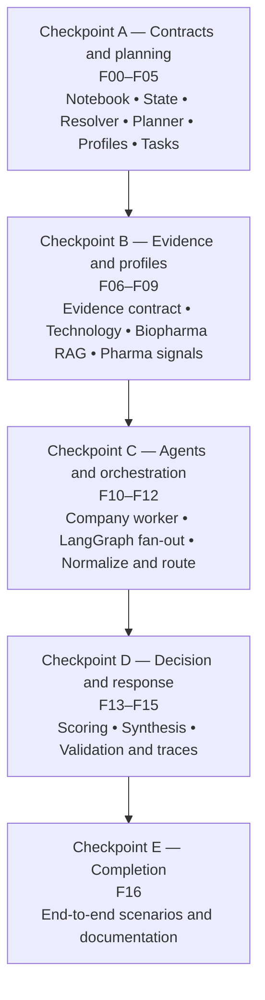

# Multi-Industry Financial Research Notebook
## Feature-by-Feature Implementation Plan

**Status:** Implemented through F16 for the notebook-local scope  
**Design source:** [Multi-Industry Financial Research Notebook LLD](multi-industry-financial-research-notebook-lld.md)  
**Target runtime:** Local Jupyter notebook  
**Working notebook:** `Autonomous_financial_analyst_Learners_Notebook copy.ipynb`  
**Initial profiles:** `technology.ai.v1` and `healthcare.biopharma.v1`

---

## 1. Implementation principles

- Keep all work notebook-local for this phase.
- Edit only `Autonomous_financial_analyst_Learners_Notebook copy.ipynb` among notebook artifacts.
  Companion integration scripts, deterministic tests, and design documents are maintained as
  implementation assets; merged, Part 1, Part 2, and unsolved notebooks remain read-only.
- Preserve assignment mark annotations and learner placeholders unless a feature explicitly requires editing that cell.
- Add state contracts before tools, tools before agents, and worker agents before the parent workflow.
- Preserve full agent autonomy over planning, permitted tool choice, tool sequencing, follow-up research, and explanation.
- Make resolver, profile, task, extraction, eligibility, and scoring capabilities agent-callable through guarded wrappers whose cores remain deterministic.
- Enforce non-bypassable graph gates for identity, profile/tool permissions, task budgets, evidence completeness, scoring eligibility, score fidelity, and final response validation.
- Build technology and biopharma as configurations of one generic worker runtime.
- Do not introduce production services, distributed workers, external databases, or new unsourced sector APIs.
- Keep live-provider checks separate from deterministic unit tests.

### 1.1 Capability categories

| Type | Purpose | Short example |
|---|---|---|
| Autonomous research tool | The LLM chooses when and how to retrieve information. | `search_financial_news("Microsoft AI")` |
| Guarded agent tool | The LLM requests an action, but deterministic Python produces the authoritative result. | `resolve_companies_tool(["Microsoft"])` returns registry-backed `MSFT` |
| Internal deterministic function | Hidden implementation called by a tool or graph node. | `resolve_company_mentions()` performs registry matching |
| Mandatory guardrail | Automatic validation that the LLM cannot skip or override. | `validate_resolution_gate()` blocks an ambiguous company |

The required execution pattern is:

```text
LLM tool call
  → input validation
  → deterministic implementation
  → output validation and state update
  → mandatory LangGraph gate
  → continue, clarify, retry, or stop
```

When a required call is missing, its validated state is also missing, so the graph gate must block progression or route back to that step.

---

## 2. Dependency order



### Exact feature dependencies

| Feature | Requires |
|---|---|
| F00 | None |
| F01 | F00 |
| F02 | F01 |
| F03 | F01 |
| F04 | F02 |
| F05 | F02, F03, F04 |
| F06 | F01 |
| F07 | F04, F06 |
| F08 | F04, F06 |
| F09 | F08 |
| F10 | F05, F07, F09 |
| F11 | F10 |
| F12 | F11 |
| F13 | F09, F12 |
| F14 | F12, F13 |
| F15 | F14 |
| F16 | F15 |

---

## 3. Feature summary

| ID | Feature | Primary output |
|---|---|---|
| F00 | Canonical notebook and section layout | One implementation notebook and stable section order |
| F01 | State contracts and run initialization | Conversation, run, worker, evidence, and result state types |
| F02 | Local company registry, resolver tool, and resolution gate | Canonical technology/biopharma identities before research |
| F03 | Structured free-text query planner | Validated `QueryPlan` |
| F04 | Industry Profile Registry and guarded selector | Versioned configurations and enforced tool permissions |
| F05 | Guarded research-plan and company-task builder | One validated, bounded task per company |
| F06 | Canonical evidence adapters | Consistent `EvidenceRecord` output |
| F07 | Technology profile refactor | Existing AI functionality behind `technology.ai.v1` |
| F08 | Biopharma RAG index and retrieval | Company-filtered biopharma evidence |
| F09 | Biopharma signal extraction and rubric gate | Structured pharma signals; scoring initially guarded |
| F10 | Generic company-worker subgraph | One isolated result per company |
| F11 | Parent LangGraph fan-out and fan-in | `Send`-based multi-company orchestration |
| F12 | Normalization and comparison routing | Single, same-profile, or cross-profile mode |
| F13 | Sector scoring and eligibility | Guarded deterministic technology and biopharma scoring |
| F14 | Mode-specific synthesis | Single-company, sector, and portfolio answers |
| F15 | Evidence validation and local traces | Evidence-ID validation and `.research_runs/` records |
| F16 | End-to-end scenario tests and documentation | Verified notebook behavior across all routing modes |

---

# 4. Feature details

## F00. Canonical notebook and section layout

**Implementation status:** Complete

### Goal

Prevent changes from drifting across four overlapping notebook artifacts.

### Dependencies

None.

### Notebook changes

1. Use `Autonomous_financial_analyst_Learners_Notebook copy.ipynb` as the only implementation notebook.
2. Preserve the merged, Part 1, Part 2, and unsolved notebooks as read-only references.
3. Add a new notebook section after the existing local router:

```text
Section 3.0 — Multi-Industry Orchestrator
Section 3.1 — State and Contracts
Section 3.2 — Company and Industry Registries
Section 3.3 — Evidence Adapters
Section 3.4 — Industry Profiles
Section 3.5 — Company Worker Graph
Section 3.6 — Parent Orchestrator Graph
Section 3.7 — Same- and Cross-Industry Synthesis
Section 3.8 — Validation and Tests
```

4. Update notebook metadata only if required to keep the existing `Project 2` kernel.

### Tests

- `nbformat.validate()` succeeds.
- All cell IDs remain unique.
- Existing Part 1 and Part 2 cells retain their order.
- Existing local tests can still locate their source cells.

### Definition of done

One documented notebook is the only target for subsequent feature work, with no deleted assignment scaffolding.

---

## F01. State contracts and fresh-run initialization

**Implementation status:** Complete

### Goal

Separate conversation memory from request-specific research evidence.

### Dependencies

F00.

### Notebook changes

Add definitions for:

- `QueryPlan`
- `ResolvedCompany`
- `EvidenceRecord`
- `CompanyTask`
- `CompanyResearchResult`
- `ScoringEligibility`
- `CompanyWorkerState`
- `OrchestratorState`

`company_results` uses a reset-aware map reducer: `initialize_research_run` emits a reset marker at the start of a request, and parallel workers later merge results by ticker.

Add:

```python
def initialize_research_run(state: OrchestratorState) -> dict:
    ...
```

It generates a new `run_id` and resets:

- Plan
- Resolved companies
- Company tasks
- Company results
- Comparison mode
- Scoring eligibility
- Scores
- Final answer
- Run errors
- Validation errors and retries

It preserves conversation messages and intentionally remembered company IDs.

### Tests

Create `tests/test_multiindustry_state.py`:

- New request receives a new `run_id`.
- Prior evidence, results, scores, and errors are cleared.
- Conversation messages remain available.
- Parallel company-result updates merge through the reducer.
- Worker state contains exactly one company task.

### Definition of done

Two consecutive questions using one `thread_id` share conversational context but cannot reuse prior evidence through graph state.

---

## F02. Local company registry and resolver

**Implementation status:** Complete

### Goal

Resolve free-text names to stable identities and supported profiles.

### Dependencies

F01.

### Notebook changes

Add a local `COMPANY_REGISTRY` containing at minimum:

- The five technology companies already in the AI corpus.
- The biopharma companies represented in `pharma_rag_official_sources.zip`.
- Canonical ticker, company name, aliases, exchange when known, industry, sub-industry, and profile ID.

Add:

```python
def resolve_company_mention(mention: str) -> ResolvedCompany:
    ...

def resolve_companies(plan: QueryPlan) -> list[ResolvedCompany]:
    ...

@tool
def resolve_companies_tool(company_mentions: list[str]) -> dict:
    """Coordinator-callable wrapper around deterministic registry resolution."""
    ...

def validate_resolution_gate(results: list[ResolvedCompany]) -> dict:
    """Return ready, needs_clarification, unsupported, or no_companies."""
    ...
```

The coordinator may decide when to call `resolve_companies_tool`, but it cannot supply canonical IDs, tickers, or profiles directly. The wrapper returns the deterministic resolution result plus a gate status. The parent graph must route through `validate_resolution_gate` and cannot enter profile selection or research fan-out unless `ready=True`.

Resolution must detect:

- Exact ticker
- Canonical name
- Known alias
- Duplicate mentions
- Ambiguous mentions
- Unsupported companies

### Tests

Create `tests/test_company_resolver.py`:

- `Microsoft` and `MSFT` resolve to the same company ID.
- `Google` resolves to the intended listed entity/ticker.
- `Pfizer` resolves to `healthcare.biopharma.v1`.
- Duplicate names and tickers collapse to one company.
- Ambiguous names return `ambiguous` instead of guessing.
- Unsupported names return `unsupported`.
- Technology and biopharma profiles are never swapped.
- Tool invocation returns the same canonical identities as the pure resolver.
- Ambiguous, unsupported, and empty inputs produce non-ready gate statuses.
- A mocked coordinator attempt to continue without a ready resolver result is routed to clarification or stop.

### Definition of done

The resolver is available to the coordinator as a tool, its result remains deterministic, and no research tool is called until the mandatory resolution gate reports `ready=True` for every requested company.

---

## F03. Structured free-text query planner

**Implementation status:** Complete

### Goal

Convert a natural-language question into a bounded, validated plan.

### Dependencies

F01.

### Notebook changes

Add `QUERY_PLANNER_PROMPT` and a structured model output matching `QueryPlan`.

Add:

```python
def plan_query(
    query: str,
    conversation_context: Sequence[BaseMessage],
) -> QueryPlan:
    ...

def validate_query_plan(plan: QueryPlan) -> list[str]:
    ...
```

The planner extracts:

- Query type
- Company mentions
- Requested dimensions
- Time horizon
- Risk profile
- Whether numeric scoring was requested
- Whether current evidence is required

The planner does not choose tools, profiles, or scoring eligibility.

### Tests

Create `tests/test_query_planner.py` using mocked structured outputs:

- Single-company analysis
- Same-industry comparison
- Cross-industry comparison
- Explicit ranking request
- Follow-up such as “compare their debt” using remembered companies
- Invalid risk profile rejected or defaulted deterministically
- Empty company list handled explicitly

### Definition of done

Representative free-text questions consistently produce valid `QueryPlan` objects without initiating research.

---

## F04. Industry Profile Registry

**Implementation status:** Complete

### Goal

Centralize industry-specific prompts, tools, dimensions, extractors, corpora, and scoring rules.

### Dependencies

F02.

### Notebook changes

Add:

```python
class IndustryProfile(TypedDict):
    ...

INDUSTRY_PROFILES = {
    "technology.ai.v1": TECHNOLOGY_AI_PROFILE,
    "healthcare.biopharma.v1": BIOPHARMA_PROFILE,
}
```

Add deterministic accessors:

```python
def get_industry_profile(profile_id: str) -> IndustryProfile:
    ...

def attach_industry_profiles(
    companies: list[ResolvedCompany],
) -> list[ResolvedCompany]:
    ...

@tool
def select_industry_profiles_tool(company_ids: list[str]) -> dict:
    """Return only registry-backed profiles and their permitted capabilities."""
    ...
```

The coordinator can invoke the guarded selector, but cannot invent a profile or expand its tool allowlist. A mandatory profile gate verifies that every resolved company maps to one supported versioned profile before tasks are created. Unknown profile IDs fail explicitly.

F04 registers tool contracts independently of callable binding because F07 and F08 implement the explicit technology and biopharma RAG adapters later. Shared tools are marked implemented; `query_technology_rag` and `query_biopharma_rag` are marked with their owning future feature. F10 must fail closed if an allowed contract still lacks a real callable when the worker is created.

### Tests

Create `tests/test_industry_profiles.py`:

- Each profile has a unique versioned ID.
- Every allowed tool has a registered contract; F10 later requires a real callable before binding.
- Technology profile uses only technology RAG.
- Biopharma profile uses only biopharma RAG.
- Required dimensions are non-empty.
- A profile with a rubric has a scoring function.
- Unsupported profile lookup fails clearly.
- Guarded selector output cannot contain a tool outside its registered profile allowlist.
- Fan-out is blocked when the profile gate is not valid.

### Definition of done

All current industry variation is selected through versioned configuration rather than `if sector == ...` logic scattered throughout the notebook. Mixed-profile selection is agent-callable, deterministic, and unable to pass the mandatory gate when a company is dropped, added, unknown, or assigned a swapped profile.

---

## F05. Research-plan and company-task builder

**Implementation status:** Complete

### Goal

Transform the validated query and resolved companies into one bounded task per company.

### Dependencies

F02, F03, and F04.

### Notebook changes

Add:

```python
def build_company_tasks(
    plan: QueryPlan,
    companies: list[ResolvedCompany],
) -> list[CompanyTask]:
    ...

@tool
def build_company_tasks_tool(run_id: str) -> dict:
    """Build tasks from the validated current-run plan, companies, and profiles."""
    ...

def validate_task_gate(tasks, companies, max_companies) -> dict:
    ...
```

The tool receives a run identifier instead of accepting arbitrary company identities, tool lists, or dimensions from the LLM. It reads validated current-run state and delegates to the pure task builder. The task gate is a required routing step before `Send` fan-out.

For the notebook-local implementation, `register_task_planning_context` stores defensive copies of the validated plan, companies, and profile selection under the current `run_id`. This is an in-process bridge until the parent F11 graph supplies the same values directly from `OrchestratorState`; it is not external or durable storage.

Rules:

- Include shared financial dimensions requested or required by the query.
- Add only dimensions supported by the company profile.
- Add only tools from the profile allowlist.
- Preserve the user’s time horizon and risk profile.
- Never include more than one company in a task.
- Apply a notebook-configured company-count limit.

### Tests

Create `tests/test_company_task_builder.py`:

- One task per unique resolved company.
- Technology task receives AI dimensions and technology RAG.
- Biopharma task receives pharma dimensions and biopharma RAG.
- Cross-industry query produces different profile-specific tasks from one shared plan.
- Unsupported dimensions are recorded rather than silently substituted.
- Company-count limit is enforced.
- Agent-supplied tool names or peer-company tasks cannot enter the task list.
- Missing, duplicate, or over-budget tasks fail the mandatory task gate.

### Definition of done

Every resolved request can be expressed through an agent-callable guarded tool as a finite list of isolated `CompanyTask` objects. The agent supplies only `run_id`, unsupported requested dimensions remain explicit, and only a valid task-gate result can reach fan-out.

---

## F06. Canonical evidence adapters

**Implementation status:** Complete

### Goal

Normalize shared source results into `EvidenceRecord` objects with identity, freshness, and provenance.

### Dependencies

F01.

### Notebook changes

Wrap the current functions without rewriting their underlying data access:

```python
fetch_price_evidence(task)
fetch_history_evidence(task)
fetch_financial_metric_evidence(task)
fetch_news_evidence(task)
fetch_sentiment_evidence(task)
```

Add:

```python
def to_evidence_record(
    run_id,
    company,
    profile_id,
    evidence_type,
    tool_result,
) -> list[EvidenceRecord]:
    ...
```

Every record receives a stable run-scoped `evidence_id`.

### Tests

Create `tests/test_evidence_contract.py`:

- Successful tool output converts correctly.
- Error output becomes `status="failed"` and is not accepted as evidence.
- Company/ticker mismatch is rejected.
- Retrieval and as-of dates remain distinct.
- Evidence IDs are unique within a run.
- Cache hits preserve provenance while recording the current cache status.

### Definition of done

Downstream normalization and synthesis no longer depend on tool-specific dictionary shapes. Evidence now includes stable run-scoped IDs, source metadata, separate `as_of` and `retrieved_at` values, and explicit cache, freshness, missing, and failed status.

---

## F07. Technology profile refactor

**Implementation status:** Complete

### Goal

Place the existing working AI implementation behind the new profile contract without changing its validated rubric behavior.

### Dependencies

F04 and F06.

### Notebook changes

1. Add `query_technology_rag` as an explicit wrapper or rename of `query_private_database`.
2. Preserve compatibility temporarily through a deprecated alias if existing assignment cells require it.
3. Bind the existing four dimensions to `technology.ai.v1`:
   - `infrastructure_moat`
   - `product_deployment`
   - `research_depth`
   - `strategic_commitment`
4. Wrap the current `extract_ai_signals` output with evidence IDs.
5. Rename or wrap `score_companies` as `score_technology_companies` while preserving the existing pure function.

### Tests

Create `tests/test_technology_profile.py`:

- Existing five-company signal outputs retain the same schema.
- Existing deterministic score fixtures remain unchanged.
- Technology retrieval cannot access the biopharma collection.
- Every non-missing signal contains evidence references.
- Deprecated alias returns the same result during migration.

### Definition of done

The current technology behavior works through `technology.ai.v1`. The explicit RAG wrapper enforces technology identity and collection scope, the signal adapter requires evidence IDs, and the profile-specific score wrapper preserves existing deterministic arithmetic.

---

## F08. Biopharma RAG index and retrieval

**Implementation status:** Complete

### Goal

Turn the existing official-source archive into a separate company-filtered local retrieval capability.

### Dependencies

F04 and F06.

### Notebook changes

1. Extract `content/pharma_rag_official_sources.zip` into a stable local directory.
2. Load its manifest and metadata schema.
3. Convert PDF pages and supported link records into documents.
4. Attach required metadata:
   - Company ID and ticker
   - Industry/sub-industry/profile
   - Document name and type
   - Publication date
   - Page
   - Corpus version
5. Build a separate `Biopharma_Official_Sources` Chroma collection.
6. Write a collection-specific completion marker only after a successful build.
7. Implement `query_biopharma_rag(ticker, query)` with mandatory ticker/profile filters.
8. Default the notebook-local index to the five-company starter set `PFE`, `MRK`, `LLY`, `JNJ`,
   and `AZN`; pass `tickers=None` only for an explicit full-corpus build.
9. Include the selected ticker scope in the index fingerprint and completion marker.
10. Print flushed progress logs for corpus reuse/extraction, each company and file, extracted page
    counts, token chunk totals, each company embedding batch, and index completion. Support
    `verbose=False` for tests or quiet runs.
11. Build each index attempt in a new immutable child directory and publish its directory name in
    the root completion marker only after every embedding batch succeeds. Never delete and reuse a
    Chroma SQLite path that may remain cached by the active notebook kernel.

### Tests

Create `tests/test_biopharma_rag.py` with a small local fixture corpus:

- Pfizer query returns only Pfizer chunks.
- Merck query cannot receive Pfizer chunks.
- Technology collection is never queried.
- Document/page metadata survives retrieval.
- Missing company evidence returns explicit `missing`.
- An incomplete index is not treated as ready.
- Corpus-version change triggers a rebuild requirement.
- Starter ticker selection changes the fingerprint and filters out unselected companies.
- Progress output identifies the company and ticker currently being extracted.
- Two forced builds under one persistence root publish different immutable child directories and
  both complete without reopening the same SQLite database path.

### Definition of done

The notebook can safely extract the local archive, build a separately versioned Chroma collection on demand, and retrieve company-isolated biopharma evidence without calling nonexistent sector APIs. Normal notebook startup does not unpack or embed the 221 MB archive automatically. The default starter build limits extraction and embedding to Pfizer, Merck, Eli Lilly, Johnson & Johnson, and AstraZeneca for faster local setup while preserving an explicit full-corpus option. Each successful rebuild atomically publishes a fresh immutable Chroma child directory, so an interrupted build or a path cached by the live kernel cannot make the next attempt write to a read-only SQLite handle.

---

## F09. Biopharma signal extraction and rubric gate

**Implementation status:** Complete

### Goal

Convert biopharma documents into a stable, comparable schema.

### Dependencies

F08.

### Notebook changes

Implement:

```python
extract_pharma_signals(
    companies: list[str],
    evidence_by_company: dict,
) -> dict
```

Initial dimensions:

- Clinical pipeline
- Regulatory progress
- Exclusivity and patents
- Commercialization
- Sector risks

Each signal returns:

```python
{
    "level": "none | partial | full | missing",
    "score": 0.0 | 0.5 | 1.0 | None,
    "reason": "...",
    "evidence_ids": [...],
}
```

Add `PHARMA_SIGNAL_RUBRIC` with explicit definitions and missing-data rules. F13 enables
`score_biopharma_companies` only after its fixed weights, inverted-risk mapping, strict completeness
gate, bands, and calibration fixtures pass.

### Tests

Create `tests/test_pharma_signal_extractor.py`:

- Same schema for every company.
- Missing evidence produces `missing`, not a guess.
- Evidence IDs belong to the requested company.
- Technology evidence is rejected.
- Extractor output is parseable and deterministic after structured normalization.
- Rubric definitions cover every level for every dimension.

### Definition of done

Biopharma evidence can be compared structurally across five fully defined levels and dimensions,
while ungrounded signals are downgraded to missing. F09 performs no arithmetic itself; F13 consumes
these signals only through its validated research-strength rubric.

---

## F10. Generic company-worker subgraph

**Implementation status:** Complete

### Goal

Research one company using a profile-configured agent graph.

### Dependencies

F05, F07, and F09.

### Notebook changes

Implement:

```python
def create_company_worker(profile: IndustryProfile):
    ...
```

Worker nodes:

```text
initialize_worker
→ worker_agent
→ execute_allowed_tools
→ worker_agent
→ mandatory_evidence_exit_gate
→ worker_agent when evidence is incomplete and budget remains
→ collect_evidence when complete or bounded-partial
→ extract_profile_signals
→ validate_company_result
→ END
```

The worker agent autonomously chooses which permitted source tool to call, the order of calls, and whether follow-up evidence is useful. The graph, not the agent, enforces the assigned ticker, profile allowlist, successful-evidence minimums, and tool-round ceiling.

Reuse existing:

- Tool logging
- Error capture
- Successful-call deduplication
- Retry-after-failure behavior
- Tool-round limits
- Citation correction patterns where applicable

New restrictions:

- One ticker per worker.
- Profile allowlist enforcement.
- No peer-company context.
- Evidence identity validation before result creation.

### Tests

Create `tests/test_company_worker.py` using mocked tools/models:

- Technology task binds only technology tools.
- Biopharma task binds only biopharma tools.
- Tool request outside the allowlist is rejected.
- Failed tool call does not fail the entire worker.
- Tool-round ceiling terminates even if the agent requests more work.
- Agent may select different valid tool sequences for the same task without bypassing the evidence exit gate.
- Worker output contains only its assigned ticker.
- Missing required dimension produces `partial`.

### Definition of done

The same worker graph produces isolated, validated results for both profiles using configuration rather than duplicated code. It fails closed when profile callables are missing, enforces ticker and tool boundaries, converts every result to canonical evidence, and terminates through bounded complete, partial, or failed outcomes.

---

## F11. Parent LangGraph fan-out and fan-in

**Implementation status:** Complete

### Goal

Coordinate free-text planning and one company branch per resolved company.

### Dependencies

F10.

### Notebook changes

Create the parent graph with nodes:

```text
initialize_run
coordinator_plan
resolve_companies_tool
mandatory_resolution_gate
select_industry_profiles_tool
mandatory_profile_gate
build_company_tasks_tool
mandatory_task_gate
fan_out_company_tasks
company_worker
collect_results
```

The coordinator chooses when to invoke its guarded planning tools. Conditional edges make their successful outcomes mandatory before `Send`; an LLM message that attempts to skip a tool is routed back to the missing step or to a bounded clarification/stop path.

Use LangGraph `Send` for company tasks and the F01 reset-aware map reducer for
`company_results`. The reducer merges by ticker without making list order part of identity.

Configure:

- Maximum supported companies per query.
- Local `max_concurrency`, initially 2 or 3.
- Parent recursion limit.
- Clear error accumulation for failed branches.

Do not call a raw `ThreadPoolExecutor` for company orchestration. Individual adapter internals may use bounded concurrency later if justified.

Implemented notebook-local details:

- `create_multi_company_orchestrator(...)` compiles the parent graph and injects fresh
  profile-specific F10 workers into one `Send` branch per task.
- `NotebookOrchestrator` caps caller-supplied `max_concurrency` and `recursion_limit` at the
  local factory settings.
- Resolution, profile, and task outputs are stored explicitly in `OrchestratorState`; each is
  recomputed by a mandatory gate before its downstream phase is reachable.
- A worker exception is converted into an identity-preserving failed
  `CompanyResearchResult`, so successful sibling branches remain available.
- `collect_results` validates expected branch coverage, run ID, company ID, profile ID, and
  evidence identity after the reducer fan-in barrier.
- The implementation is maintained by `scripts/implement_multiindustry_f11.py` and verified by
  `tests/test_multi_company_orchestrator.py`.

### Tests

Create `tests/test_multi_company_orchestrator.py`:

- One company creates one branch.
- Four companies create four isolated branches.
- Results merge without overwriting.
- Completion order does not change result identity.
- One failed branch does not erase successful branches.
- Company-count and concurrency configuration are enforced.
- Research fan-out cannot be reached by skipping resolution, profile, or task gates.

### Definition of done

The parent graph can fan out mixed technology and biopharma tasks and collect one result for every resolved company.

---

## F12. Normalization and comparison routing

**Implementation status:** Complete

### Goal

Validate fan-in results and select the correct response mode.

### Dependencies

F11.

### Notebook changes

Expose scoring eligibility as a guarded tool backed by a pure function:

```python
@tool
def check_scoring_eligibility_tool(run_id: str) -> ScoringEligibility:
    ...
```

The tool retrieves the eligibility decision from validated current-run state. The model cannot
pass raw metrics, profile configuration, rubric values, or a proposed decision. Deterministic
score computation remains F13 work and cannot run before this eligibility gate.

Implement:

```python
normalize_company_result(task, result, run_id)
normalize_all_results(tasks, results, run_id)
select_comparison_mode(results)
check_scoring_eligibility(results, mode)
```

Modes:

- `single`
- `same_profile`
- `cross_profile`

Normalization checks:

- Company identity
- Profile identity
- Evidence status
- Freshness
- Required dimensions
- Evidence IDs referenced by extracted signals
- Duplicate results

Implemented notebook-local details:

- `normalize_all_results(...)` restores authoritative task order regardless of `Send` completion
  order and produces exactly one normalized result for each expected task.
- Missing or identity-contaminated branches become identity-preserving failed placeholders;
  successful sibling branches remain available.
- Unexpected/duplicate inputs and malformed expected-task identity are blocking normalization
  errors. Ordinary missing evidence remains a contained partial/failed branch condition.
- Signal evidence IDs are checked against successful current-run evidence, stale evidence is
  rejected when freshness was requested, and financial summaries are rebuilt from normalized
  evidence rather than trusting worker-provided summaries.
- `validate_comparison_routing(...)` requires exact current-run task coverage before selecting
  `single`, `same_profile`, or `cross_profile`.
- Partial/failed results may still select the correct narrative mode, but
  `check_scoring_eligibility(...)` disables numeric scoring. Cross-profile and single-company
  modes always disable sector scoring; complete same-profile technology and biopharma comparisons
  may use only their own enabled versioned rubric.
- The parent F11 graph enables these mandatory post-fan-in nodes with `enable_f12=True`.

### Tests

Create `tests/test_fan_in_normalization.py` and `tests/test_comparison_mode_routing.py`:

- One company routes to `single`.
- Two technology companies route to `same_profile`.
- Two biopharma companies route to `same_profile`.
- Technology plus biopharma routes to `cross_profile`.
- Different healthcare sub-industry profiles route to `cross_profile`.
- Partial results disable numeric scoring.
- Cross-profile mode always disables sector scoring.
- Completion order cannot change normalized task order.
- Missing branches produce failed placeholders without erasing successful siblings.
- Cross-run, cross-company, cross-profile, duplicate, and unexpected data fail closed.
- The guarded eligibility tool accepts only a validated `run_id` context.

### Definition of done

The same normalized input always selects the same comparison mode and scoring decision.

---

## F13. Sector scoring and eligibility

**Implementation status:** Complete

### Goal

Preserve the legacy deterministic technology arithmetic and add a transparent notebook-local
biopharma research-strength rubric behind the same run-scoped guard.

### Dependencies

F12 and F09.

### Notebook changes

### Technology

- Consume only F12-normalized canonical company results from the validated current run.
- Require at least two complete `technology.ai.v1` results and an eligible `same_profile`
  comparison before score computation is available.
- Rebuild the legacy scoring inputs from canonical evidence rather than accepting an agent-supplied
  score payload.
- Require all five legacy financial metrics for every company: `market_cap`, `total_revenue`,
  `pe_ratio`, `beta`, and `dividend_yield`. Every value must be numeric and finite.
- Require all four technology signals to be complete and grounded in valid current-run evidence.
  Derive each numeric signal value from the fixed level mapping (`none=0.0`, `partial=0.5`,
  `full=1.0`) instead of trusting a stored or LLM-generated `score` field.
- Delegate the final calculation to the existing `score_technology_companies`/
  `score_companies` arithmetic unchanged, including the conservative, balanced, and growth weights.
- Read `risk_profile` from the validated query plan; neither the agent nor the guarded score-tool
  call may override it.

Expose the computation through a guarded tool whose only public argument is the current `run_id`:

```python
@tool
def compute_sector_scores_tool(run_id: str) -> dict:
    ...
```

The wrapper resolves an immutable validated scoring context for that run, rejects absent or stale
contexts, rechecks eligibility and canonical input completeness, and then invokes the selected
deterministic sector scorer. Raw metrics, signals, weights, risk profiles, and proposed scores are not tool
arguments.

### Biopharma

- Enable only `healthcare.biopharma.score.v1` for complete `healthcare.biopharma.v1` peers.
- Reuse and normalize the legacy five-metric financial rank component.
- Map positive pharma levels as `none=0.0`, `partial=0.5`, `full=1.0`; invert `sector_risks` to
  `none=1.0`, `partial=0.5`, `full=0.0`.
- Use sector-signal weights `(15,20,25,20,20)%` for conservative, `(25,20,20,20,15)%` for
  balanced, and `(35,25,10,20,10)%` for growth in the documented dimension order.
- Blend financial/pharma components at `60/40`, `50/50`, and `35/65` respectively.
- Return 0–100 `Strong`, `Moderate`, or `Weak research profile` bands at thresholds 70 and 50;
  never label these bands Buy/Hold/Sell.
- Reject missing/non-finite metrics, missing/ungrounded signals, and incomplete results without
  imputation.

### Ineligible modes and results

- Reject score computation for `single` and `cross_profile` modes.
- Reject partial or failed company results, missing/non-finite financial metrics, incomplete or
  ungrounded signals, and any request whose F12 eligibility decision is false.
- Never apply a technology rubric to biopharma, a biopharma rubric to technology, or either rubric
  to mixed-profile results. There is no validated portfolio-level cross-industry rubric in v1.

### Tests

`tests/test_sector_scoring.py` verifies:

- Same inputs produce identical scores.
- Legacy technology arithmetic and score fixtures do not regress.
- The five financial metrics must exist and be finite for every company.
- Signal numbers are re-derived from the fixed level mapping; injected signal `score` values cannot
  change the result.
- Missing signal dimensions and signals without valid evidence IDs prevent scoring.
- The risk profile comes from the immutable query plan and cannot be supplied to the score tool.
- Single-company, cross-profile, partial/failed, profile-disabled, and otherwise ineligible
  requests are rejected.
- LLM-generated metrics, weights, risk profiles, and scores cannot enter the arithmetic path.
- Guarded score-tool output matches direct pure-function output.
- The guarded tool accepts only `run_id`, reads immutable validated current-run context, and rejects
  unknown, stale, or mismatched contexts.
- Score calls made without a valid eligibility result are rejected before legacy arithmetic runs.
- Biopharma fixtures verify risk inversion, all three risk profiles, component weights, research
  bands, strict missing-data rejection, fixed-level derivation, and guarded-tool parity.

### Definition of done

An agent can request technology or biopharma scoring with only `run_id`, but cannot provide or
alter numeric inputs. Eligible technology peers reproduce the legacy table; eligible biopharma
peers reproduce the documented research-strength rubric. Single-company, cross-profile, partial,
ungrounded, and non-finite requests cannot score; repeated validated inputs are identical.

---

## F14. Mode-specific synthesis

**Implementation status:** Complete

### Goal

Produce grounded answers appropriate to single-company, same-profile, and cross-profile requests.

### Dependencies

F12 and F13.

### Notebook changes

Implemented one factory with mode-specific prompts:

```python
create_synthesizer(
    mode: ComparisonMode,
    profile: IndustryProfile | None = None,
)
```

The public execution boundary is:

```python
synthesize_answer(
    context: SynthesisContext | Mapping[str, Any],
    injected_model: Any,
) -> SynthesisResult
```

`SynthesisContext` carries the current `run_id`, original query, F12 mode, normalized results,
scoring eligibility, and optional authoritative F13 scores. `SynthesisResult` contains the mode,
answer, cited evidence IDs, authoritative scores actually used, and limitations.

### Single-company prompt

- Summarize shared financial and profile-specific evidence.
- Report missing dimensions.
- Cite evidence IDs.

### Same-profile prompt

- Compare like-for-like sector dimensions.
- Explain authoritative deterministic scores when eligible.
- Do not recompute or reorder scores.
- Explain only the optional authoritative F13 score table already supplied after F12/F13 guards.

### Cross-profile prompt

- Compare shared financial dimensions.
- Apply sector context to interpretation.
- Present profile-specific findings separately.
- State that no universal numeric score was applied.

### Implemented boundaries

- F14 performs no research, retrieval, normalization, or score arithmetic.
- The injected model receives only two messages: a mode policy and serialized bounded context.
  No tools are bound to the model in any mode.
- Context validation rechecks the selected F12 mode and current-run company, profile, and evidence
  identities before model invocation.
- Only successful supplied evidence IDs may appear in the structured result, and at least one is
  required when usable evidence exists.
- Single and cross-profile contexts reject any non-empty score table.
- Same-profile scores require positive F12 eligibility and exact coverage of the normalized company
  set. The returned `scores_used` is a defensive copy of F13 output; model-proposed score fields are
  ignored.
- Missing dimensions, partial/failed company results, source errors, scoring ineligibility, and the
  cross-profile no-universal-score rule are appended as mandatory deterministic limitations.
- F15 remains responsible for validating claims inside answer prose, exact score fidelity in prose,
  and final cross-profile narrative boundaries.

### Tests

`tests/test_synthesis_modes.py` uses mocked model responses to verify:

- Correct prompt selected for every mode.
- Cross-profile prompt excludes both sector rubrics.
- Score table passed as immutable context.
- Missing-company and partial-result limitations are included.
- Synthesizer exposes no source-research, eligibility, or scoring tools in any mode.
- Single and cross-profile score injection is rejected.
- Fabricated, stale, and missing evidence citations fail closed.
- Mode/result mismatches fail before model invocation.
- Notebook cells remain synchronized with `scripts/implement_multiindustry_f14.py`.

### Definition of done

Every comparison mode produces a structured response using only current-run normalized results and
the correct synthesis policy. F13 scores cannot be introduced in an ineligible mode or altered by
the synthesis model, and incomplete evidence is disclosed even when the model omits the limitation.

---

## F15. Evidence validation and local run traces

**Implementation status:** Complete

### Goal

Bind final claims to current-run evidence and make notebook behavior inspectable.

### Dependencies

F14.

### Notebook changes

Implemented deterministic validation:

```python
validate_synthesis_result(
    run_id,
    normalized_results,
    synthesis_result,
    *,
    authoritative_scores=None,
    scoring_eligibility=None,
    required_limitations=None,
) -> ValidationResult
```

`ValidationResult` reports the overall verdict, validated IDs, inline and declared IDs, separate
evidence/score/mode/limitation flags, and deterministic errors. Validation rejects:

- Unknown evidence IDs
- Evidence IDs from another `run_id`
- Evidence belonging to another company or profile
- Failed evidence and ambiguous duplicate IDs
- Drift between ordered inline `[EV-*]` citations and `SynthesisResult.evidence_ids`
- Any change to the authoritative structured F13 score table
- Recognizable prose score/rank claims that disagree with F13
- Numeric score/rank claims in `single` or `cross_profile` mode
- Missing mandatory F14 limitations

`run_f15_validated_synthesis(...)` wires F14 synthesis, validation, and trace publication. An
invalid draft receives deterministic correction feedback through the same tool-free F14 model.
The hard limit is two correction calls after the initial draft. Retry exhaustion preserves the
last answer, appends explicit validation warnings, and returns `final_status="failed"`.

These validators are graph controls, not tools offered to an agent. Every synthesis path must traverse them before `END`, so an autonomous agent cannot declare its own answer grounded, override a score mismatch, or opt into cross-industry scoring.

Local trace APIs are:

```python
create_research_trace(...)
record_validation_attempt(...)
finalize_research_trace(...)
write_research_trace(...)
```

They write `.research_runs/<run_id>.json`, now covered by `.gitignore`. Records include query,
mode, canonical companies, profiles, provenance-only evidence metadata, F13 scores, latest F14
synthesis, all validation attempts, UTC timestamps, and final status. Same-directory temporary
writes plus `fsync`/`os.replace` provide atomic publication; retention is bounded. Sensitive fields
are recursively redacted, signed URL parameters are removed, and full private-document values,
chunks, page content, and source metadata are excluded.

### Tests

Focused suites are `tests/test_f15_evidence_validation.py`, `tests/test_f15_local_traces.py`, and
`tests/test_f15_workflow.py`. They verify:

- Valid evidence IDs pass.
- Unknown and prior-run IDs fail.
- Wrong-company evidence fails.
- Wrong-profile, failed, duplicate, inline/list drift, and duplicate citations fail.
- Score-fidelity mismatch fails.
- Single/cross-profile numeric scoring and ranking fail.
- Mandatory limitations are independently reconstructed.
- Retry exhaustion terminates.
- Successful, failed, and interrupted traces are explicit.
- Atomic-write failure preserves the previous record and removes temporary files.
- Retention is bounded and unsafe run IDs are rejected.
- Trace excludes API keys, configuration secrets, raw credentials, and private-document content.
- Representative single-company, same-profile, and cross-profile examples all pass locally without
  provider calls.

### Definition of done

A successful final answer cannot silently cite unavailable evidence, alter deterministic scoring,
violate its comparison mode, or omit required limitations. Every attempt is inspectable in a
bounded redacted trace. The validator makes no claim of semantic entailment beyond these explicit
machine-checkable contracts.

---

## F16. End-to-end scenarios and documentation

**Implementation status:** Complete

### Goal

Verify the complete local workflow and document its supported behavior.

### Dependencies

F15.

### Notebook changes

The canonical notebook contains executed, retained-output demonstrations for:

1. Single technology company.
2. Single biopharma company.
3. Same-profile technology comparison.
4. Same-profile biopharma comparison.
5. Cross-profile technology-versus-biopharma comparison.
6. Supported alias resolution.
7. Unknown company bounded stop.
8. Partial tool/RAG failure with usable evidence retained.
9. Invalid current-run evidence-ID rejection.
10. Modified authoritative F13 score rejection.

The saved output contains compact routing, validation, attempt, and trace-filename metadata only.
Seven scenarios succeed, the unknown company stops before research without a trace, and the two
deliberate integrity probes fail F15 validation. Nine redacted `.research_runs/*.json` records are
created.

Completed documentation updates:

- Notebook narrative cells
- LLD routing, scoring, F15 trace, F16 setup, command, outcome, and limitation sections
- Feature implementation plan and completion checkpoint

No new dependency was required. The notebook baseline remains a description of the simpler learner
baseline rather than the F16 implementation specification.

### Tests

Implemented:

- `tests/test_f16_end_to_end_scenarios.py`: ten offline scenarios using actual F1–F15 deterministic
  boundaries and fake market, history, sentiment, RAG, and synthesis providers.
- `scripts/run_f16_scenarios.py`: import-safe four-primary and all-ten offline runners with compact
  summaries.
- `tests/test_f16_live_smoke.py`: offline runner checks plus an optional live boundary.
- `scripts/f16_live_adapter.py`: presence-only readiness checks and a hard-gated adapter over the
  notebook's initialized real graph/tools; it performs no work at import time.
- `tests/test_f16_live_adapter.py`: opt-in, configuration, RAG-readiness, routing, scoring-entry,
  bounded-stop, and secret-nondisclosure tests with injected fakes.
- `tests/test_f16_notebook_demo.py`: notebook source/output synchronization and isolated rerun.

Live smoke is opt-in only. The notebook cell requires `F16_ENABLE_LIVE_TESTS=1`, all three provider
environment-variable names, initialized F1–F15 contracts/tools, and the notebook's local RAG setup
cells. It constructs the adapter directly from `globals()`; no separate adapter environment
variable is required in the notebook. `F16_LIVE_ADAPTER=module:function` remains available only for
the standalone runner's external injection path. Missing configuration blocks before provider
invocation, and compact output never includes configuration values, answer prose, private content,
or full trace paths.

Online notebook sequence:

1. Run configuration and provider-tool cells without displaying secret values.
2. Build/configure the technology and biopharma RAG stores.
3. Run F1–F15 and the F16 runner setup cell.
4. Edit `USER_QUERY` and run the clearly labelled F16 free-text online cell; that execution is the
   explicit opt-in.

The free-text cell bootstraps import-safe tool objects from `scripts/f16_live_tools.py`, so it no
longer requires the original Part 1 tool cells to be rerun after a kernel restart. It restores the
existing technology index without rebuilding it and adds canonical `get_financial_metrics` to
both profile allowlists for eligible F13 scoring.

The adapter prints safe scenario/company/mode progress and displays only an F15-validated final
answer, never a failed draft or retrieved document body. It executes deterministic F13 scoring
only when the LLM plan explicitly requests scoring and F12 revalidation authorizes it; otherwise
F14 produces a qualitative mode-correct answer with mandatory limitations.

The notebook also exposes `ask_financial_analyst(query)` for direct learner testing. Its input is
only a free-text sentence; company resolution and comparison-mode selection remain graph
responsibilities. The accompanying cell prints the guarded route, validation result, optional
F13 ranking, validated answer, and trace filename.

Documentation deliverables:

- Concise `Attributes` documentation for every field of every F00–F16 `TypedDict` state/contract.
- A docstring on every class, method, helper, and nested LangGraph node.
- `scripts/generate_multiindustry_contract_reference.py`, which produces the exhaustive
  `docs/designs/multi-industry-state-contract-method-reference.md` developer/agent index.
- `tests/test_multiindustry_documentation_contracts.py`, which prevents undocumented definitions
  or fields from being reintroduced.

Commands:

```bash
.venv/bin/python -m pytest -q tests/test_f16_end_to_end_scenarios.py \
  tests/test_f16_live_smoke.py tests/test_f16_live_adapter.py \
  tests/test_f16_notebook_demo.py
.venv/bin/python -m scripts.run_f16_scenarios --all-offline
```

### Definition of done

All ten offline scenarios exhibit the intended implemented boundary, compact outputs are retained
in the canonical notebook, and the default suite uses no credentials or network calls. Optional
live execution remains separately gated and was not run without explicit opt-in.

---

# 5. Delivery checkpoints

## Checkpoint A — Contracts and planning

Features: F00–F05.

Outcome:

- Stable state model
- Free-text plan
- Deterministic company resolution
- Profile selection
- Isolated company tasks

Do not start LangGraph fan-out before this checkpoint passes.

## Checkpoint B — Evidence and both profiles

Features: F06–F09.

Outcome:

- Canonical evidence
- Existing technology behavior preserved
- Biopharma corpus indexed and filtered
- Structured biopharma signals available

Biopharma numeric scoring may remain disabled at this checkpoint.

## Checkpoint C — Agents and orchestration

Features: F10–F12.

Outcome:

- Generic company worker
- `Send`-based multi-company graph
- Deterministic fan-in normalization
- Correct same- versus cross-profile routing

## Checkpoint D — Scoring, synthesis, and validation

Features: F13–F15.

Outcome:

- Profile-specific scoring boundaries
- Three synthesis modes
- Evidence-ID validation
- Local run traces

## Checkpoint E — Completion

Feature: F16.

Outcome:

- Complete deterministic test suite
- Optional live integration demonstrations
- Updated notebook and design documentation

---

# 6. Explicitly deferred work

- Production service extraction
- Durable or distributed LangGraph execution
- Shared database/Redis cache
- Distributed locking
- External security-master integration
- Provider/insurer/medtech profiles
- ClinicalTrials.gov, FDA, or EMA adapters unless explicitly sourced later
- Cross-industry numeric portfolio rubric
- Multi-user security controls
- Trade execution
