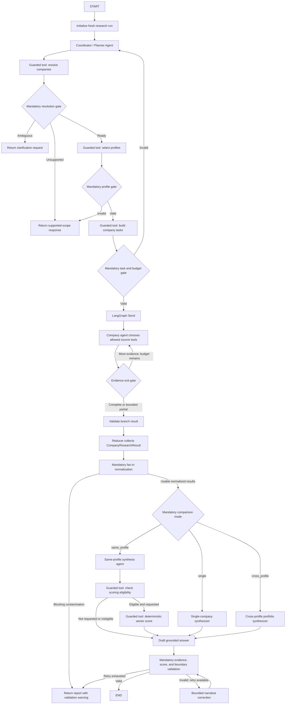

# Multi-Industry Financial Research Notebook
## Low-Level Design

**Status:** Implemented notebook-local design through F16; production extensions deferred  
**Supported profiles:** Technology/AI and Healthcare/Biopharma  
**Runtime:** Local Jupyter notebook with LangGraph, local Chroma, `MemorySaver`, `.api_cache/`, and redacted `.research_runs/` traces  
**Working notebook:** `Autonomous_financial_analyst_Learners_Notebook copy.ipynb`; all other notebooks are read-only references  
**Related documents:** [Notebook Baseline Design](autonomous-financial-research-notebook-baseline-design.md) and [Open-Universe Orchestrator HLD](open-universe-orchestrator-final-hld.md)

---

## 1. Purpose and boundaries

This design extends the current notebook so a user can enter a free-text question containing one or more companies. The notebook must resolve the companies, select the correct industry playbook, research each company independently, and choose an appropriate synthesis path.

The first supported profiles are:

- `technology.ai.v1`
- `healthcare.biopharma.v1`

Healthcare v1 is intentionally limited to biopharma. The available local archive contains official pharma/biopharma reports; it does not establish equivalent support for providers, insurers, medtech, or every company classified broadly as healthcare.

The notebook must support:

1. One-company research.
2. Multiple companies using the same industry profile.
3. Multiple companies using different profiles.
4. Ambiguous, duplicated, unsupported, or partially failed company requests.

The implementation remains inside one notebook process. It does not introduce deployed services, distributed workers, durable workflow storage, authentication, or a production security master.

### 1.1 Core decisions

- Define state and evidence contracts before adding graph nodes.
- Use LangGraph `Send` for company-level fan-out.
- Use one generic company-worker graph configured by an industry profile.
- Let LLM agents interpret questions, choose and sequence permitted tools, decide when more evidence is needed, and explain validated evidence.
- Expose identity resolution, profile selection, task construction, extraction, eligibility, and scoring as guarded deterministic tools where agent autonomy benefits from invoking them.
- Keep tool internals, state reducers, allowlists, budgets, evidence normalization, and final validation deterministic and non-bypassable.
- Require mandatory graph gates before research fan-out, scoring, and final response; an agent may choose its path, but it cannot skip the invariants needed to leave a phase.
- Permit numeric scoring only when all compared companies share a compatible, validated rubric.
- Use qualitative portfolio synthesis for technology-versus-biopharma requests unless a separate cross-industry rubric is explicitly implemented.

---

## 2. State design

### 2.1 State lifetimes

| State | Lifetime | Contents |
|---|---|---|
| Conversation context | Across turns in one local `thread_id` | Messages, remembered companies, last selected profiles |
| Research run | One user request | Plan, resolved companies, tasks, evidence, results, scores, errors |
| Company worker | One company branch | Company task, messages, tool results, evidence, signals, retries |
| Local cache | Across runs until TTL expiry | JSON-serializable adapter and report results |
| Vector indexes | Across runs until corpus version changes | Technology and biopharma Chroma collections |

An initialization node must overwrite every research-run field for a new user request. Conversation messages may persist; prior evidence and scores must not silently carry into a later run.

### 2.2 Query plan

```python
class QueryPlan(TypedDict):
    query_type: str
    # fact | analyze | compare | rank

    company_mentions: list[str]
    requested_dimensions: list[str]
    risk_profile: str
    # conservative | balanced | growth

    scoring_requested: bool
    freshness_required: bool
    time_horizon: str | None
```

The planner extracts intent. It does not establish canonical identities, choose final profiles, or declare scoring eligibility.

### 2.3 Resolved company

```python
class ResolvedCompany(TypedDict):
    company_id: str
    ticker: str
    company_name: str
    aliases: list[str]
    exchange: str | None

    industry: str
    sub_industry: str
    profile_id: str

    resolution_status: str
    # resolved | ambiguous | unsupported

    resolution_message: str | None
```

The local company registry is authoritative for the notebook. LLM recognition may propose a company, but deterministic registry validation produces the final `ResolvedCompany`.

### 2.4 Evidence record

```python
class EvidenceRecord(TypedDict):
    evidence_id: str
    run_id: str

    company_id: str
    ticker: str
    profile_id: str

    evidence_type: str
    value: Any

    source_name: str
    source_uri: str | None
    document_name: str | None
    page: int | None

    as_of: str | None
    retrieved_at: str
    freshness_status: str
    # fresh | stale | unknown

    status: str
    # success | missing | failed

    error: str | None
```

Every factual result must be representable as an `EvidenceRecord`. Final responses cite `evidence_id` values instead of relying only on tool-name citations.

### 2.5 Company task

```python
class CompanyTask(TypedDict):
    run_id: str
    company: ResolvedCompany
    query_plan: QueryPlan

    shared_dimensions: list[str]
    industry_dimensions: list[str]
    allowed_tools: list[str]
```

One task contains exactly one company. A task never contains peer-company evidence.

### 2.6 Company worker state

```python
class CompanyWorkerState(TypedDict):
    task: CompanyTask

    messages: Annotated[Sequence[BaseMessage], add_messages]
    evidence: list[EvidenceRecord]
    industry_signals: dict

    tool_round_count: int
    validation_retry_count: int

    result: "CompanyResearchResult | None"
    errors: list[str]
```

The worker state is branch-local. Tool results from one company must never be appended to another company’s worker state.

### 2.7 Company result

```python
class CompanyResearchResult(TypedDict):
    run_id: str
    company: ResolvedCompany
    profile_id: str

    financial_evidence: dict
    industry_signals: dict
    evidence: list[EvidenceRecord]

    missing_dimensions: list[str]
    errors: list[str]
    status: str
    # success | partial | failed
```

### 2.8 Scoring decision

```python
class ScoringEligibility(TypedDict):
    eligible: bool
    rubric_id: str | None
    reason: str
    excluded_companies: list[str]
    missing_requirements: dict[str, list[str]]
```

Scoring eligibility is determined before a scoring function runs. A synthesizer cannot override this result.

Parallel company results use a reset-aware map reducer. The reset marker clears prior-run results when a new request starts; subsequent worker updates merge by ticker.

```python
@dataclass(frozen=True)
class ResetCompanyResults:
    pass


def merge_company_results(current, update):
    if isinstance(update, ResetCompanyResults):
        return {}
    return {**(current or {}), **(update or {})}
```

### 2.9 Orchestrator state

```python
class OrchestratorState(TypedDict):
    messages: Annotated[Sequence[BaseMessage], add_messages]
    remembered_company_ids: list[str]
    last_profile_ids: list[str]

    run_id: str
    original_query: str
    plan: QueryPlan | None
    resolved_companies: list[ResolvedCompany]
    company_tasks: list[CompanyTask]

    company_results: Annotated[
        dict[str, CompanyResearchResult],
        merge_company_results,
    ]
    normalized_company_results: dict[str, CompanyResearchResult]
    fan_in_normalization: dict | None

    comparison_mode: str | None
    # single | same_profile | cross_profile
    comparison_route_status: dict | None

    scoring_eligibility: ScoringEligibility | None
    scores: dict | None

    final_answer: str | None
    validation_retry_count: int
    validation_errors: list[str]
    run_errors: list[str]
```

`company_results` uses the reset-aware reducer because multiple `Send` branches may return updates concurrently. Worker errors remain inside each `CompanyResearchResult`; the parent derives the run-level error list after fan-in.

---

## 3. Tool design

### 3.0 Capability categories

| Type | Purpose | Short example |
|---|---|---|
| Autonomous research tool | The LLM decides when and how to collect information. | Call `search_financial_news("Microsoft AI")`. |
| Guarded agent tool | The LLM requests an action, while deterministic Python controls the result. | Call `resolve_companies_tool(["Microsoft"])`; the registry returns `MSFT`. |
| Internal deterministic function | Hidden Python implementation used by a tool wrapper or workflow node. | `resolve_company_mentions()` performs registry matching. |
| Mandatory guardrail | Software automatically checks correctness; the LLM cannot skip or override it. | `validate_resolution_gate()` blocks research when `Roche` is ambiguous. |

Internal deterministic functions and mandatory guardrails are software controls rather than entries in the LLM's tool inventory. For a guarded tool, validation occurs in the same execution chain and is checked again at the graph transition:

```text
LLM calls tool
  → validate tool input
  → run deterministic function
  → validate tool output and save it in state
  → mandatory LangGraph gate
  → continue, clarify, retry, or stop
```

If the LLM omits a required tool call, the expected validated state is absent and the mandatory gate blocks progress or routes back to the missing step.

### 3.1 Existing shared capabilities

| Capability | Current form | LLD use |
|---|---|---|
| `get_stock_price` | Agent-callable tool | Shared market adapter |
| `get_stock_history` | Agent-callable tool | Shared history adapter |
| `search_financial_news` | Agent-callable tool | Shared news adapter |
| `analyze_sentiment` | Agent-callable tool | Shared text analysis tool |
| `get_financial_metrics` | Deterministic function | Shared comparison evidence |
| `get_relevant_articles` | Deterministic helper | Bounded article selection |
| `get_average_sentiment` | Deterministic helper | Article-backed aggregate sentiment |
| `query_private_database` | Technology-specific RAG tool with a generic name | Rename/wrap as `query_technology_rag` |
| `extract_ai_signals` | Technology extractor | Reuse under `technology.ai.v1` |
| `score_companies` | Technology scoring function | Rename/wrap as `score_technology_companies` |
| `cached_call` | Local caching decorator | Reuse for local adapter calls |

### 3.2 Autonomous research tools

Research agents decide which of these tools to call, in which order, and whether another call is needed. Their freedom is bounded by the active profile allowlist, the assigned company, tool-round budgets, and evidence requirements.

#### `query_technology_rag`

Refactors the current `query_private_database` contract so its scope is explicit.

```python
@tool
def query_technology_rag(ticker: str, query: str) -> str:
    """Retrieve technology/AI evidence for one supported company."""
```

#### `query_biopharma_rag`

Uses the local official-source archive and a separate Chroma collection.

```python
@tool
def query_biopharma_rag(ticker: str, query: str) -> str:
    """Retrieve biopharma evidence for one supported company."""
```

The biopharma profile initially exposes one real RAG tool. Separate clinical-trial or regulatory-event tools must not be invented without actual corresponding APIs or datasets.

### 3.3 Guarded deterministic agent tools

“Agent-callable” describes who may invoke a capability; “deterministic” describes how it computes its result. These properties are compatible. The coordinator and synthesis agents may invoke the following tools, but cannot alter their algorithms, read outside current validated state, or bypass their validation outcomes.

| Guarded tool | Agent freedom | Deterministic constraint | Mandatory gate |
|---|---|---|---|
| `resolve_companies_tool` | Decide when resolution is needed and pass extracted mentions | Registry matching, deduplication, ambiguity, and support status | Research cannot start until all companies are resolved |
| `select_industry_profiles_tool` | Request profiles for resolved companies | Profile IDs come only from the registry | Every company must have a supported, versioned profile |
| `build_company_tasks_tool` | Request bounded tasks from the validated plan | One company per task; dimensions and tools are allowlisted | Fan-out requires a valid task for every company |
| `extract_profile_signals_tool` | Request sector signal extraction after evidence collection | Structured schema, evidence-ID checks, and profile-specific extractor | Company result cannot complete with invalid signals |
| `check_scoring_eligibility_tool` | Ask whether numeric scoring is allowed | Uses normalized current-run results and fixed rules | Score tool is unavailable when ineligible |
| `compute_sector_scores_tool` | Request a score for an eligible current run by passing only `run_id` | Reads immutable validated state and the query plan's risk profile; fixed rubric and arithmetic; no LLM-supplied values | Final answer must match the authoritative score table |

The guarded-tool pattern separates the public tool wrapper from a pure function and an exit gate:

```python
def resolve_company_mentions(mentions: list[str]) -> list[ResolvedCompany]:
    """Pure registry-backed implementation."""

@tool
def resolve_companies_tool(company_mentions: list[str]) -> dict:
    results = resolve_company_mentions(company_mentions)
    return validate_resolution_gate(results)

def route_after_resolution(state):
    # Non-bypassable graph control.
    return "profiles" if state["resolution"]["ready"] else "clarify_or_stop"
```

The scoring eligibility and computation tools accept only `run_id`. They do not accept an
agent-supplied profile, risk profile, financial metrics, evidence, signal values, weights, or final
scores. The implementation reads an immutable validated current-run context; `risk_profile` comes
from that run's validated query plan.

### 3.4 Mandatory system controls

The following remain normal Python functions or graph routing controls because agents must not be able to replace or skip them:

```python
initialize_run_state(state)
merge_company_results(left, right)
normalize_evidence(records)
normalize_company_result(result)
select_comparison_mode(results)

validate_resolution_gate(results)
validate_task_gate(tasks, companies)
validate_company_result(result)
validate_evidence_ids(answer, available_evidence)
validate_score_fidelity(answer, scores)
validate_cross_profile_boundary(answer, mode)
```

These controls also enforce company isolation, retry and tool-round ceilings, local concurrency limits, cache provenance, and terminal routing.

### 3.5 Tool allowlists

```python
TECHNOLOGY_TOOL_NAMES = [
    "get_stock_price",
    "get_stock_history",
    "search_financial_news",
    "analyze_sentiment",
    "query_technology_rag",
]

BIOPHARMA_TOOL_NAMES = [
    "get_stock_price",
    "get_stock_history",
    "search_financial_news",
    "analyze_sentiment",
    "query_biopharma_rag",
]
```

The profile selects the tool list before the worker graph is invoked. A technology worker cannot call biopharma RAG, and a biopharma worker cannot call technology RAG.

Coordinator and synthesis agents receive only their role-specific guarded tools. Company workers receive only the source tools listed by their selected profile. No agent is given the complete global tool catalog.

### 3.6 Tool-result contract

Source tools return explicit status rather than throwing unhandled exceptions:

```python
{
    "status": "success | missing | error",
    "data": ..., 
    "source": ..., 
    "retrieved_at": ..., 
    "as_of": ..., 
    "error": None,
}
```

The worker converts this result into one or more `EvidenceRecord` objects. Failed calls remain retryable and must not count as successful evidence.

---

## 4. Industry Profile Registry

```python
class IndustryProfile(TypedDict):
    profile_id: str
    industry: str
    sub_industry: str

    worker_prompt: str
    allowed_tools: list[str]

    shared_dimensions: list[str]
    industry_dimensions: list[str]

    rag_collection: str
    corpus_version: str

    signal_extractor: Callable
    rubric_id: str | None
    scoring_function: Callable | None
    synthesis_prompt: str
```

### 4.1 Technology profile

```python
TECHNOLOGY_AI_PROFILE = {
    "profile_id": "technology.ai.v1",
    "industry": "technology",
    "sub_industry": "ai_platforms",
    "allowed_tools": TECHNOLOGY_TOOL_NAMES,
    "industry_dimensions": [
        "infrastructure_moat",
        "product_deployment",
        "research_depth",
        "strategic_commitment",
    ],
    "rag_collection": "AI_Initiatives",
    "signal_extractor": extract_technology_signals_with_evidence,
    "rubric_id": "technology.ai.score.v1",
    "scoring_function": score_technology_companies,
}
```

### 4.2 Biopharma profile

```python
BIOPHARMA_PROFILE = {
    "profile_id": "healthcare.biopharma.v1",
    "industry": "healthcare",
    "sub_industry": "biopharma",
    "allowed_tools": BIOPHARMA_TOOL_NAMES,
    "industry_dimensions": [
        "clinical_pipeline",
        "regulatory_progress",
        "exclusivity_and_patents",
        "commercialization",
        "sector_risks",
    ],
    "rag_collection": "Biopharma_Official_Sources",
    "signal_extractor": extract_pharma_signals,
    "rubric_id": "healthcare.biopharma.score.v1",
    "scoring_function": score_biopharma_companies,
}
```

Biopharma scoring is a notebook-local research-strength rubric, not an investment recommendation.
It is enabled only for complete same-profile comparisons and uses fixed weights, inverted risk,
strict no-imputation rules, and deterministic calibration fixtures.

---

## 5. Agent design

### 5.1 Coordinator / Query Planner Agent

**Input:** Free-text question and limited conversation context.  
**Output:** Validated `QueryPlan`, resolution result, selected profiles, and bounded company tasks.  
**Tools:** `resolve_companies_tool`, `select_industry_profiles_tool`, and `build_company_tasks_tool`.  
**Constraint:** Structured model output and every guarded-tool result are validated by mandatory graph gates.

The coordinator interprets wording such as “compare,” “rank,” “safer,” “long term,” or “pipeline strength.” It controls the planning sequence and may revise a proposed plan, but canonical company identity, supported profile IDs, tool allowlists, and task limits come only from deterministic tool results. The graph will not fan out research until the resolution, profile, and task gates all pass.

### 5.2 Generic Company Research Agent

**Factory:** `create_company_worker(profile: IndustryProfile)`  
**Input:** One `CompanyTask`.  
**Output:** One `CompanyResearchResult`.  
**Tools:** Profile allowlist only.

The worker autonomously chooses the order and number of permitted source calls, including follow-up calls when evidence is incomplete. The graph shape is shared across industries:

```text
worker agent → allowed source tool(s) → worker agent → evidence exit gate → result or bounded continuation
```

The profile changes the prompt, tools, RAG collection, industry dimensions, extractor, and evidence rules. The agent cannot call a tool outside the profile allowlist or research a different ticker. Separate technology and biopharma worker implementations are not maintained.

### 5.3 Single-Company Synthesizer

Produces one report from one validated `CompanyResearchResult`. It has no tools and must cite only successful evidence IDs present in the current run. The deterministic wrapper always adds a limitation stating that a single-company answer does not use a comparison score.

### 5.4 Same-Profile Synthesizer

Compares companies that share the same exact `profile_id`. F12 decides eligibility and F13 optionally computes the authoritative score table before F14 starts. The synthesizer receives that table as immutable context: it may explain the values but cannot call scoring tools, change values, recompute ranks, or supply replacement scores.

### 5.5 Cross-Profile Portfolio Synthesizer

Compares shared financial dimensions and keeps sector-specific conclusions separate. It receives neither a sector score table nor scoring tools. The deterministic wrapper requires an explicit limitation that no universal numeric score was applied. It cannot apply a technology rubric to a biopharma company or a biopharma rubric to a technology company.

### 5.5.1 F14 synthesis boundary

All three policies use the same bounded interface:

```python
class SynthesisContext(TypedDict):
    run_id: str
    original_query: str
    comparison_mode: ComparisonMode
    normalized_results: CompanyResultMap
    scoring_eligibility: ScoringEligibility
    scores: dict[str, Any] | None

class SynthesisResult(TypedDict):
    mode: ComparisonMode
    answer: str
    evidence_ids: list[str]
    scores_used: dict[str, Any]
    limitations: list[str]
```

`synthesize_answer(context, injected_model)` deterministically verifies the run, company and
profile identities, selected comparison mode, successful evidence-ID allowlist, and score
boundary before calling the model. The model receives only a system policy and serialized bounded
context; no research, retrieval, eligibility, or scoring tools are bound. After generation, the
wrapper rejects unknown evidence IDs, requires at least one supplied citation when evidence is
available, restores the authoritative F13 score table instead of trusting model-generated score
fields, and merges mandatory missing/partial-data limitations into the structured result. F15
performs the stricter claim-level citation, score-fidelity, and final mode-boundary checks.

### 5.6 Mandatory controls, not agent decisions

- Run initializer
- Evidence normalizer
- Comparison-mode selector
- Resolution, profile, task, evidence, and scoring exit gates
- State reducers and company-isolation checks
- Tool allowlist and invocation-budget enforcement
- Citation/evidence validator
- Score-fidelity validator
- Cross-profile scoring boundary validator
- Cache and trace writers

The resolver, profile selector, task builder, eligibility checker, and scoring functions have deterministic cores, but their safe wrappers are agent-callable. This preserves autonomous orchestration without turning identity, permissions, or arithmetic into probabilistic judgments.

---

## 6. LangGraph workflow



### 6.1 Fan-out

The task-builder routing function returns one `Send` per resolved company:

```python
def fan_out_company_tasks(state: OrchestratorState):
    return [
        Send(
            "company_worker",
            {
                "company_tasks": [task],
                "run_id": state["run_id"],
                "original_query": state["original_query"],
            },
        )
        for task in state["company_tasks"]
    ]
```

LangGraph owns company-level orchestration. The notebook should configure a small concurrency limit appropriate for local provider rate limits.

In the notebook implementation, `create_multi_company_orchestrator(...)` returns a
`NotebookOrchestrator` wrapper around the compiled graph. The wrapper enforces the configured
local `max_concurrency` and parent recursion ceiling even when an invocation requests larger
values. Resolution, profile, and task gates are explicit graph nodes before this dispatcher, so
the `Send` boundary is not reachable with unvalidated tasks.

### 6.2 Fan-in

Each branch returns:

```python
{"company_results": {company_result["company"]["ticker"]: company_result}}
```

The reset-aware map reducer collects results without sharing worker-local messages or evidence during execution.

F12 then restores authoritative task order and writes a separate
`normalized_company_results` map. Missing or identity-invalid branches become failed placeholders;
unexpected or duplicate branch inputs are blocking errors. This keeps reducer arrival order and
untrusted branch summaries out of comparison routing.

### 6.3 Comparison-mode selection

```python
def select_comparison_mode(results):
    if len(results) == 1:
        return "single"

    profiles = {result["profile_id"] for result in results}
    if len(profiles) == 1:
        return "same_profile"

    return "cross_profile"
```

Before writing the mode, `validate_comparison_routing(...)` verifies that normalized results
exactly cover current-run tasks and retain the expected company and profile identities. Contained
partial or failed branches still select the appropriate narrative mode, while deterministic
`check_scoring_eligibility(...)` disables numeric scoring for incomplete, single-company,
cross-profile, or profile-disabled comparisons.

### 6.4 Routing matrix

| Resolved request | Mode | Scoring behavior |
|---|---|---|
| One technology company | `single` | No comparison score |
| One biopharma company | `single` | No comparison score |
| Multiple technology companies | `same_profile` | Technology rubric allowed when complete |
| Multiple biopharma companies | `same_profile` | Biopharma research-strength rubric allowed when complete |
| Technology plus biopharma | `cross_profile` | Qualitative by default; no universal score |
| Healthcare companies with different sub-industry profiles | `cross_profile` | Qualitative by default |
| Ambiguous company | Stop before fan-out | Request clarification |
| Unsupported company/profile | Stop before research | No sector score |
| Partial worker failure | Continue with successful/partial results | Do not score an incomplete comparison |

---

## 7. Normalization and scoring

### 7.1 Shared financial dimensions

Cross-profile comparison is limited to evidence that can be interpreted across both profiles:

- Revenue trend
- Profitability and cash generation
- Balance-sheet strength
- Valuation with sector context
- Price performance and volatility
- Recent material risks
- Evidence completeness and freshness

Raw financial fields may be shared, but their interpretation must retain sector context.

### 7.2 Same-profile scoring eligibility

```python
eligible = (
    len(results) >= 2
    and len({r["profile_id"] for r in results}) == 1
    and mode == "same_profile"
    and profile["scoring_function"] is not None
    and all(r["status"] == "success" for r in results)
    and required_dimensions_are_complete(results, profile)
)
```

If any condition fails, return `eligible=False` with explicit reasons. `single`, `cross_profile`,
partial, failed, profile-disabled, and otherwise incomplete requests cannot score, although
synthesis may continue qualitatively.

### 7.3 Guarded sector scoring

#### Technology

F13 enables numeric scoring only for eligible complete `technology.ai.v1` comparisons. It consumes
F12-normalized canonical results and rebuilds the legacy scorer inputs under these invariants:

- Every company has finite numeric values for `market_cap`, `total_revenue`, `pe_ratio`, `beta`,
  and `dividend_yield` in canonical financial evidence.
- All four technology signal dimensions are present, non-missing, and grounded by valid current-run
  evidence IDs.
- Signal numbers are re-derived from the fixed mapping `none=0.0`, `partial=0.5`, and `full=1.0`;
  any stored or LLM-produced signal `score` is ignored.
- The calculation delegates to the legacy `score_technology_companies`/`score_companies`
  arithmetic unchanged.
- The conservative, balanced, or growth `risk_profile` is read from the validated query plan.

The retained assignment financial weights are:

| Risk profile | Market cap | Revenue | P/E | Beta | Dividend yield |
|---|---:|---:|---:|---:|---:|
| Conservative | 0.8 | 0.8 | 1.2 | 1.2 | 1.2 |
| Balanced | 1.0 | 1.0 | 1.0 | 1.0 | 1.0 |
| Growth | 1.2 | 1.2 | 0.8 | 0.8 | 0.8 |

The technology-signal weights are:

| Risk profile | Infrastructure moat | Product deployment | Research depth | Strategic commitment |
|---|---:|---:|---:|---:|
| Conservative | 1.2 | 1.2 | 0.8 | 1.0 |
| Balanced | 1.0 | 1.0 | 1.0 | 1.0 |
| Growth | 1.2 | 0.8 | 1.2 | 1.0 |

`total_score` is the financial rank component plus the AI-signal component. The legacy
Buy/Hold/Sell thresholds scale to the achievable maximum for the selected risk profile: Buy at
`3.25/4.5`, Hold at `2.50/4.5`, and Sell below that proportion. These are deterministic assignment
rubric labels, not independently calibrated investment advice.

#### Biopharma baseline

Eligible complete `healthcare.biopharma.v1` peers use
`healthcare.biopharma.score.v1`. The existing five-metric financial rank component is normalized
to 0–100 and blended with five fixed sector signals:

| Signal | Conservative | Balanced | Growth |
|---|---:|---:|---:|
| Clinical pipeline | 15% | 25% | 35% |
| Regulatory progress | 20% | 20% | 25% |
| Exclusivity and patents | 25% | 20% | 10% |
| Commercialization | 20% | 20% | 20% |
| Sector risks | 20% | 15% | 10% |

Positive dimensions map `none=0.0`, `partial=0.5`, and `full=1.0`. `sector_risks` is inverted:
`none=1.0`, `partial=0.5`, and `full=0.0`. Stored signal scores are ignored and recomputed from
the evidence-grounded levels.

| Risk profile | Financial component | Pharma component |
|---|---:|---:|
| Conservative | 60% | 40% |
| Balanced | 50% | 50% |
| Growth | 35% | 65% |

The 0–100 result is labelled `Strong research profile` at 70 or above, `Moderate research profile`
from 50 through 69.999, and `Weak research profile` below 50. These bands are explicitly not
Buy/Hold/Sell recommendations. Missing/non-finite financial metrics, missing signals, ungrounded
signals, partial results, and failed results prevent scoring rather than being imputed.

The agent-callable wrapper accepts only `run_id`:

```python
@tool
def compute_sector_scores_tool(run_id: str) -> dict:
    ...
```

It resolves an immutable validated scoring context, rechecks eligibility and input completeness,
and rejects unknown, stale, mismatched, or ineligible runs before invoking the pure scorer. The LLM
cannot inject metrics, levels, weights, risk profile, or final scores through the tool interface.

### 7.4 Cross-profile scoring

Cross-profile numeric ranking is disabled in v1:

```python
ScoringEligibility(
    eligible=False,
    rubric_id=None,
    reason="No validated cross-industry portfolio rubric",
    excluded_companies=[],
    missing_requirements={},
)
```

If the user explicitly asks to rank technology and biopharma companies, the response explains the
boundary and provides a qualitative comparison based on the user’s objectives. Neither sector
rubric may cross a profile boundary.

### 7.5 F13 verification and completion criteria

Deterministic tests cover legacy technology-score parity, repeated-input determinism, all five
finite financial metrics, complete grounded signals, fixed level-to-number derivation, query-plan
risk-profile authority, biopharma risk inversion, profile-specific weights, research bands, and
parity between guarded-tool and direct computation. Calibration fixtures verify that conservative
weights favor exclusivity/risk stability while growth weights emphasize pipeline and regulatory
progress. The `run_id`-only wrapper rejects unknown/stale contexts, and every single, cross-profile,
partial/failed, ungrounded, or non-finite request fails closed before scoring.

F13 is complete when eligible technology comparisons reproduce the legacy score table, eligible
biopharma comparisons reproduce the documented research-strength rubric, no agent-supplied numeric
value enters either arithmetic path, and unsupported modes fail closed.

---

## 8. RAG design

### 8.1 Separate collections

| Profile | Corpus | Collection |
|---|---|---|
| Technology/AI | `content/Companies-AI-Initiatives/` | `AI_Initiatives` |
| Healthcare/Biopharma | `content/pharma_rag_official_sources.zip` | `Biopharma_Official_Sources` |

The notebook's initial biopharma build indexes only `PFE`, `MRK`, `LLY`, `JNJ`, and `AZN` for
faster local iteration. The ticker scope participates in the corpus fingerprint and completion
marker, so this starter index cannot be confused with a later full-corpus build. Passing
`tickers=None` explicitly selects all manifest companies.

Verbose progress is enabled by default for index construction. It reports the current
company/ticker and file during text extraction, extracted page counts, total chunks, each
company-level embedding batch, reuse of a completed index, and final persistence location.

Each rebuild writes to a new immutable child directory under `content/vectorstore_biopharma/`.
Only after all embedding batches succeed does the root completion marker publish that child as
the active index. This avoids deleting or reopening a SQLite path that Chroma may still cache in
the running notebook kernel; an interrupted attempt remains isolated and is never considered
ready.

### 8.2 Required chunk metadata

- `company_id`
- `ticker`
- `company_name`
- `industry`
- `sub_industry`
- `profile_id`
- `document_name`
- `document_type`
- `publication_date`
- `page`
- `corpus_version`

Retrieval filters by `ticker` and `profile_id` before semantic ranking. A result about another company or from another profile cannot substitute merely because its text is semantically similar.

### 8.3 Index readiness

Each collection uses its own directory, collection name, corpus version, and completion marker. An interrupted build must not replace the last complete local index.

---

## 9. Validation and resilience

### 9.1 Evidence validation

Before synthesis:

- Confirm evidence company identity matches the worker company.
- Reject failed tool results as evidence.
- Check required source and retrieval timestamps.
- Mark stale or missing evidence explicitly.
- Verify every extracted signal references available evidence IDs.

### 9.2 Response validation

After synthesis:

- `validate_synthesis_result(...)` catalogs only F12-normalized evidence owned by the current
  `run_id`, ticker, company ID, and profile. Duplicate IDs are ambiguous and failed evidence is
  unusable.
- Inline `[EV-*]` citations must exactly match `SynthesisResult.evidence_ids` in order and without
  duplicates. Unknown, stale, cross-company, and cross-profile IDs fail closed.
- `scores_used` must exactly equal the optional authoritative F13 table. Recognizable
  `TICKER score N` and `TICKER ranked N` prose claims are also checked against `total_score` and
  `rank`; single and cross-profile modes reject such numeric score/rank claims.
- F15 independently rebuilds the mandatory limitations for partial/failed results, missing
  dimensions, source errors, unavailable scoring, and the no-universal-score boundary.
- These checks prove explicit provenance and contract fidelity only. They do not perform research,
  calculate scores, or claim semantic proof that every prose statement is supported.

`run_f15_validated_synthesis(...)` connects the complete boundary:

```text
F14 draft → deterministic F15 validation → atomic trace update
         ↘ invalid: correction feedback to tool-free F14 (maximum two corrections)
```

The initial draft plus at most two correction calls yields at most three validation attempts. A
valid draft is returned only after its successful trace is published. Retry exhaustion returns the
last draft with an explicit validation warning and `final_status="failed"`; it is never silently
presented as validated.

### 9.3 Bounded execution

- Worker tool rounds are capped.
- F15 narrative correction retries are hard-capped at two after the initial draft.
- Failed/skipped tool calls remain retryable.
- Successful identical calls may be deduplicated.
- A failed company branch does not erase successful branch results.

---

## 10. Local runtime and observability

The notebook retains:

- `MemorySaver` for local threaded conversation memory.
- `.api_cache/` for disk-backed TTL results.
- Local Chroma persistence.
- Bounded background cache refresh.

The implemented ignored `.research_runs/` directory contains one redacted JSON trace per request
that reaches the valid F14/F15 synthesis boundary. Planning, resolution, or invalid-context stops
may occur before trace creation:

```python
{
    "schema_version": "f15.research_trace.v1",
    "run_id": "...",
    "query": "...",
    "companies": [...],
    "profiles": [...],
    "comparison_mode": "...",
    "evidence_provenance": [...],
    "f13_scores": {...},
    "f14_synthesis": {...},
    "validation_attempts": [...],
    "started_at": "...",
    "updated_at": "...",
    "completed_at": "...",
    "final_status": "success | failed | interrupted",
    "terminal_error": null,
}
```

Writes use a temporary file in the same directory, `fsync`, and `os.replace`, so a failed publish
does not corrupt the previous trace. Bounded retention keeps the current record and newest prior
records. Credential-like fields are recursively redacted, source URL query strings/fragments are
removed, and evidence is projected onto provenance fields only: raw values, chunks, page content,
and source metadata never enter the trace. This is field/key-based redaction, not semantic scanning:
free-form queries, answers, limitations, and errors must not be populated with credentials or full
private-document quotations upstream.

---

## 11. F16 verification and local operation

The canonical notebook now contains an executed F16 section with retained compact outputs for ten
offline scenarios:

1. Single technology company.
2. Single biopharma company.
3. Same-profile technology comparison.
4. Same-profile biopharma comparison.
5. Technology-versus-biopharma cross-profile comparison.
6. Supported alias resolution (`ASTRA ZENECA` → `AZN`).
7. Unknown company bounded stop.
8. Partial biopharma RAG failure with usable evidence retained.
9. Invalid evidence-ID rejection.
10. Modified F13 score rejection.

The end-to-end test fixtures exercise the implemented resolver, task builder, F12 normalization and
routing, F13 scoring, F14 synthesis, F15 validation, and trace contracts with fake market, history,
sentiment, RAG, and model providers. The compact notebook runner omits answer prose, evidence
bodies, error text, endpoints, secrets, and full local paths.

### 11.1 Local commands

```bash
# Complete deterministic suite
.venv/bin/python -m pytest -q

# F16 end-to-end and runner checks
.venv/bin/python -m pytest -q \
  tests/test_f16_end_to_end_scenarios.py \
  tests/test_f16_live_smoke.py \
  tests/test_f16_notebook_demo.py

# Four primary offline summaries
.venv/bin/python -m scripts.run_f16_scenarios

# All ten offline summaries
.venv/bin/python -m scripts.run_f16_scenarios --all-offline
```

Live execution is never automatic. The canonical notebook now uses
`scripts/f16_live_adapter.py:create_notebook_live_executor`, which accepts the already initialized
notebook namespace and reuses the real planner, guarded company graph, allowed source tools, F12
routing, optional F13 scoring, and F15 synthesis/validation/trace boundary. It neither reads
`config.json` nor initializes indexes itself.

Before running the online cell, the learner must run the notebook's configuration and RAG setup
cells, set `F16_ENABLE_LIVE_TESTS=1`, and confirm presence of `OPENAI_API_KEY`,
`OPENAI_API_BASE`, and `TAVILY_API_KEY`. The readiness cell reports variable/contract names and
per-profile RAG booleans only; it never returns their values. An absent RAG index is a visible
partial-readiness condition rather than permission to fabricate evidence. The standalone runner
continues to support an explicitly injected `F16_LIVE_ADAPTER=module:function` for external smoke
harnesses. The default test run skips all provider calls.

The four online demonstrations cover single technology, single biopharma, same-profile
technology, and cross-profile requests. Output contains safe progress, compact terminal metadata,
and the final answer only after F15 reports valid; it never prints retrieved document bodies or an
unvalidated draft. Qualitative same-profile requests do not automatically enter F13: numeric
scoring runs only if planning records `scoring_requested=true` and F12 authorizes complete
canonical inputs.

The final F16 notebook cell is the learner-facing free-text entry point. The learner edits only
`USER_QUERY`; `ask_financial_analyst(query)` passes that text to the coordinator without declaring
companies or comparison mode in advance. The guarded graph resolves supported identities and
selects the mode. The cell displays routing, validation status, any authoritative F13 score table
sorted by `total_score`, the validated answer, and the local trace filename.

The free-text cell imports `scripts/f16_live_tools.py` and bootstraps fresh structured tool objects
for price, canonical financial metrics, history, news, sentiment, and Technology RAG. This removes
the original course-cell execution-order dependency that could leave `Dict`, cache decorators, or
tool globals undefined after a kernel restart. The bootstrap reopens an existing technology Chroma
index; it does not rebuild or duplicate embeddings. Biopharma continues to use the explicitly
configured F08 vector store. Running the clearly labelled online cell itself sets the live opt-in.

`get_financial_metrics` is now in both profile allowlists and produces the exact F13 five-field
contract. Revenue, P/E, beta, and dividend coverage requires this evidence type; a stock-price
snapshot can no longer incorrectly satisfy those scoring requirements.

### 11.3 Developer and agent contract documentation

Every F00–F16 class, method, nested graph node, and helper has a notebook docstring. Every
`TypedDict` state/contract docstring contains an `Attributes` entry for each field. The generated
[`multi-industry-state-contract-method-reference.md`](multi-industry-state-contract-method-reference.md)
indexes all 179 state/contract fields, 29 classes, and 213 methods with signatures, declared
outputs, purpose, and usage guidance. Regenerate it with:

```bash
PYTHONPATH=. .venv/bin/python -m scripts.generate_multiindustry_contract_reference
```

### 11.2 Observed terminal behavior

- Seven standard/contained-failure demos finish `success`.
- The unknown-company demo stops before research as `bounded_stop` and creates no F15 trace.
- Invalid evidence and modified-score probes finish `failed` with deterministic F15 rejection.
- Nine of the ten demos create redacted trace files; the resolver stop does not reach F15.
- Partial RAG failure may still produce a validated narrative when usable evidence remains, but it
  disables scoring and surfaces mandatory limitations.

Offline fixtures verify orchestration and guardrails; they are not current market analysis.

---

## 12. Deferred beyond the notebook

- Production security-master integration
- Distributed task queues or worker services
- Shared Redis/database cache
- Distributed refresh locking
- Durable LangGraph checkpoints
- Multi-user authentication and authorization
- Centralized secrets management
- Production observability and alerting
- Universal cross-industry scoring
- Trade execution or portfolio automation
