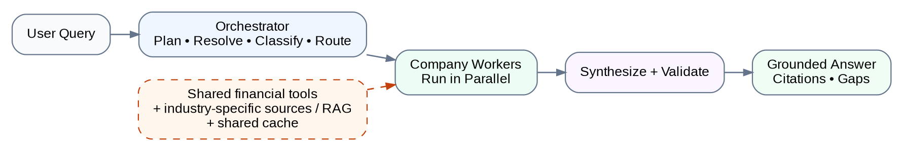
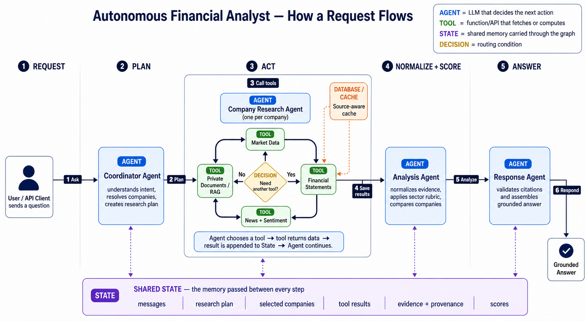

# Multi-Company Financial Research Orchestrator
## High-Level Design

**Status:** Final design proposal; not yet implemented  
**Purpose:** Portfolio-grade extension of the existing autonomous financial analyst assignment  
**Baseline reference:** [Autonomous Financial Research Analyst — Notebook Baseline Design](autonomous-financial-research-notebook-baseline-design.md)  
**Reading guide:** The main body is optimized for a fast architecture review. Detailed component behavior, cache policy, failure semantics, and implementation notes are retained in the appendices.

---

## 1. Executive summary

The current assignment can analyze five hardcoded technology companies and explicitly challenges the learner to adapt the agent to another industry, such as healthcare or fintech. That proves the research pattern is reusable, but it does not yet behave like a sector-aware financial-research platform.

The extension turns that baseline into a **query-driven, industry-aware, multi-company research orchestrator**:

1. Understand the user’s exact question.
2. Resolve each company and determine its industry and sub-industry.
3. Build a combined research contract: shared financial evidence requirements plus the appropriate industry playbook for business-specific dimensions, tools, prompts, scoring, and synthesis.
4. Choose the cheapest correct execution path.
5. Research each company independently and concurrently.
6. Normalize evidence before any comparison.
7. Score only when the selected rubric and required evidence are valid.
8. Synthesize a grounded answer with explicit gaps and freshness.



### The core decision

We use an **orchestrator–workers–synthesizer** architecture.

- The **orchestrator** resolves companies, attaches the shared financial contract, selects industry playbooks for business-specific analysis, and creates bounded company tasks.
- Each **worker** researches exactly one company using the shared financial adapters plus the prompt and additional tools from that company’s industry profile.
- The **synthesizer** is selected by comparison mode: sector-specific for same-industry comparisons and portfolio-level for cross-industry comparisons.

This matches the workload: company research is independently parallelizable, but comparison and ranking require a single cross-company view.

### What this design optimizes for

| Priority | Design response |
|---|---|
| Relevance | Workers retrieve only the domains and dimensions required by the query |
| Trust | Claims retain source identity, company identity, and freshness |
| Latency | Independent companies and source calls run concurrently within limits |
| Cost | Direct fact lookups bypass the full agent workflow; fresh cache entries are reused |
| Resilience | Source and company failures are isolated; partial answers remain usable |
| Reproducibility | Scoring, thresholds, ranking, and validation remain deterministic |

The platform provides financial research and decision support. It does not execute trades or guarantee investment outcomes.

---

## 2. Context: from assignment to platform

The original notebook architecture is documented separately in the [Notebook Baseline Design](autonomous-financial-research-notebook-baseline-design.md). That baseline demonstrates one LangGraph agent/tool loop using market data, historical prices, financial news, sentiment analysis, private-document RAG, prompt-enforced citations, error handling, and notebook conversation memory. Its final exercise also asks the learner to adapt the agent beyond the AI/technology sector, for example to healthcare or fintech.

For multi-company ranking, the notebook sends a fixed list—MSFT, GOOGL, NVDA, AMZN, and IBM—to the same agent. The ranking is primarily synthesized by the LLM unless a later deterministic scoring module is added outside the original notebook flow.

This HLD begins where that baseline ends. It preserves the useful tools and RAG path, but replaces notebook-scale orchestration with explicit planning, company isolation, normalization, validation, freshness, and bounded concurrency.

The platform gap is not one more generic tool. It is **industry-aware coordination and correctness at scale**.

The current design must address four problems:

1. **Fixed universe:** company routing is hardcoded.
2. **Generic work:** a single agent tends to generate a broad report instead of answering the exact question for each company.
3. **Mixed lifetimes:** conversational memory can accidentally carry stale research evidence into a later turn.
4. **Open-universe risk:** a private RAG corpus covering a few companies cannot safely answer for every public company.

The extension is a separate orchestration layer rather than a rewrite of the working notebook. Existing tools—and any later deterministic scoring modules—remain reusable behind the new control plane.

---

## 3. Scope

### In scope

- Current fact lookup
- Single-company research
- Multi-company comparison or separate summaries
- Sector-aware research for supported technology, healthcare, fintech, and other configured industries
- Cross-industry qualitative comparison using shared dimensions and explicit sector context
- Qualitative ranking
- Conditional deterministic scoring for supported comparable companies
- Shared financial adapters and canonical financial evidence across supported industries
- Shared filings, news, and sentiment plus industry-specific data sources and private-report RAG
- Follow-up questions such as “compare their debt” or “add Amazon”
- Explicit freshness, partial coverage, data gaps, and not-scored outcomes

### Out of scope for the first release

- Trade execution or automated portfolio management
- Unlimited company discovery or unbounded fan-out
- A universal scoring formula that treats unlike industries as directly comparable without an explicit cross-industry rubric
- Fully autonomous financial decisions
- Large distributed microservice deployment
- Aggressive final-answer caching across ambiguous conversations

---

## 4. Design in one page

The system keeps three lifetimes separate:

| Layer | Lifetime | Purpose |
|---|---|---|
| Conversation state | Across turns | Remembers companies and resolves follow-up language |
| Research run | One user request | Holds the current plan, evidence, results, scores, and validation |
| Shared cache | Across runs and users | Reuses source data only when freshness and version rules permit |

This separation enables the key principle:

> Remember the subject of the conversation, but revalidate the evidence needed for the current question.

### Execution paths

| Query | Path |
|---|---|
| “What is Microsoft’s current market cap?” | Direct source lookup |
| “Analyze NVIDIA’s AI infrastructure position.” | One query-specific company worker |
| “Compare Microsoft, Google, and Amazon on AI maturity.” | One worker per company, then synthesis |
| “Rank them using the supported rubric.” | Workers, eligibility checks, deterministic scoring, synthesis |
| “Compare a healthcare company with a fintech company.” | Sector-aware workers, shared-dimension normalization, and qualitative synthesis unless a cross-industry rubric is explicitly selected |

The router always selects the least expensive path that can answer correctly.

### Industry-aware execution rule

The system separates **shared financial research** from **industry-specific business research**.

A common financial layer is available to every company worker and uses the same adapter contracts for market data, price history, financial statements, core ratios, filings, news, and sentiment. It produces a canonical `FinancialEvidence` object with provenance and freshness. The industry profile does not replace these tools; it selects the relevant metrics and defines how they should be interpreted, normalized, and scored for that sector.

A versioned **Industry Profile Registry** owns only the business-specific playbook: sector domains, additional source/tool allowlist, worker prompt, terminology, evidence rules, structured signal-extractor schema, sector rubric, and synthesis template.

- **Technology / AI:** product adoption, platform position, AI deployment, ecosystem, governance, and technology risk.
- **Pharma / biopharma:** clinical pipeline, trial evidence, regulatory status, patent and exclusivity exposure, commercialization, safety, reimbursement, and concentration risk.
- **Fintech:** payment or transaction economics, credit quality, funding, licenses, fraud controls, compliance, and cyber resilience.
- **Cross-industry:** compare the shared financial layer plus explicitly selected portfolio dimensions; keep sector-specific conclusions separate unless a validated portfolio rubric exists.

The same worker runtime and financial adapters are reused across industries. Only the industry-specific prompt, additional tools, signal extractor, schema extensions, interpretation rules, and evaluation policy change. Private RAG retrieval is filtered by company, industry, sub-industry, document type, and corpus version. Retrieval returns evidence; a profile-specific extractor converts that evidence into comparable structured signals before scoring or synthesis.

See **Appendix F** for the detailed design.

---

## 5. High-level architecture



*Figure 2 — Simplified request flow. Blue boxes are agents that decide the next action, green boxes are tools that fetch or compute evidence, the purple lane is shared state carried through the graph, the yellow diamond is a routing decision, and the orange box is the source-aware cache. The numbered labels show the request-to-response call sequence.*

The request flows through six logical stages:

1. **Understand:** preserve conversation context and extract the user’s intent.
2. **Resolve and classify:** validate company identities and determine industry/sub-industry.
3. **Build the combined plan:** attach the shared financial evidence contract, then select industry-specific dimensions, additional tools, worker prompts, evidence rules, scoring, and synthesis mode.
4. **Research:** run direct lookup or bounded company workers using the common financial adapters, profile-specific source adapters, source-aware caches, and company/industry-isolated RAG.
5. **Extract and decide:** convert validated industry evidence into profile-specific structured signals, normalize results, and optionally apply the matching deterministic rubric.
6. **Respond:** use the appropriate sector or cross-industry synthesizer, validate, and assemble a grounded answer.

---

## 6. Request journey

Consider this query:

> Compare Microsoft, Google, and Amazon on enterprise AI maturity.

### Step 1 — Plan the question

The planner produces a structured contract:

- Query type: comparison
- Companies: MSFT, GOOGL, AMZN
- Domain: AI strategy
- Dimensions: product breadth, deployment maturity, enterprise adoption, and AI governance
- Sources: private reports, filings, and relevant recent news
- Scoring: not requested

The planner is bounded structured output, not an open-ended agent loop.

### Step 2 — Validate the companies

LLM recognition may propose candidates, but deterministic validation establishes the final security identity, share class, and exchange. Invalid, private, duplicated, or ambiguous companies are handled before fan-out.

### Step 3 — Fan out by company

The orchestrator creates one task per validated company:

```text
MSFT worker  ─┐
GOOGL worker ─┼─> normalized company results
AMZN worker  ─┘
```

Each worker receives the same comparison contract, but retrieves only evidence for its assigned company. It does not compare companies.

### Step 4 — Normalize before reasoning across companies

Deterministic code checks source status, freshness, company identity, missing dimensions, and scoring eligibility. Failed or mismatched evidence is excluded before synthesis.

### Step 5 — Synthesize the answer

The synthesizer compares like with like, cites supplied evidence, and reports limitations. It cannot call tools again, invent missing values, or change deterministic scores.

### Same runtime, different playbook

For a pharma query such as:

> Compare Pfizer and Merck on pipeline strength and near-term clinical risk.

The finalized plan does **not** select AI maturity. It loads the pharma profile and may select:

- Pipeline breadth and therapeutic-area concentration
- Trial phase, design quality, enrollment, endpoints, and readout status
- Regulatory submissions, approvals, holds, and label scope
- Patent and exclusivity exposure
- Commercialization readiness, reimbursement, and launch execution
- Safety, manufacturing, litigation, and concentration risks

The pharma worker reuses the same market-data, financial-statement, filing, news, and sentiment tools used for technology companies. It then adds clinical-trial, regulatory, pipeline-document, patent/exclusivity, and drug-commercialization tools from the pharma profile. A pharma synthesizer combines shared financial health with pipeline and regulatory evidence. AI is included only when the user explicitly asks about AI-enabled discovery or another material AI topic.

---

## 7. Key boundaries

### Agent judgment

LLMs are used where interpretation is valuable:

- Query understanding
- Domain and dimension selection
- Qualitative evidence interpretation
- Company-level conclusions
- Cross-company explanation

### Deterministic control

Code owns decisions that must be reproducible:

- Ticker validation
- Arithmetic and scoring
- Freshness and cache eligibility
- Recommendation thresholds
- Ranking order
- Coverage and failure classification
- Citation, claim, and company-identity checks

### Worker boundary

A worker is **query-specific and company-specific**.

It may analyze several selected domains for its company, but the top-level fan-out unit remains the company—not each dimension. This limits duplicate retrieval, prompt size, coordination cost, and cross-company evidence contamination.

---

## 8. Correctness and trust model

The architecture treats evidence quality as a first-class system concern.

### Source contract

Every source result carries:

- Status: success, missing, failed, stale, or not applicable
- Company and source identity
- Source “as of” time and retrieval time
- Cache status
- Error code where relevant

### RAG isolation and signal extraction

Private-document retrieval follows:

```text
Check company coverage
→ apply ticker/company metadata filters
→ retrieve candidate chunks
→ reject mismatched company identity
→ return validated evidence or explicit missing status
```

The system never substitutes a semantically similar report from another company. RAG retrieval itself does not create a comparable company score. For technology, the platform reuses the existing `extract_ai_signals` / `extract_ai_signals_tool` capability from the earlier scoring design. Successful RAG Q&A calls are captured in `rag_queries` and passed through `prior_reports`, keeping the narrative and score grounded in the same evidence. Other profiles may add equivalent pipeline/trial or operating-risk extractors. Missing evidence remains missing rather than being inferred.

### Honest missing-data behavior

- No news means **sentiment unavailable**, not neutral sentiment.
- No usable company report means **Data Gap**.
- Some unavailable sources with a usable result means **Partial Coverage**.
- A trustworthy result without complete scoring inputs means **Not Scored**.

### Validation

Before response assembly, deterministic validators verify claim IDs, source IDs, numeric consistency, company coverage, freshness, ranking order, and recommendation thresholds. LLM evaluators may assess relevance and groundedness, but they do not replace deterministic checks.

---

## 9. Scale, latency, and resilience

The first release is deliberately bounded:

- Maximum 10 companies per request
- Maximum 5 concurrent company workers
- 90-second worker timeout
- Up to two retries for transient source failures
- Request-level token, cost, and deadline budgets

### Failure isolation

A source failure does not erase other successful sources. A company failure does not fail sibling workers. The whole request fails only when no trustworthy result can be produced or a critical orchestration step fails.

### Cache behavior

Normal cache hits are read concurrently without locks. A missing or stale key uses single-flight refresh: one caller fetches and updates while duplicate callers wait for that same key. Unrelated keys continue normally.

Volatile data uses short TTLs; versioned artifacts such as embeddings, prompts, rubrics, and corpora use version-based invalidation. The system primarily caches source and intermediate results rather than conversational final answers.

### Deployment shape

The initial deployment is a modular Python application:

- Streamlit and/or FastAPI
- LangGraph orchestration
- Redis for volatile caches and distributed refresh locks
- PostgreSQL for conversation checkpoints, run records, provenance, and evaluations
- Vector database for document chunks and embeddings
- Object storage or files for original reports

This keeps the first release understandable and deployable while preserving a path to distributed workers later.

---

## 10. Major trade-offs

| Decision | Why selected | Cost accepted |
|---|---|---|
| Orchestrator–workers–synthesizer | Natural company-level parallelism and centralized comparison | More schemas and coordination than one large agent |
| One worker per company | Strong evidence isolation and failure boundaries | Very broad company queries can make one worker heavier |
| Fresh research run per query | Prevents stale or reducer-carried evidence leakage | Requires explicit shared caching below the graph |
| Deterministic scoring | Reproducible ranking and recommendation labels | Scoring applies only to validated comparable universes |
| Explicit RAG coverage registry | Prevents wrong-company retrieval | Some open-universe companies will have no private-report coverage |
| Sector-aware profiles | Reuses one workflow across industries without pretending one rubric fits all sectors | Requires industry-specific corpora, dimensions, prompts, and evaluation sets |
| Modular monolith first | Faster delivery and easier debugging | Not optimized for very large distributed workloads |

Alternative agentic patterns are used as supporting techniques where appropriate, but none alone solves dynamic company fan-out, isolated research, and cross-company synthesis. See **Appendix D**.

---

## 11. Delivery plan

The implementation should progress through risk-reducing vertical slices:

1. **Comparison slice:** two-to-five named technology companies, bounded fan-out, structured evidence, and grounded synthesis.
2. **Industry-extension slice:** add one healthcare or fintech profile with sector-specific dimensions, sources, risks, and RAG metadata.
3. **Source correctness:** freshness policies, cache interface, RAG registry, and explicit missing statuses.
4. **Validation:** claim IDs, numeric checks, company coverage, and bounded repair.
5. **Scoring:** supported universe, exact required fields, deterministic calculation, and eligibility checks.
6. **Conversation:** inherit/add/remove/replace companies with a fresh research run per turn.
7. **Production hardening:** API/UI, Redis, PostgreSQL, metrics, Docker, CI, authentication, and rate limiting.

Large-universe discovery, hierarchical reduction, and distributed job workers remain later-stage extensions.

---

## 12. Success criteria

The first production-oriented release is successful when it demonstrates:

- Structured planner output is valid on at least 98% of the evaluation set.
- Company resolution is at least 95% accurate on supported cases.
- No wrong-company RAG chunk passes validation.
- Missing news never becomes fabricated neutral sentiment.
- Source and worker failures preserve usable partial results.
- Every volatile claim exposes freshness metadata.
- Every requested company appears in the answer or an explicit limitation section.
- At least one supported non-technology sector passes the end-to-end research flow.
- Cross-industry requests do not receive a universal numeric score unless an explicit cross-industry rubric is selected.
- Deterministic numeric, ranking, and recommendation checks pass all regression tests.
- Concurrent multi-company execution is measurably faster than sequential execution.
- The application runs outside the notebook using documented setup steps.

---

## 13. Final recommendation

Build the system as a **bounded, modular orchestrator**, not as one unconstrained autonomous agent.

```text
Conversation context
→ structured plan and company validation
→ cheapest correct execution route
→ query-specific company research
→ deterministic normalization and optional scoring
→ evidence-grounded synthesis
→ deterministic validation and response assembly
```

This design preserves the strengths of the original assignment while adding the boundaries required for a credible production-oriented portfolio system: query relevance, open-universe company handling, evidence isolation, freshness, partial-failure survival, deterministic decisions, and observable execution.

Implementation-level schemas, graph nodes, cache keys, retry logic, and exact function contracts belong in the companion Low-Level Design or the detailed appendices below.

---
## Appendix A. Conversation versus research run

The architecture uses a **conversation** and a **research run** because they solve different problems and have different lifetimes.

### A.1 Conversation

A conversation represents the ongoing interaction with one user and persists across multiple questions.

```text
Conversation ID: conv-101

Turn 1:
Compare Microsoft, Google, and NVIDIA.

Turn 2:
Now compare their debt levels.

Turn 3:
Add Amazon.
```

The conversation stores only the context required to understand follow-up requests, such as:

- Conversation messages
- The active company set
- The previous query type
- A compact summary of the previous request

Example:

```python
ConversationState = {
    "messages": [...],
    "active_companies": [
        "MSFT",
        "GOOGL",
        "NVDA",
        "AMZN",
    ],
    "previous_query_type": "comparison",
    "previous_query_summary": "Compared debt levels",
}
```

Its purpose is to resolve references such as:

```text
their
those companies
add Amazon
remove NVIDIA
compare them again
```

The conversation does not treat previously retrieved financial data, news, sentiment, or RAG evidence as current evidence.

### A.2 Research run

A research run is one execution created to answer one specific user query. Each new top-level question normally creates a fresh research run.

```text
Conversation: conv-101

Research run 1:
Compare MSFT, GOOGL, and NVDA on AI maturity.

Research run 2:
Compare MSFT, GOOGL, and NVDA on debt levels.

Research run 3:
Compare MSFT, GOOGL, NVDA, and AMZN on debt levels.
```

Each research run stores the plan, evidence, worker outputs, validation results, and final answer for that request.

```python
ResearchState = {
    "run_id": "run-003",
    "user_query": "Add Amazon and compare their debt levels",
    "query_plan": {...},
    "resolved_companies": [
        "MSFT",
        "GOOGL",
        "NVDA",
        "AMZN",
    ],
    "worker_results": {...},
    "scores": {...},
    "data_gaps": [],
    "final_answer": "...",
}
```

A research run may contain:

- The current query plan
- Resolved and validated companies
- Financial metrics and statements
- Market data
- News and sentiment
- Private-report RAG evidence
- Company-worker outputs
- Scores and scoring eligibility
- Data gaps and partial-coverage details
- The synthesis and validation result

After completion, the run becomes a historical execution record. Its evidence is not automatically reused as current evidence for the next user request.

### A.3 Relationship between them

One conversation can create many research runs.

```text
One conversation
    ├── Research run 1
    ├── Research run 2
    ├── Research run 3
    └── Research run 4
```

The execution flow is:

```text
User query
    ↓
Conversation controller reads prior context
    ↓
Resolve references and the active company set
    ↓
Create a fresh research run
    ↓
Gather or revalidate evidence for the current question
    ↓
Generate and validate the answer
    ↓
Return the answer to the conversation
```

### A.4 Example follow-up

First turn:

```text
User:
Compare Microsoft and Google on AI maturity.
```

The conversation records:

```python
active_companies = ["MSFT", "GOOGL"]
```

Research run 1 gathers AI-related reports, relevant financial evidence, news, sentiment, and private-report evidence.

Second turn:

```text
User:
Now compare their debt levels.
```

The conversation resolves:

```text
their = MSFT and GOOGL
```

The system then creates research run 2 because the requested evidence is different. The new run gathers or revalidates information such as:

- Total debt
- Cash and equivalents
- Debt-to-equity ratio
- Interest expense
- Interest coverage
- Latest relevant filing data

It does not reuse the AI-focused worker reports from research run 1 as evidence for the debt comparison.

### A.5 What persists and what refreshes

| Information | Conversation | Research run |
|---|---:|---:|
| User and assistant messages | Yes | Current request context only |
| Active company set | Yes | Copied into the current run |
| Previous intent or query summary | Yes | No |
| Current query plan | No | Yes |
| Financial metrics | No | Yes |
| News and sentiment | No | Yes |
| RAG evidence | No | Yes |
| Company-worker outputs | No | Yes |
| Scores | No | Yes |
| Data gaps and validation results | No | Yes |
| Final answer | Added to conversation messages | Generated by the run |

### A.6 Relationship with caching

A fresh research run does not mean that every API, RAG, or model call must execute again.

```text
Fresh research run
    ↓
Worker requests a required source
    ↓
Source adapter checks the shared cache
    ├── Valid cache entry → reuse it
    └── Missing or stale entry → call the source and update the cache
```

The three concepts remain separate:

```text
Conversation state
→ remembers what the user is discussing

Research run
→ records how the current answer was produced

Shared cache
→ avoids unnecessary API, retrieval, embedding, and model calls
```

The current query's freshness policy determines whether a cache entry is reusable. For example, a four-minute-old price may be rejected for a “price right now” query but accepted for a broader historical-performance analysis if that source is not required to be real time.

### A.7 Design rule

> The conversation remembers the subject, the research run gathers or revalidates the evidence for the current question, and the shared cache avoids repeating work when existing evidence still satisfies the current freshness and provenance requirements.

---

## Appendix B. Volatile caches and refresh locking

### B.1 Volatile versus nonvolatile data

In this architecture, **volatile** means that the underlying value changes frequently or becomes unacceptable after a short period. It does not merely mean that Redis stores the value in memory.

Examples of volatile source data include:

| Data | Why it is volatile | Illustrative cache lifetime |
|---|---|---:|
| Current stock price | Changes continuously during market hours | 1–5 minutes |
| Market capitalization | Changes with the stock price | 5–15 minutes |
| Financial ratios from a market-data provider | Can change as prices or provider calculations change | 12–24 hours |
| Financial-news search results | New articles are continuously published | 30–60 minutes |
| News-based sentiment | Changes when the underlying article set changes | Same lifetime as the news set |
| Temporary provider status | Rate limits and outages may recover quickly | Seconds or minutes |

Relatively stable or nonvolatile data changes infrequently or only after a known event. Examples include:

- Original annual or quarterly report files
- Completed research-run records
- Corpus registry entries
- Historical source provenance
- Document embeddings, while the document, chunking strategy, and embedding model remain unchanged
- Scoring rubrics, while the rubric version remains unchanged
- Prompt configurations, while the prompt version remains unchanged

Stable artifacts are normally invalidated through explicit events or version changes rather than only through short TTLs.

```text
Document unchanged
+ same chunking version
+ same embedding model
→ reuse the existing embedding
```

### B.2 Recommended storage roles

```text
Redis
├── Short-lived market-data responses
├── Financial-ratio cache entries
├── Recent-news results
├── Article-sentiment results
├── Short-lived RAG retrieval results
└── Distributed refresh locks

Vector database
├── Document chunks
└── Embeddings

PostgreSQL
├── Conversation checkpoints
├── Research-run records
├── Source provenance
├── Corpus registry
└── Evaluation results

Object storage or filesystem
└── Original company reports and filings
```

Redis is treated as disposable cache and coordination infrastructure, not as the authoritative system of record. If Redis data is lost, the system should be able to reload the data from the source API, vector database, or durable storage.

### B.3 Normal cache reads do not require a lock

A distributed single-flight lock is not acquired for every cache access.

```text
Request arrives
    ↓
Read cache without a lock
    ↓
Fresh value exists?
    ├── Yes → return immediately
    └── No or stale → coordinate one refresh using a lock
```

When a fresh cache entry exists, all workers and application instances may read it concurrently:

```text
Instance A ──┐
Instance B ──┼── read the same fresh cached value
Instance C ──┘
```

No refresh lock is needed because no external source update is required.

### B.4 Why a lock is needed on a miss or stale entry

Assume three application instances request the same expired value at nearly the same time:

```text
Instance A checks cache → miss
Instance B checks cache → miss
Instance C checks cache → miss
```

Without coordination, all three may call the same external API:

```text
A → external API
B → external API
C → external API
```

This wastes provider quota, increases cost, and can trigger throttling.

With a distributed single-flight lock:

```text
A acquires refresh lock
B cannot acquire the same lock
C cannot acquire the same lock

A calls the API
A writes the fresh value to Redis
A releases the lock

B and C read the newly cached value
```

Only duplicate refresh attempts for the **same cache key** are coalesced. Requests for other tickers or source types continue concurrently.

```text
financial_metrics:MSFT  → one coordinated refresh
financial_metrics:GOOGL → separate concurrent refresh
news:MSFT               → separate concurrent operation
rag:MSFT                → separate concurrent operation
```

### B.5 Cache refresh algorithm

The source adapter follows this sequence:

```text
1. Read the cache without acquiring a lock.
2. If the entry satisfies the current freshness policy, return it.
3. If the entry is missing or stale, attempt to acquire the refresh lock.
4. After acquiring the lock, read the cache again.
5. If another process already refreshed it, return the new cached value.
6. Otherwise, call the external source.
7. Write the new value to the cache with an appropriate TTL.
8. Release the lock.
```

The second cache check is necessary because another process may complete the refresh while the current process is waiting for the lock.

Illustrative pseudocode:

```python
async def get_financial_metrics(ticker: str):
    cache_key = f"financial_metrics:{ticker}"
    lock_key = f"lock:{cache_key}"

    # Fast path: concurrent reads require no lock.
    cached = await redis.get(cache_key)
    if cached and is_fresh(cached):
        return deserialize(cached)

    lock = redis.lock(
        lock_key,
        timeout=30,
        blocking_timeout=10,
    )

    acquired = await lock.acquire()

    if not acquired:
        # Another instance is probably refreshing this key.
        return await wait_for_cached_value(cache_key)

    try:
        # Check again after acquiring the lock.
        cached = await redis.get(cache_key)
        if cached and is_fresh(cached):
            return deserialize(cached)

        fresh_result = await call_financial_api(ticker)

        await redis.set(
            cache_key,
            serialize(fresh_result),
            ex=86400,
        )

        return fresh_result
    finally:
        await lock.release()
```

### B.6 Waiting behavior

Workers waiting for the same refresh are suspended asynchronously. They do not consume a thread in a busy loop and do not stop unrelated work.

```text
MSFT metrics refresh → duplicate MSFT callers wait
GOOGL metrics        → continues
NVDA news            → continues
AMZN RAG              → continues
```

Waiting callers should have a timeout so they cannot wait indefinitely if the lock owner hangs or crashes. The lock itself must also expire automatically.

### B.7 Strict freshness versus stale-while-revalidate

Two policies are possible when a stale value exists.

#### Strict freshness

```text
Stale value
    ↓
One caller refreshes
Other duplicate callers wait
```

Use this when the query explicitly requires fresh data, such as a current stock price.

#### Stale-while-revalidate

```text
Slightly stale but acceptable value
    ├── Return the cached value immediately
    └── Allow one process to refresh it
```

Use this only when the query's freshness policy permits slightly stale data, such as a broad historical summary or a financial ratio that does not require intraday precision.

The response must expose the source timestamp and freshness status rather than silently presenting stale data as current.

### B.8 Design rule

> Fresh cache entries are read concurrently without locks. A distributed single-flight lock is used only when a missing or stale entry must be populated or refreshed, ensuring that one process performs the external call while duplicate callers wait for or reuse the same result.

---

## Appendix C. Worker scope, analysis domains, and dimensions

### C.1 One query-specific worker per company

For a multi-company request, the orchestrator normally creates one worker for each validated company.

```text
User query
    ↓
Query planner selects companies, domains, and dimensions
    ↓
Dynamic fan-out
    ├── Company worker: MSFT
    ├── Company worker: GOOGL
    └── Company worker: AMZN
    ↓
Structured fan-in
    ↓
Cross-company synthesizer
```

Each worker owns only one company. It does not compare itself with sibling workers and does not make the final ranking decision. Its job is to produce a trustworthy, query-specific company result using the same analysis contract supplied to every company in the request.

This gives the architecture clear ownership:

| Component | Responsibility |
|---|---|
| Query planner | Selects companies, analytical scope, sources, freshness, and output mode |
| Company worker | Researches one company against the selected domains and dimensions |
| Normalizer | Checks completeness, freshness, evidence, and comparability |
| Scoring engine | Calculates deterministic scores when the query and rubric allow it |
| Synthesizer | Performs cross-company comparison, ranking, and combined conclusions |

### C.2 Domains versus dimensions

An **analysis domain** is a broad area of company analysis. An **analysis dimension** is a specific criterion evaluated inside that domain.

```text
Company analysis
├── Financial health
│   ├── Revenue growth
│   ├── Profitability
│   ├── Cash position
│   ├── Total debt
│   ├── Debt-to-equity
│   └── Valuation
│
├── AI strategy
│   ├── Product breadth
│   ├── Innovation level
│   ├── Strategic alignment
│   ├── Deployment maturity
│   ├── Enterprise adoption
│   └── AI governance and controls
│
├── Sentiment
│   ├── Average news sentiment
│   ├── News volume
│   ├── Major positive events
│   ├── Major negative events
│   └── Evidence coverage
│
└── Investment risks
    ├── Competitive risk
    ├── Regulatory risk
    ├── Execution risk
    ├── Financial risk
    └── Technology or AI risk
```

The domains do not each repeat the same dimensions. Every domain has dimensions appropriate to that subject.

For clarity, **AI governance and controls** belongs under the AI-strategy domain, while **investment risks** is a broader domain covering threats to the company or investor. These are related but not interchangeable.

### C.3 Query-specific selection

The planner does not select every domain and every dimension for every request.

#### AI-maturity comparison

```text
Compare Microsoft, Google, and Amazon on enterprise AI maturity.
```

Selected scope:

```yaml
analysis_domains:
  - ai_strategy

analysis_dimensions:
  ai_strategy:
    - product_breadth
    - deployment_maturity
    - enterprise_adoption
    - strategic_alignment
    - ai_governance_and_controls
```

The orchestrator creates one worker for Microsoft, one for Google, and one for Amazon. Each worker evaluates the same AI-strategy dimensions for its company.

#### Debt comparison

```text
Compare Microsoft and Google on debt levels.
```

Selected scope:

```yaml
analysis_domains:
  - financial_health

analysis_dimensions:
  financial_health:
    - total_debt
    - cash_position
    - debt_to_equity
    - interest_coverage
```

The workers do not retrieve AI initiatives or general sentiment unless the plan explicitly identifies them as necessary.

#### Full investment deep dive

```text
Provide a detailed investment comparison of Microsoft, Google, and NVIDIA.
```

Selected scope may include:

```yaml
analysis_domains:
  - financial_health
  - ai_strategy
  - sentiment
  - investment_risks
```

Each company still has one worker. That worker evaluates all selected domains for its company:

```text
MSFT worker
├── Financial-health dimensions
├── AI-strategy dimensions
├── Sentiment dimensions
└── Investment-risk dimensions

GOOGL worker
├── Financial-health dimensions
├── AI-strategy dimensions
├── Sentiment dimensions
└── Investment-risk dimensions
```

The final synthesizer compares the corresponding domains and dimensions across companies.

### C.4 Why not one worker per dimension?

Creating separate workers for every company-domain or company-dimension pair would produce many small tasks and increase coordination overhead.

For example, three companies across four domains could create twelve top-level workers instead of three. That design would increase:

- Duplicate source retrieval
- Repeated company context
- Token usage
- Merge complexity
- Cross-worker inconsistencies
- Risk of contradictory conclusions for the same company

The selected design therefore uses:

> **One top-level worker per company, with query-selected domains and dimensions evaluated inside that worker.**

Source calls inside a company worker may still execute concurrently when they are independent:

```text
MSFT worker
    ├── Financial-data adapter
    ├── Filing retrieval
    ├── News search
    ├── Sentiment analysis
    └── Private-report RAG
```

This provides two controlled concurrency levels:

1. Different companies can be researched concurrently.
2. Independent required sources for one company can be retrieved concurrently.

Both levels remain bounded by worker, provider, timeout, token, and cost limits.

### C.5 Comparable worker output

All workers in the same comparison must return the same requested domain-and-dimension structure.

Illustrative output:

```json
{
  "ticker": "MSFT",
  "domains": {
    "ai_strategy": {
      "product_breadth": {
        "finding": "...",
        "claim_ids": ["MSFT-C1"]
      },
      "deployment_maturity": {
        "finding": "...",
        "claim_ids": ["MSFT-C2"]
      },
      "enterprise_adoption": {
        "finding": "...",
        "claim_ids": ["MSFT-C3"]
      }
    }
  },
  "missing_dimensions": []
}
```

Google and Amazon return the same requested fields. This common contract enables the normalizer and synthesizer to compare like with like and identify missing dimensions explicitly instead of inferring them from differently structured prose reports.

### C.6 Design rule

> Company workers perform query-specific, single-company deep dives in parallel. Analysis domains define the broad areas selected for the query, dimensions define the criteria within those domains, and the synthesizer owns cross-company comparison and ranking.

## Appendix D. Agentic pattern selection rationale

### D.1 Selected pattern

The central pattern is:

```text
Structured Planner / Router
        ↓
Orchestrator
        ↓
Dynamic company-level fan-out
    ├── Company Worker A
    ├── Company Worker B
    └── Company Worker N
        ↓
Deterministic normalization and optional scoring
        ↓
Cross-company Synthesizer
        ↓
Validators / Evaluators
```

The architecture is therefore not based on only one agentic pattern. It combines:

- Structured planning and routing
- Orchestrator–workers
- Parallel map-reduce fan-out and fan-in
- Cross-company synthesis
- Deterministic scoring where applicable
- Evaluator and validator checks

### D.2 Why orchestrator–workers–synthesizer fits the problem

The pattern was selected because the system has three naturally separate responsibilities:

1. **Decide the work.** The query determines the companies, domains, dimensions, required sources, freshness, scoring mode, and output format.
2. **Perform independent company research.** Each company can be researched independently using its own financial data, news, filings, RAG evidence, citations, and failure status.
3. **Combine the results.** Comparison, ranking, and combined conclusions require a centralized view after the company-level results have been normalized.

For a query such as “Compare Microsoft, Google, and Amazon on enterprise AI maturity,” the planner creates one consistent task per company. The workers execute concurrently and return the same requested domain-and-dimension structure. The synthesizer then compares like with like.

This pattern provides:

- Dynamic support for a variable number of companies
- Parallel execution for lower latency
- One-company evidence boundaries that reduce cross-company contamination
- Failure isolation when one company or source fails
- Consistent worker contracts for reliable comparison
- A clear separation between evidence gathering and comparative judgment
- Deterministic scoring and validation after all worker results arrive

### D.3 Why the alternatives were not selected as the central pattern

#### Sequential prompt chaining

```text
Analyze MSFT → Analyze GOOGL → Analyze AMZN → Compare
```

Sequential chaining is simple and remains useful inside a worker, but using it across companies would waste available parallelism. End-to-end latency would grow with the number of companies, and an early failure could delay or interrupt later work.

#### Simple routing

Routing can select a direct fact lookup, one worker, or multi-company fan-out. It is therefore part of the architecture, but routing alone cannot execute several company and source tasks or merge their outputs.

#### Plan-and-execute

The structured query planner is a lightweight plan-and-execute component. However, plan-and-execute by itself does not define concurrent company isolation, fan-in reduction, or cross-company synthesis, so it is used as a supporting pattern rather than the complete architecture.

#### One large ReAct agent

A single tool-using agent could research every company, but it would create a large shared context, unpredictable tool loops, harder citation tracing, less predictable cost, and greater risk of mixing company evidence. ReAct-style behavior may still be used inside a company worker when the next research step genuinely requires judgment. Mandatory scoring inputs are fetched deterministically rather than left to optional agent tool choice.

#### Handoffs

Handoffs work best when one specialist should take control from another, such as support triage followed by billing resolution. The company analyses here are independent and should run concurrently, so sequential ownership transfer would add latency and blur responsibility for the final result.

#### Decentralized multi-agent collaboration

Allowing company agents to discuss or negotiate with each other would add communication cost, circular reasoning, inconsistent criteria, and difficult debugging. The company workers do not need peer-to-peer communication; they need a common contract and a centralized synthesizer.

#### Evaluator–optimizer

Evaluator–optimizer improves output quality but does not solve company decomposition, concurrent execution, or fan-in. It is used after worker or synthesis generation for bounded correction and quality checks.

#### Hierarchical multi-agent reduction

A hierarchy such as company workers → sector reducers → global synthesizer is appropriate for very large universes. It is unnecessary for the first release, which is intentionally bounded to a small number of companies, but remains a future scaling option.

### D.4 Why one worker per company instead of one worker per domain

The top-level unit of parallelization is the company, not every domain or dimension. One company worker evaluates all domains selected for that company.

For three companies and four domains, one worker per domain would create twelve top-level workers, repeat company context, duplicate retrieval, fragment citations, and require another company-level merge before cross-company comparison. One worker per company produces a coherent company result while still allowing independent source adapters inside that worker to run concurrently.

```text
Company-level concurrency:
MSFT worker ‖ GOOGL worker ‖ AMZN worker

Source-level concurrency inside MSFT worker:
Financial data ‖ filings ‖ news ‖ RAG
```

### D.5 Pattern responsibilities

| Pattern or component | Responsibility |
|---|---|
| Conversation controller | Preserve user context and resolve follow-ups |
| Structured planner/router | Select companies, domains, dimensions, sources, freshness, and execution path |
| Orchestrator | Create and coordinate bounded company tasks |
| Company worker | Gather and interpret evidence for exactly one company |
| Fan-in normalizer | Validate completeness, freshness, and comparability |
| Deterministic scorer | Calculate supported scores and recommendation labels |
| Synthesizer | Compare companies and answer the original query |
| Validators/evaluators | Check claims, numbers, ranking, coverage, and quality |

### D.6 Design rule

> Use orchestrator–workers–synthesizer as the central pattern because company research is independently parallelizable while comparison requires a centralized view. Use planning, routing, prompt chaining, deterministic scoring, and evaluator patterns as supporting mechanisms at the stages where they provide the strongest control.

## Appendix E. Detailed component and operational reference

This appendix retains the detailed component, persistence, freshness, resilience, security, observability, deployment, decision, rollout, and acceptance notes that were removed from the quick-read main body.

### E.1. Major components

#### E.1.1 User interface and API

The initial portfolio application may expose:

- A Streamlit interface for demonstration
- A FastAPI endpoint for programmatic access

Responsibilities include:

- Accepting the query and conversation identifier
- Displaying progress at a high level
- Returning the final answer
- Showing source dates and coverage limitations
- Exposing optional full company reports or audit details

Long-running asynchronous job APIs may be added after the synchronous two-to-five-company flow is stable.

#### E.1.2 Conversation controller

The conversation controller is the long-lived context boundary.

It stores:

- Conversation messages
- Active company set
- Previous query type
- Compact previous-query summary

It supports operations such as:

- Inherit prior companies
- Add a company
- Remove a company
- Replace the company set

It invokes a new research run for every top-level user request.

It does not persist market data, news, sentiment, RAG chunks, or worker reports as current evidence.

#### E.1.3 Two-stage industry-aware planning

Planning occurs in two bounded stages.

**Stage 1 — intent plan, before company enrichment**

- Query type and requested output
- Mentioned or inherited companies
- Explicit dimensions or constraints stated by the user
- Freshness and scoring intent

**Stage 2 — finalized research plan, after company resolution**

The resolver enriches each company with canonical identity, industry, sub-industry, and applicable profile. The plan builder then loads the versioned industry playbook and selects:

- Shared financial domains, required evidence, and freshness rules
- Industry-specific business domains and dimensions
- Common financial adapters plus required and optional sector adapters
- Worker prompt template and structured output schema
- Sector-tool allowlist and source priority
- Financial and sector evidence-completeness rules
- Same-industry or cross-industry synthesis mode
- Matching scoring rubric, if one is valid

This prevents the planner from selecting AI dimensions for a pharma company simply because the original assignment focused on AI. Planning remains structured and bounded; it is not an open-ended agent loop.

#### E.1.4 Company resolver and ticker validator

The resolver maps names, abbreviations, and tickers to canonical public securities.

It handles:

- Multiple share classes
- Exchange ambiguity
- ADRs
- Private companies
- Invalid or delisted symbols
- Duplicate company references

LLM-based company recognition may propose candidates, but deterministic provider or security-master validation establishes the final identity.

Only validated companies enter company-worker fan-out.

#### E.1.4A Industry Profile Registry

The registry is a versioned control-plane configuration. Each profile defines:

- Industry and sub-industry identifiers
- Default and optional industry-specific analysis domains
- Sector-specific dimensions and terminology
- Financial metric selection and sector-relative interpretation policy
- Required sector source types and additional tool allowlist
- Worker system prompt and output-schema extensions
- Structured signal-extractor prompt/schema and version
- Evidence completeness and not-applicable rules
- Sector-business rubric and thresholds, when validated
- Same-sector synthesis template
- Cross-industry mapping to shared portfolio dimensions
- Evaluation datasets and quality thresholds

A profile can be updated independently of the graph topology. The generic orchestration code remains stable while industry knowledge is expressed as data and versioned templates.

#### E.1.5 Execution router

The router selects the least expensive correct path:

| Query shape | Execution path |
|---|---|
| Current fact lookup | Direct source adapter |
| One-company analysis | One company worker |
| Multi-company comparison | Concurrent workers and synthesis |
| Ranking | Concurrent workers, eligibility checks, optional scoring, synthesis |
| No valid company | Structured no-company or unsupported response |

Simple fact queries must not trigger the full multi-agent workflow.

#### E.1.6 Company worker

Each company worker owns one company and one query-specific task.

The worker receives:

- Canonical company identity and industry/sub-industry
- Industry-profile ID and version
- Original user request and query type
- Shared financial evidence contract and requested financial dimensions
- Requested sector-specific domains and dimensions
- Profile-selected system prompt and output-schema extensions
- Common financial tools plus profile-selected additional tools, source priorities, and required evidence
- Freshness policy and scoring eligibility rules

Its responsibilities are:

- Invoke the shared financial tools when required by the query
- Invoke only the additional sector tools allowed by the selected industry profile
- Request only the financial and business evidence required for the query
- Preserve source-level status independently
- Pass validated industry evidence through the profile-specific structured signal extractor
- Generate structured claims using sector-appropriate terminology and attach source IDs to each extracted signal
- Produce a concise company-level conclusion
- Report missing, stale, and not-applicable evidence separately
- Avoid cross-company comparison

Cross-company reasoning belongs exclusively to the synthesizer.


For a multi-company request, the orchestrator creates one worker per validated company. Every worker receives the same query-specific analysis contract so that its output is comparable with the other workers' outputs.

```text
Compare MSFT, GOOGL, and AMZN on enterprise AI maturity
    ├── MSFT worker: AI strategy domain and requested dimensions
    ├── GOOGL worker: AI strategy domain and requested dimensions
    └── AMZN worker: AI strategy domain and requested dimensions
            ↓
       Cross-company synthesizer
```

A broad deep-dive query may select several domains for each company. This does not create one company worker per dimension. The same company worker evaluates all selected domains and dimensions for its company, while required source calls inside that worker may execute concurrently.

#### E.1.7 Source adapters

Source adapters are split into two layers.

**Shared financial adapters — reusable across industries**

- Current price and market data
- Historical prices and returns
- Financial statements and filings
- Core financial metrics and ratios
- Financial news
- Article sentiment

These adapters produce one canonical `FinancialEvidence` model. Industry profiles select which fields are material and how to interpret them; they do not create duplicate financial tools.

**Industry-specific adapters — loaded only when required**

- Private-report RAG with industry-aware metadata
- Clinical-trial registry and trial-result adapters for pharma/biopharma
- Regulatory-event adapters for approvals, submissions, safety actions, and holds
- Patent/exclusivity and drug-commercialization adapters where licensed data is available
- Payments, credit-quality, licensing, fraud, and cyber-risk adapters for fintech
- Product, platform, cloud, AI-deployment, and ecosystem adapters for technology

The router does not call every adapter. The query determines the shared financial evidence needed; the industry profile determines the minimum additional sector tool set.

#### E.1.7A Profile-specific signal extraction

Source adapters retrieve evidence; they do not directly produce a cross-company score. After retrieval and company-identity validation, the worker invokes the extractor declared by the selected industry profile.

Examples:

| Profile | Structured extractor | Example dimensions |
|---|---|---|
| Technology / AI | Existing `extract_ai_signals` / `extract_ai_signals_tool` | Reuse the earlier rubric classification, grounded in captured `rag_queries` through `prior_reports` |
| Pharma / biopharma | `extract_pipeline_signals` | Pipeline breadth, trial quality and progress, regulatory position, exclusivity exposure, commercialization readiness |
| Fintech | `extract_fintech_signals` | Unit economics, credit quality, funding resilience, compliance controls, fraud and cyber resilience |

Every extractor follows one interface:

```python
IndustrySignalResult = {
    "ticker": "...",
    "profile_id": "...",
    "profile_version": "...",
    "dimensions": {
        "dimension_name": {
            "rating": "...",
            "rationale": "...",
            "source_ids": ["..."],
            "confidence": 0.0,
        }
    },
    "missing_dimensions": [],
    "status": "success|partial|missing|failed",
}
```

The extractor is a bounded structured-output model call or equivalent deterministic parser. It must:

- Consume only evidence already validated for the requested company and profile
- Use the same dimension schema for all companies compared under that profile
- Attach source IDs to every populated signal
- Return explicit missing dimensions rather than guessing
- Avoid cross-company ranking or final recommendation generation

A deterministic scoring engine maps validated signals to rubric points. For technology, this reuses the existing `score_companies(...)` path rather than introducing new scoring math. This separation prevents free-form RAG prose from becoming an inconsistent or unauditable score.

Each adapter follows the same conceptual flow:

```text
Validate request
→ construct versioned cache key
→ check cache
→ verify freshness
→ reuse or refresh
→ normalize response
→ attach provenance and status
```

Every result includes:

- Success, missing, failed, stale, or not-applicable status
- Source identifiers
- Source “as of” time
- Retrieval time
- Cache-hit information
- Error code where applicable

#### E.1.8 Shared cache layer

The cache is independent of graph state and reusable across conversations and research runs.

Cache categories include:

- Company/ticker resolution
- Current market data
- Financial metrics
- Historical prices
- News results
- Per-article sentiment
- Document chunks and embeddings
- RAG retrieval results
- AI-signal extraction
- Optional query-specific worker results

The cache uses:

- TTL invalidation for volatile data
- Version invalidation for prompts, models, rubrics, retrievers, and corpora
- Event invalidation for new filings or newly ingested reports
- Brief negative caching for genuine not-found conditions

Duplicate cache misses for the same key use single-flight request coalescing. Only duplicate requests wait; unrelated companies and source keys continue concurrently.

#### E.1.9 Private-report RAG subsystem

The private corpus is explicitly bounded and cannot be assumed to cover the open universe.

The RAG subsystem includes:

- Corpus registry
- Document ingestion
- Company metadata
- Document dates and types
- Chunking and embeddings
- Vector retrieval
- Ticker-scoped metadata filters
- Post-retrieval company-identity validation

Required document metadata includes:

- Ticker
- Canonical company name
- Document ID
- Document type
- Document date
- Corpus version

Retrieval behavior:

```text
Check corpus coverage
→ if uncovered, return explicit missing status
→ if covered, retrieve using company metadata filter
→ reject every mismatched chunk
→ return only validated evidence
```

Similarity alone is not proof that a chunk belongs to the requested company. The RAG subsystem returns validated evidence and source metadata; it does not assign the sector score. The profile-specific signal extractor consumes this output in the next step.

#### E.1.10 Fan-out and fan-in orchestrator

For multi-company queries, LangGraph dynamically dispatches one worker per validated company using `Send`.

The fan-out is bounded by:

- Maximum companies per request
- Maximum concurrent company workers
- Provider-level concurrency limits
- Per-worker timeout
- Total request deadline
- Token and cost budget

Worker results are accumulated by ticker through a reducer in the fresh research-run state.


The unit of top-level fan-out is the company, not the analytical dimension. Domain and dimension selection controls what each company worker investigates. This avoids fragmented evidence, duplicated retrieval, and unnecessary coordination between multiple workers for the same company.

Initial portfolio limits:

- Maximum 10 companies per request
- Maximum 5 concurrent company workers
- 90-second worker timeout
- Two retries for transient external-source failures

Large-universe hierarchical reduction is a later-phase capability.

#### E.1.11 Deterministic normalization

After fan-in, deterministic code classifies each company result as:

- Complete
- Partial
- Failed
- Validation failed
- Eligible for synthesis
- Eligible for scoring
- Not scored
- Data gap

The synthesizer receives only approved evidence. It does not inspect prose markers such as `[DEEP DIVE FAILED]` to make workflow decisions.

The final answer distinguishes:

- **Partial Coverage:** a usable report exists, but one or more requested sources are unavailable
- **Data Gaps:** no trustworthy company-level result is available
- **Not Scored:** a trustworthy report exists, but deterministic scoring inputs are incomplete or incompatible

#### E.1.12 Conditional deterministic scoring

Scoring is not the default path for every query.

It runs only when:

- The user requests ranking or scoring
- The selected rubric is appropriate for the compared companies
- Every scored company has the same required inputs
- Inputs satisfy freshness requirements
- The rubric and thresholds are versioned

The scoring engine separates a reusable financial component from a sector-specific business component. The financial component uses the same canonical evidence schema, but sector profiles control metric selection, peer-relative normalization, and interpretation. A total sector score is produced only when all companies use the same validated sector rubric. Cross-industry numeric ranking requires a separate portfolio-level rubric.

Missing inputs must never trigger per-company reweighting. The company is marked `Not Scored` instead.

A pure deterministic function calculates:

- Component scores
- Total score
- Ranking order
- Recommendation label

The LLM explains the result but does not calculate or reorder it.

#### E.1.13 Industry-aware synthesizer

The synthesizer is selected from two modes:

- **Sector synthesizer:** used when companies share an industry profile; it compares sector-specific dimensions and applies sector terminology.
- **Portfolio synthesizer:** used for mixed industries; it compares only explicitly shared dimensions and keeps sector-specific findings in separate sections.

The synthesizer receives:

- Original query
- Structured query plan
- Synthesis-eligible company results
- Evidence claims and source references
- Deterministic scores, when available
- Partial-coverage and gap records
- Freshness metadata

It must:

- Answer the exact user request
- Compare only the requested domains and dimensions
- Avoid unwanted rankings
- Cite supplied evidence claim IDs or source IDs
- Distinguish fact from qualitative interpretation
- State when evidence is insufficient for reliable ranking

It must not:

- Call source tools again
- Recalculate scores
- Use failed company results
- Invent missing values
- Introduce unsupported companies
- Present qualitative judgment as deterministic scoring

#### E.1.14 Validation layer

Deterministic validators check:

- Referenced evidence claim IDs exist
- Source IDs exist
- Evidence belongs to the correct company
- Numeric statements match structured source data
- Score ranking matches deterministic order
- Recommendation labels match thresholds
- Excluded companies do not appear in comparative claims
- Every requested company is acknowledged
- Source freshness satisfies the plan

LLM-based evaluators may assess:

- Groundedness
- Relevance
- Comparative reasoning quality
- Completeness
- Limitation transparency

LLM evaluation supplements deterministic validation and never replaces a check that can be expressed in code.

#### E.1.15 Response assembler

The final response is assembled from validated synthesis and deterministic sections:

```text
Answer
Comparison or Ranking, when requested
Partial Coverage
Data Gaps
Not Scored
Freshness
Sources
```

Full company reports are optional audit artifacts rather than mandatory content in every response. They can be shown in expandable UI panels or exposed through a run-details endpoint.

---

### E.2. State and persistence model

#### E.2.1 Conversation state

Conversation state is long-lived and checkpointed by conversation ID.

It includes:

- Messages
- Active company set
- Previous query type
- Previous-query summary

#### E.2.2 Research-run state

Research-run state is newly created for every top-level request and identified by a run ID.

It includes:

- Current query
- Query plan
- Resolved companies
- Current worker results
- Eligibility classifications
- Scores
- Synthesis
- Validation results
- Final response

This separation prevents reducer-backed prior results from leaking into a later turn.

#### E.2.3 Shared cache

The cache sits below the graph and is reused across runs.

Therefore:

> A new research state does not force a new API call. It forces the required input to pass current cache-freshness and provenance checks before reuse.

#### E.2.4 Persistence choices

Development and notebook mode:

- MemorySaver or local checkpoints
- SQLite or disk-backed cache
- Local vector store

Portfolio deployment:

- PostgreSQL-backed conversation checkpoints and run metadata
- Redis for volatile source caches and distributed single-flight locks
- Persistent vector database for document chunks and embeddings

---

### E.3. Freshness strategy

Freshness is source-specific and query-specific.

Suggested starting policies:

| Source | Typical maximum age |
|---|---:|
| Current price | 1–5 minutes |
| Market capitalization | 15 minutes |
| Financial ratios | 24 hours |
| Historical prices | 24 hours |
| News search | 1 hour |
| Article sentiment | Same evidence lifetime as article set |
| Quarterly financial values | Until a newer filing is available |
| Private reports | Until corpus version changes |

A query for “price right now” may require a stricter policy than a query about long-term company strategy.

The final answer should expose meaningful `as of` information for volatile claims.

---

### E.4. Failure and resilience model

#### E.4.1 Source-level failure

A source failure does not erase other successful sources.

Example:

```text
MSFT
├── Financial metrics: success
├── Market price: success
├── News: failed
├── Sentiment: unavailable
└── Private RAG: success
```

The worker may still produce a partial but trustworthy result.

#### E.4.2 Worker-level failure

A worker is failed only when it cannot produce a trustworthy company-level answer.

Worker exceptions are captured into structured failure status so that sibling workers complete normally.

#### E.4.3 Run-level failure

The entire request fails only when:

- No requested company produces usable evidence, or
- A critical orchestration component cannot complete

Otherwise, the system returns partial results with explicit coverage information.

#### E.4.4 Retry and timeout principles

- Retry only transient failures
- Use bounded exponential backoff and jitter
- Do not retry permanent conditions such as invalid ticker or company not in corpus
- Apply source, worker, and whole-request deadlines
- Do not allow duplicate callers to wait indefinitely on a single-flight owner

---

### E.5. Security and responsible-use controls

The deployed system should include:

- Environment-based or managed secrets
- API authentication where publicly exposed
- Input-size and company-count limits
- User and provider rate limits
- Tool allowlists
- Retrieved-document prompt-injection defenses
- Logging redaction
- Dependency and container vulnerability checks
- Explicit financial-research disclaimer
- No trade-execution capability

Retrieved documents are untrusted input. Their instructions must not override system policies or tool permissions.

---

### E.6. Observability and reproducibility

Every request receives a `run_id`; every conversation receives a `conversation_id`.

Capture:

- Query-plan output
- Resolved company identities
- Worker start, completion, and failure
- Source calls and cache hits
- Source and LLM latency
- Token usage and estimated cost
- Retry counts
- Freshness outcomes
- Scoring eligibility
- Validation outcomes
- Final run status

Track metrics such as:

- End-to-end request latency
- Company-worker latency
- Worker success rate
- Source failure rate
- Cache-hit rate
- Duplicate-call coalescing rate
- Tokens and cost per request
- Citation-validation failure rate
- Groundedness score
- Companies per request

Store version fields for:

- Planner prompt
- Worker prompt
- Synthesizer prompt
- Model
- Scoring rubric
- Retriever
- Embedding model
- Corpus

These versions are required for reproducible evaluations.

---

### E.7. Deployment architecture

The first portfolio deployment should remain a modular monolith.

```text
Streamlit / FastAPI
        ↓
Modular Python application
        ↓
LangGraph orchestration
   ├── Redis: volatile cache and refresh locks
   ├── PostgreSQL: checkpoints, run metadata, and provenance
   ├── Vector database: chunks and embeddings
   └── External providers: market data, news, and models
```

A modular monolith is preferred initially because it:

- Keeps development and deployment manageable
- Preserves clear package boundaries
- Avoids unnecessary network hops
- Supports later extraction of distributed workers if scale requires it

Distributed job queues and horizontally scaled workers are later enhancements.

---

### E.8. Major architectural decisions

| Decision | Selected approach | Reason |
|---|---|---|
| Baseline versus extension | Preserve both | Demonstrates assignment progression and avoids destabilizing working code |
| Orchestration | LangGraph | Supports stateful graphs, dynamic `Send`, reducers, and checkpointing |
| Worker scope | Query-specific, one company per worker | Isolates evidence by company; selected domains and dimensions define the depth of that worker's analysis |
| Conversation memory | Separate conversation controller | Preserves follow-up context without retaining stale evidence |
| Research state | Fresh per user request | Prevents cross-turn contamination |
| Evidence reuse | Shared source-aware cache | Avoids unnecessary API, RAG, and LLM calls |
| Duplicate cache misses | Single-flight per cache key | Prevents provider stampedes without blocking unrelated work |
| Company validation | Deterministic after LLM recognition | Avoids ticker and security ambiguity |
| RAG coverage | Explicit registry and metadata filters | Prevents cross-company contamination |
| Failure handling | Structured per-source and per-worker status | Preserves partial results and avoids parsing prose markers |
| Scoring | Conditional and deterministic | Prevents false precision and invented comparability |
| Missing score inputs | Not Scored | Avoids inconsistent per-company formulas |
| Final synthesis | Evidence-grounded LLM output | Enables flexible explanation while preserving provenance |
| Deployment | Modular monolith | Appropriate complexity for portfolio and first production-oriented release |

---

### E.9. Implementation phases

#### E.9.1 Phase 0 — Stabilize the assignment baseline

- Preserve the original notebook
- Confirm existing tools and tests
- Identify reusable functions
- Record known limitations and baseline latency

#### E.9.2 Phase 1 — First vertical slice

Support two-to-five explicitly named technology companies in a comparison query.

Build:

- Structured query planner
- Company resolution and validation
- Query-specific workers
- Bounded LangGraph fan-out
- Structured source results
- Metadata-filtered RAG
- Partial-failure normalization
- Evidence-grounded synthesis
- Coverage validation

Exclude initially:

- Conversation follow-ups
- Sector discovery
- Deterministic scoring
- Distributed workers

#### E.9.3 Phase 2 — Source correctness and caching

- Source-specific freshness policies
- Persistent cache interface
- Single-flight coalescing
- Corpus registry
- Embedding and retrieval versioning
- Missing sentiment instead of neutral defaults
- Source-level partial-result preservation

#### E.9.4 Phase 3 — Evidence and deterministic validation

- Claim IDs
- Source-ID validation
- Numeric consistency checks
- Company coverage checks
- Freshness checks
- Bounded synthesis revision

#### E.9.5 Phase 4 — Conditional deterministic scoring

- Define supported company universe
- Version the rubric
- Define exact required fields
- Add scoring eligibility
- Validate ranking and recommendation labels

#### E.9.6 Phase 5 — Conversational follow-ups

- Persistent conversation state
- Inherit/add/remove/replace company operations
- Fresh research invocation on every turn
- Durable checkpoints

#### E.9.7 Phase 6 — Application hardening

- FastAPI or Streamlit integration
- PostgreSQL and Redis
- Structured logging and metrics
- Docker
- CI and automated tests
- Authentication and rate limiting

#### E.9.8 Phase 7 — Portfolio evaluation package

Demonstrate:

- Single-company research
- Concurrent multi-company comparison
- A non-AI query proving query-specific execution
- Follow-up memory with refreshed evidence
- Out-of-corpus RAG behavior
- Missing-news behavior
- Partial worker failure
- Conditional scored ranking
- Freshness-sensitive current-price lookup

Measure:

- Concurrent versus sequential latency
- Cache-hit rate
- Partial-failure survival
- Groundedness
- Numeric consistency
- Citation validity
- Cross-company RAG contamination
- Token and cost usage

---

### E.10. Acceptance criteria for the first production-oriented release

The release is acceptable when:

- Planner structured-output validity is at least 98% on the evaluation set
- Company resolution accuracy is at least 95% on supported cases
- No wrong-company RAG chunks pass validation
- Missing news never becomes fabricated neutral sentiment
- One source failure preserves other successful sources
- One worker failure does not fail the full multi-company run
- Every volatile claim has freshness metadata
- Every requested company appears in the answer, partial coverage, data gaps, or not-scored section
- Deterministic numeric and recommendation checks pass 100% of regression tests
- Concurrent execution demonstrates lower latency than sequential execution for multi-company queries
- The application runs outside the notebook through documented setup steps

---

## Appendix F. Industry-aware research playbooks and comparison boundaries

### F.1 Design principle

The financial data infrastructure is reusable across industries; business-analysis criteria are not universal. Every worker starts from the same canonical financial evidence layer, then loads a versioned industry playbook for sector-specific tools, dimensions, interpretation, scoring, and synthesis.

```text
Intent plan
→ company resolution and industry classification
→ industry profile selection
→ profile-specific company tasks
→ sector or portfolio synthesis
```

### F.2 Industry Profile Registry

Each profile defines:

```python
IndustryProfile = {
    "profile_id": "pharma.biopharma.v1",
    "industry": "healthcare",
    "sub_industry": "biopharma",
    "shared_financial_policy": {...},
    "business_domains": {...},
    "required_industry_sources": [...],
    "optional_industry_sources": [...],
    "industry_tool_allowlist": [...],
    "worker_prompt_template": "...",
    "worker_output_schema": {...},
    "evidence_rules": {...},
    "scoring_rubric": {...},
    "synthesizer_template": "...",
    "portfolio_dimension_mapping": {...},
}
```

The planner loads this profile only after the company has been resolved and classified. The profile version is recorded in the research run for reproducibility.

### F.3 Shared financial layer versus sector-specific analysis

Every worker can use the same financial adapter family and canonical evidence model:

```python
FinancialEvidence = {
    "market_data": {...},
    "income_statement": {...},
    "balance_sheet": {...},
    "cash_flow": {...},
    "core_ratios": {...},
    "filings": [...],
    "news_and_sentiment": {...},
    "provenance": {...},
    "freshness": {...},
}
```

The common layer supports financial comparison through dimensions such as revenue trend, profitability trend, liquidity, leverage, cash generation, capital allocation, and valuation. Raw values are retained, but interpretation may be sector-relative. For example, the same P/E field can be retrieved for technology and pharma while each sector profile supplies the relevant peer context and cautions.

Most business-quality reasoning remains sector-specific.

| Profile | Sector-specific dimensions | Typical required tools or sources |
|---|---|---|
| Technology / AI | Product/platform position, adoption, AI deployment, ecosystem, capex efficiency, governance, technology obsolescence | Product and platform evidence, cloud/AI disclosures, filings, technical reports, relevant news |
| Pharma / biopharma | Pipeline breadth and concentration, trial phase and design, endpoints/readouts, regulatory status, patent/exclusivity, commercialization, safety, manufacturing, reimbursement | Clinical-trial registry, regulatory events, filings, pipeline reports, patents/exclusivity, drug sales and launch evidence |
| Medtech | Product approvals, installed base, procedure volume, reimbursement, clinician adoption, manufacturing quality, recalls | Regulatory database, procedure and reimbursement evidence, filings, product reports |
| Fintech | Transaction economics, take rate, credit quality, funding cost, licenses, fraud controls, compliance, cyber resilience | Payments/transaction data, lending and loss metrics, regulatory actions, risk reports, outage/cyber evidence |

AI is not a mandatory domain for pharma. It is selected only when the query or material company strategy makes it relevant, such as AI-assisted drug discovery.

### F.4 Pharma worker contract

```python
CompanyTask = {
    "company": "PFE",
    "industry_profile": "pharma.biopharma.v1",
    "shared_financial_dimensions": [
        "revenue_trend",
        "profitability_and_cash_generation",
        "liquidity_and_leverage",
        "valuation_relative_to_sector",
    ],
    "industry_dimensions": [
        "clinical_pipeline",
        "regulatory_progress",
        "exclusivity_and_patents",
        "commercialization",
        "sector_risks",
    ],
    "shared_financial_tools": [
        "market_data",
        "financial_statements",
        "filings",
        "financial_news",
        "sentiment",
    ],
    "industry_tools": [
        "clinical_trials",
        "regulatory_events",
        "pipeline_rag",
    ],
    "synthesis_mode": "same_sector_pharma",
}
```

The worker prompt instructs the model to distinguish confirmed facts from interpretation, preserve drug/indication/trial identifiers, and treat failed trials, missing endpoints, regulatory holds, and stale pipeline documents as explicit gaps rather than neutral evidence.

### F.5 Planner behavior

The planner is industry-aware in four ways:

1. It receives deterministic company industry/sub-industry enrichment.
2. It chooses a profile before selecting default dimensions or tools.
3. It allows the user’s explicit question to override profile defaults when valid.
4. It produces per-company tasks for mixed-industry queries instead of forcing one common worker contract.

For same-industry comparisons, all workers use the same profile version and requested sector dimensions. For mixed-industry comparisons, each worker uses its own profile while the portfolio synthesizer receives only the shared comparison contract.

### F.6 Tool and prompt selection

A worker is a generic execution shell, not a universal analyst persona. The shared platform supplies the financial adapters, canonical financial schema, cache behavior, provenance contract, and freshness policy. The industry profile supplies:

- System prompt and terminology
- Structured output-schema extensions
- Additional sector-tool allowlist and source priority
- Financial metric interpretation and peer-context rules
- Required sector evidence fields
- Missing/not-applicable behavior
- Sector-specific quality checks

This gives operational reuse without duplicating financial integrations or analytically homogenizing industries.

### F.7 Synthesis modes

#### Same-industry synthesis

A sector synthesizer compares the same sector dimensions across companies.

Example: Pfizer versus Merck on pipeline quality, upcoming readouts, regulatory exposure, exclusivity risk, and commercialization readiness.

#### Cross-industry synthesis

A portfolio synthesizer can compare the shared canonical financial evidence, but it interprets valuation and capital structure in sector context. It may compare revenue trend, cash generation, liquidity, leverage, capital allocation, and valuation relative to sector peers. Sector-specific findings remain separate and are not collapsed into one pseudo-comparable score.

### F.8 Scoring eligibility

A numeric ranking is allowed only when:

- The financial component uses the shared canonical evidence schema and a published normalization policy.
- The business component matches the industry or an explicit portfolio-level rubric.
- Every ranked company uses the same complete rubric version and weights.
- Required inputs are present and fresh.
- No dimension is silently removed, substituted, or reweighted.
- The rubric has been validated for that sector and company type.

A pharma rubric should not be used unchanged for medtech, providers, or insurers simply because all belong to healthcare.

### F.9 RAG and provenance

The corpus registry stores company, industry, sub-industry, document type, asset/product/drug where applicable, indication, trial or regulatory identifier, reporting period, publication date, corpus version, and chunking/embedding version.

Retrieval filters by company first, then profile-specific metadata. A pharma query must not receive a technology report—or a report about another drug or indication—as a semantic substitute.

### F.10 First implementation target

Implement one complete pharma/biopharma profile with:

- Reuse of the shared market, financial-statement, filing, news, and sentiment adapters
- Industry-aware planner enrichment
- Pharma worker prompt and structured schema
- Clinical-trial and regulatory adapters
- Company/drug/indication-filtered RAG
- Pharma sector synthesizer
- Same-sector evaluation set
- Explicit refusal of universal cross-industry scoring by default

---
